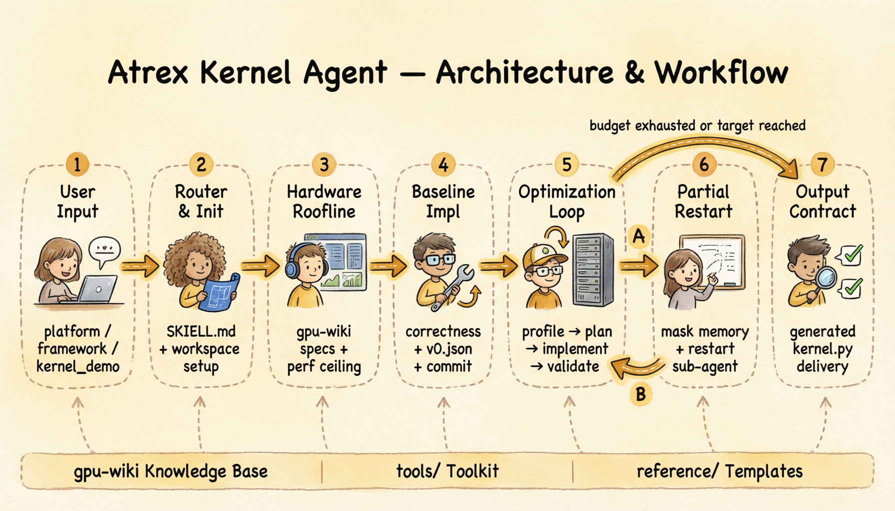
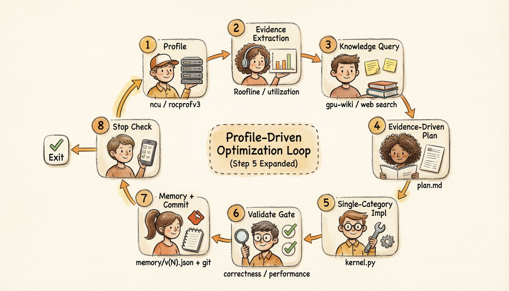

# Atrex Kernel Agent

AKA is an end-to-end Agent project for GPU kernel implementation, analysis, profiling, and iterative optimization. It helps an Agent turn PyTorch logic or an existing kernel into a high-performance GPU kernel through a structured, profile-driven workflow.





## What It Does

- Creates an isolated optimization workspace under `kernel_opt_<name>/`.
- Looks up target hardware specs from the local `gpu-wiki` knowledge base.
- Runs Roofline analysis and sets auditable performance targets.
- Implements a correct baseline kernel before entering optimization.
- Runs the profile-driven optimization loop: profile with `ncu` or `rocprofv3`, extract bottleneck evidence, query `gpu-wiki` / reference projects / web sources for relevant optimization knowledge, write an evidence-based plan, apply one optimization category, validate correctness and performance, record memory, commit, then repeat until Stop Conditions are met.
- Records plans, profile artifacts, structured memory, reports, and Git commits for every accepted iteration.

For the full architecture and workflow design, see [`docs/design.md`](docs/design.md).

## Requirements

Installation requires:

- `bash`
- `git`
- `jq`
- A compatible coding runtime installed

Running optimization tasks also requires platform-specific profiling tools:

- NVIDIA: `ncu`, wrapped by `tools/profile_iter_nvidia.sh`
- AMD: `rocprofv3`, wrapped by `tools/profile_kernel.sh`

## Installation

### 1. Internal Development Environment Setup (Required for internal users)

```bash
bash setup-dev-env.sh
```

Configures git `insteadOf` URL redirect rules so that dependencies can be fetched correctly from the internal network. **External users can skip this step.**

### 2. Pull reference-projects Submodule

```bash
git submodule update --init
```

Downloads all reference projects managed under `reference-projects/`.

### 3. Run the Installer

```bash
bash install.sh --prefix [install-path]
```

The install path is optional; defaults to `~/aka_kernel_opt`.

Common options:

```bash
bash install.sh ~/my_path          # Install to a custom directory
bash install.sh --hooks-only        # Install or update hooks only
bash install.sh --max-iterations N  # Configure hook stop behavior after memory/vN.json exceeds N
bash install.sh --uninstall         # Remove hooks installed by this script
```

The installer detects supported runtime home directories and prepares local hooks when available.

After installation, restart the coding runtime or open a new session so the hooks are loaded.

## Quick Start

Ask the Agent to optimize a kernel with at least:

- `platform`: target hardware platform, such as `H20` or `MI308X`.
- `framework`: target implementation framework, such as `CuteDSL` or `FlyDSL`.
- `kernel_demo`: path to the initial PyTorch logic or kernel implementation file.

Example:

```text
/gpu-kernel-optimizer Optimize /path/to/kernel_demo.py on MI308X with FlyDSL, dtype bf16, rel_err < 0.01.
```

The Agent will initialize a workspace, source hardware specs from `gpu-wiki`, write the workspace configuration, build a baseline, profile the kernel, and iterate until the configured Stop Conditions are met.

## Main Files

```text
.
├── SKILL.md                         # Top-level gpu-kernel-optimizer router manifest
├── install.sh                       # Installer / uninstaller
├── docs/                            # Detailed project design docs
├── reference/                       # Workspace, plan, memory, and profiling templates
├── skills/                          # Baseline, optimizer, restart, and output-contract modules
├── tools/                           # Profiling, utilization, memory, and measurement tools
└── gpu-wiki/                        # Local GPU knowledge base
```

## License

Licensed under the [Apache License 2.0](LICENSE).
