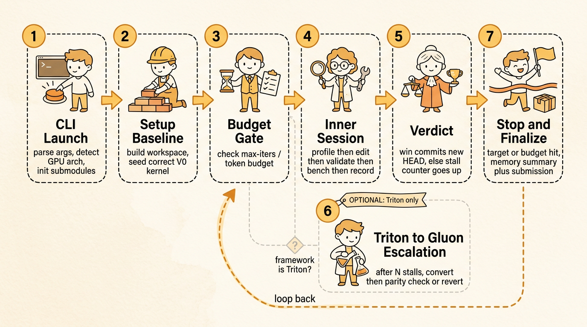

# Atrex Kernel Agent

AKA is an end-to-end Agent project for GPU kernel implementation, analysis, profiling, and iterative optimization. It helps an Agent turn PyTorch logic or an existing kernel into a high-performance GPU kernel through a structured, profile-driven workflow.


## What It Does

- Creates an isolated optimization workspace under `kernel_opt_<name>/`.
- Looks up target hardware specs from the local `gpu-wiki` knowledge base.
- Runs Roofline analysis and sets auditable performance targets.
- Implements a correct baseline kernel before entering optimization.
- Runs the profile-driven optimization loop: profile with `ncu` or `rocprofv3`, extract bottleneck evidence, query `gpu-wiki` / reference projects / web sources for relevant optimization knowledge, write an evidence-based plan, apply one optimization category, validate correctness and performance, record memory, commit, then repeat until Stop Conditions are met.
- Records plans, profile artifacts, structured memory, reports, and Git commits for every accepted iteration.

For the full architecture and workflow design, see [`docs/design.md`](docs/design.md).

## Optimization Routes

AKA ships two independent ways to run the same profile-driven workflow. Pick the one that matches how you want the loop to be driven:

| Route | Driver | Termination | Best for |
|-------|--------|-------------|----------|
| [Route 1: Interactive Skill](#route-1-interactive-skill-skillmd) | `gpu-kernel-optimizer` Skill + hooks, invoked inside a coding session | In-session judgment, guarded by hooks | Hands-on, interactive optimization from a coding runtime |
| [Route 2: Orchestrated Loop](#route-2-orchestrated-loop-orchestratoroptimizepy) | `orchestrator/optimize.py`, spawning fresh clean sessions per iteration | Mechanical (max iterations / token budget / target utilization) | Unattended, budget-bounded, batch optimization |

Both routes share the same knowledge base (`gpu-wiki/`), reference projects, tools (`tools/`), and structured memory format (`memory/v<N>.json`).

## Requirements

Shared requirements:

- `bash`
- `git`
- A compatible coding runtime installed

Running optimization tasks also requires platform-specific profiling tools:

- NVIDIA: `ncu`, wrapped by `tools/profile_nvidia.sh`
- AMD: `rocprofv3`, wrapped by `tools/profile_kernel.sh`

Route-specific requirements are listed in each route's section below.

---

## Route 1: Interactive Skill (`SKILL.md`)

This route installs the `gpu-kernel-optimizer` Skill and workflow hooks into your coding runtime. You then drive the optimization interactively from a coding session, and the hooks keep the workflow on track (memory reads, plan reads, correctness gates, stop-condition checks).

The optimization workspace `kernel_opt_<name>/` is created **in the current working directory** where you run the session, so all artifacts stay next to where you are working.

### Additional Requirements

- `jq` (required by `install.sh`)

### Installation

#### 1. Internal Development Environment Setup (internal users only — optional)

Internal users should configure git `insteadOf` URL redirect rules so that submodules and dependencies resolve against the internal network before running `git submodule update` below. **External users can skip this step entirely.**

#### 2. Pull reference-projects Submodule

```bash
git submodule update --init
```

Downloads all reference projects managed under `reference-projects/`.

#### 3. Run the Installer

```bash
bash install.sh --prefix [install-path]
```

The install path is optional; defaults to `~/aka_kernel_opt`.

Common options:

```bash
bash install.sh --prefix ~/my_path    # Install to a custom directory
bash install.sh --hooks-only          # Install or update hooks only
bash install.sh --without-github      # Skip GitHub-hosted reference repos
bash install.sh --uninstall           # Remove hooks installed by this script
```

The installer detects supported runtime home directories and prepares local hooks when available. It ships **only** the Skill route; the orchestrator route (Route 2) runs from the source repo and is pruned from the installed skill directory.

After installation, restart the coding runtime or open a new session so the hooks are loaded.

### Quick Start

Change into the directory where you want the optimization workspace to be created, then ask the Agent to optimize a kernel with at least:

- `platform`: target hardware platform, such as `H20` or `MI308X`.
- `framework`: target implementation framework, such as `CuteDSL` or `FlyDSL`.
- `kernel_demo`: path to the initial PyTorch logic or kernel implementation file.

Example:

```text
/gpu-kernel-optimizer Optimize /path/to/kernel_demo.py on MI308X with FlyDSL, dtype bf16, rel_err < 0.01.
```

The Agent initializes a `kernel_opt_<name>/` workspace in the current working directory, sources hardware specs from `gpu-wiki`, writes the workspace configuration, builds a baseline, profiles the kernel, and iterates until the configured Stop Conditions are met.

---

## Route 2: Orchestrated Loop (`orchestrator/optimize.py`)



This route runs the optimization loop from the source repo without installing anything into your coding runtime. `orchestrator/optimize.py` owns the **outer loop** and spawns a fresh, clean session for each iteration over the same git workspace. State crosses the session boundary only through disk (`memory/v<N>.json`, `plans/`, `profiles/`, and git), and HEAD is always the best kernel.

Termination is **mechanical**, not left to in-session judgment: the loop stops on a hard budget (max iterations or token budget) or a target-utilization short-circuit on a committed, correctness-passing iteration.

### Additional Requirements

- Python 3
- The `claude` CLI available on `PATH` (each iteration is a fresh `claude --print` session)
- `torch` (used to auto-detect the real runtime GPU architecture)

The orchestrator initializes the git submodules it needs on first run (`gpu-wiki/3rdparty`, `3rdparty/ncu-report-skill`, `3rdparty/humanize`). No `install.sh` step is required.

### Quick Start

Run a single-operator campaign directly against a SOL-ExecBench op directory (a dir containing `definition.json`, `reference.py`, and `workload.jsonl`):

```bash
python orchestrator/optimize.py \
    --op-dir /path/to/sol-execbench/op \
    --platform H20 --framework CuteDSL \
    --max-iters 20 --token-budget 8000000 --target-util 90
```

Everything op-specific (workspace name, the reference to optimize, the full workload/shape set, per-workload tolerances) is read from the SOL-ExecBench `--op-dir`; the ground-truth files (`definition.json`, `reference.py`, `workload.jsonl`) are used verbatim and never edited. Only `--platform` and `--framework` cannot be deduced and must be provided. A version that passes `test_kernel.py` in the workspace is directly submittable to SOL-ExecBench.

Key options:

```bash
--max-iters N        # Hard cap on optimization iterations
--token-budget N     # Hard token cap across all sessions (0 = no cap)
--target-util PCT    # Peak-utilization %% short-circuit (default 90)
--workspace DIR      # Working directory for the campaign (default: current directory)
--max-stall N        # Stop after N consecutive no-commit iterations (0 = disabled)
--convert-after N    # Triton only: after N stalled iters, run one Triton->Gluon convert session
--arch ARCH          # Override auto-detected runtime arch, e.g. sm_103 or gfx942
```

The workspace `kernel_opt_<name>/` is created under `--workspace` (or the current directory by default).

---

## Main Files

```text
.
├── SKILL.md                         # Route 1: gpu-kernel-optimizer router manifest
├── install.sh                       # Route 1 installer / uninstaller
├── orchestrator/                    # Route 2: clean-session optimization orchestrator
│   ├── optimize.py                  # Outer optimization loop driver
│   └── prompts/                     # Per-session prompts (setup, iteration, convert)
├── agents/                          # Subagent definitions used by both routes
├── docs/                            # Detailed project design docs
├── reference/                       # Workspace, plan, memory, and profiling templates
├── skills/                          # Baseline, optimizer, restart, and output-contract modules
├── tools/                           # Profiling, utilization, memory, and measurement tools
└── gpu-wiki/                        # Local GPU knowledge base
```

## Acknowledgements

This project builds on and references many excellent open-source works. We gratefully acknowledge the authors and communities behind them.

Reference kernel projects (`reference-projects/`):

- [CUTLASS](https://github.com/NVIDIA/cutlass) — CUDA Templates for Linear Algebra Subroutines
- [cutex](https://github.com/deciding/cutex) — CUDA Template Extensions
- [cuLA](https://github.com/inclusionAI/cuLA) — inclusionAI CUDA Linear Algebra
- [flash-attention](https://github.com/Dao-AILab/flash-attention) — Flash Attention
- [FlashInfer](https://github.com/flashinfer-ai/flashinfer) — Kernel library for LLM serving
- [FlyDSL](https://github.com/ROCm/FlyDSL) — ROCm FlyDSL
- [Triton](https://github.com/triton-lang/triton) — Triton language and compiler
- [DeepGEMM](https://github.com/deepseek-ai/DeepGEMM) — DeepSeek DeepGEMM
- [LeetCUDA](https://github.com/xlite-dev/LeetCUDA) — CUDA learning kernels
- [FlashMLA](https://github.com/deepseek-ai/FlashMLA) — DeepSeek FlashMLA
- [Composable Kernel](https://github.com/ROCm/composable_kernel) — ROCm Composable Kernel
- [cute-gemm](https://github.com/reed-lau/cute-gemm) — CuTe GEMM examples
- [hpc-ops](https://github.com/Tencent/hpc-ops) — Tencent HPC Ops
- [aiter](https://github.com/ROCm/aiter) — ROCm AIter
- [quack](https://github.com/Dao-AILab/quack) — Dao-AILab Quack
- [tilelang](https://github.com/tile-ai/tilelang) — TileLang

Knowledge base and tooling (`gpu-wiki/3rdparty/`, `3rdparty/`):

- [KernelWiki](https://github.com/mit-han-lab/KernelWiki) — GPU kernel knowledge base
- [modern-gpu-programming-for-mlsys](https://github.com/mlc-ai/modern-gpu-programming-for-mlsys) — Modern GPU programming for MLSys
- [ncu-report-skill](https://github.com/mit-han-lab/ncu-report-skill) — Nsight Compute report parsing skill
- [humanize](https://github.com/PolyArch/humanize) — Plan generation plugin

## Citation

Please cite our [paper](https://arxiv.org/abs/2607.14541) if it is helpful to your research.

```bibtex
@misc{atrex2026,
  title         = {Are LLM-Generated GPU Kernels Production-Ready? A Trace-Driven Benchmark and Optimization Agent},
  author        = {Lingyun Yang and Yuxiao Wang and Shenghao Liang and Linfeng Yang and Daocheng Ying and Chunbo You and Rui Zhang and Luping Wang and Yinghao Yu and Guodong Yang and Liping Zhang},
  year          = {2026},
  eprint        = {2607.14541},
  archivePrefix = {arXiv},
  primaryClass  = {cs.AI},
  url           = {https://arxiv.org/abs/2607.14541}
}
```

## License

Licensed under the [Apache License 2.0](LICENSE).
