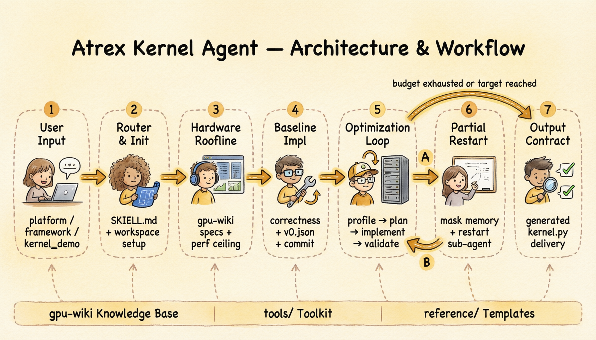
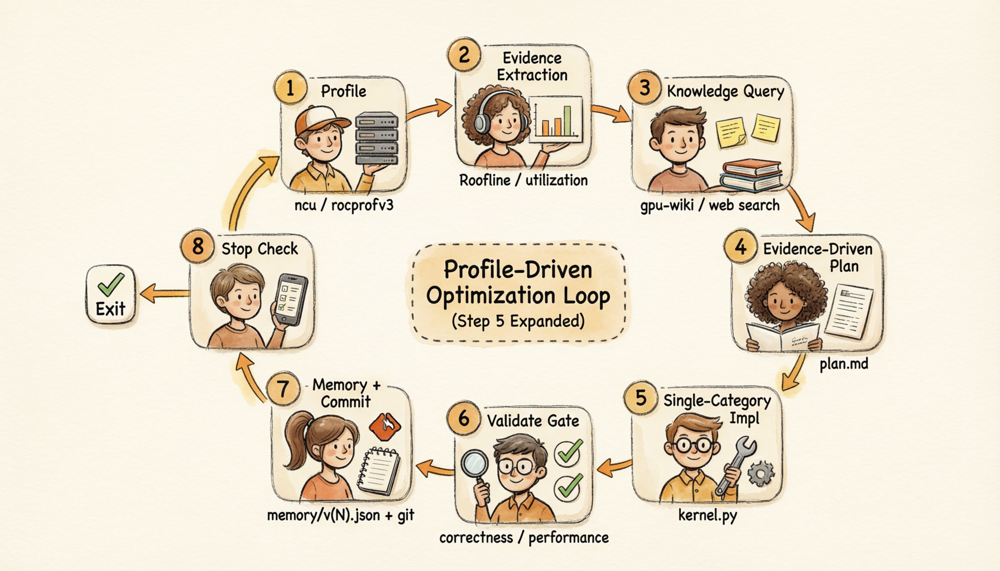
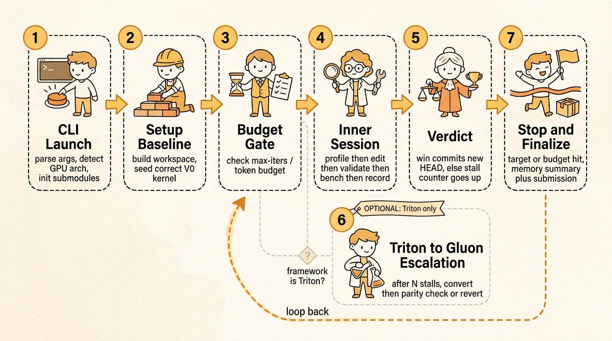

# Atrex Kernel Agent

AKA is an end-to-end Agent system for GPU kernel implementation, profiling, and iterative
optimization. The current repository exposes one supported optimization entry point,
`orchestrator/optimize.py`; the native `long_horizon/` package is its internal episode engine,
not a second CLI.





## News

- [2026-07] We helped **Qwen3.8** rank **No. 1** on the **SOL-ExecBench FlashInfer operator optimization leaderboard**. [[Leaderboard](https://research.nvidia.com/benchmarks/sol-execbench/leaderboard/collection/4/B200)]
- [2026-07] We released **Atrex Kernel Agent v0.2.0** with an orchestrated clean-session loop, native SOL-ExecBench operator workflow, Triton-to-Gluon conversion support, and a fuller NVIDIA profiling toolchain. [[Release](https://github.com/alibaba/atrex-kernel-agent/releases/tag/v0.2.0)]
- [2026-07] We released **the Atrex paper**: [Are LLM-Generated GPU Kernels Production-Ready? A Trace-Driven Benchmark and Optimization Agent](https://arxiv.org/abs/2607.14541).
- [2026-06] We released **Atrex Kernel Agent v0.1.0** as the initial open-source version, with the GPU Wiki knowledge base, profile-driven optimization workflow, profiling tools, and reference templates. [[Release](https://github.com/alibaba/atrex-kernel-agent/releases/tag/v0.1.0)]

## Current Design

- Accepts SOL-ExecBench operators and native Atrex-Bench shape operators through `--op-dir`.
- Creates one isolated Git workspace per framework and target. Leaderboard workspaces use
  `kernel_opt_<op>_<framework>_<platform>`; production workspaces add `_production`.
- Establishes a correctness-passing V0 and, by default in production mode, a self-contained
  framework-native V1 before optimization begins.
- When workload bucketing is enabled, collects evaluator-faithful structural signatures,
  partitions distinguishable workloads, and runs one independent Long Horizon campaign per bucket.
- Lets each episode perform multiple profile/research/plan/edit/repair cycles, while the
  supervisor alone owns budgets, terminal validation, same-allocation ABBA verification, and
  squash promotion.
- Builds workload aggregation mechanically from committed bucket kernels and accepts it only
  after full-workload correctness and geomean improvement checks.
- Preserves Git history, canonical `memory/v<N>.json`, plans, profiler evidence, episode journals,
  verification artifacts, and aggregation provenance for recovery and audit.

For the full architecture and workflow design, see [`docs/design.md`](docs/design.md).

## Quick Start

See the [Quick Start guide](docs/quickstart.md) for prerequisites and complete runnable examples of the orchestrated optimization loop.

## Orchestrated Optimization

`orchestrator/optimize.py` is the repository's only supported optimization entry point. It owns
mechanical termination, state recovery, Agent session isolation, sandbox execution, workload
coordination, and final packaging.



```text
operator inputs
  -> V0 correctness baseline
  -> optional framework-native V1
  -> structural workload inspection
  -> parallel bucket campaigns (or one unbucketed campaign)
  -> Long Horizon episode worktree
  -> journal + terminal handoff
  -> policy/protected-path checks + ABBA verification
  -> squash promotion
  -> deterministic full-workload aggregation when bucketed
  -> finalization
```

The orchestrator runs directly from the source repo and gives each canonical version an isolated
Git branch and worktree. A fresh Claude, Qoder, Codex, or Pi session owns one Long Horizon episode
and may execute many related engineering cycles before publishing a structured terminal handoff.
Claude and Codex can resume the same thread for bounded handoff recovery. The supervisor then
validates the journal and candidate, runs incumbent/candidate ABBA verification in one gateway
allocation, and squash-promotes only a strict correctness-passing improvement. The incumbent HEAD
therefore remains the best verified kernel. Repository-scoped skills are prepared under each
campaign's `.agents/skills/` without modifying the user's global Codex installation.

For SOL and native Atrex-Bench campaigns, the default flow collects evaluator-faithful,
production-visible runtime signatures in the sandbox. Signatures contain explicit non-tensor
arguments and tensor shape/stride/dtype/layout metadata, never tensor contents or hidden workload
values. The data-minimized inspector writes an exact, disjoint `workload_buckets.json`; workloads
with identical signatures cannot be split. Buckets then optimize concurrently in independent Git
workspaces. The first ten bucket versions form an aggregation warmup. Once every bucket has reached
V10 and produced a committed improvement, the orchestrator statically embeds the committed bucket
kernels into one self-contained dispatcher. Later wins replace only the affected bucket source.
No Agent or LLM writes aggregate dispatch code.

Every aggregate candidate must pass a separate full-workload single-seed run, five additional
correctness seeds, and a full-workload geomean comparison against the main incumbent. Signatures,
visibility policy, source blobs, pending wins, accepted kernels, and rejections remain auditable in
Git, `dispatch_signatures.json`, `aggregate_dispatch.json`, and `aggregation_state.json`.

Correctness/performance validation and profiling run on an atrex-gpu-gateway sandbox selected by
`--sandbox-hardware`. The gateway worker receives code and test/profile inputs only: optimizer `memory/`, plans,
edits, and Git state remain local. Structured test results and profile analysis artifacts are returned to the
local session. Evaluation is selected by input format: native atrex-bench operators (`shapes.json`) use the
canonical `atrex-bench/scripts/run_eval.py`, with workspace `test_kernel.py` acting only as an immutable
result adapter; SOL operators (`definition.json` + `workload.jsonl`) continue using SOL-ExecBench unchanged.
The same transport can be used directly:

```bash
python tools/sandbox.py --hardware REMOTE_GPU --no-sync -- python test_kernel.py --no-memory
python tools/sandbox.py --hardware REMOTE_GPU --sync profiles/v1 -- \
  bash tools/profile_nvidia.sh kernel.py --output-dir profiles/v1 --source

# Same interface on the bundled localhost FIFO scheduler
# Start it first with: python tools/local_gateway.py serve
python tools/sandbox.py --hardware local --url http://127.0.0.1:8000 \
  --no-sync -- python test_kernel.py --no-memory
```

Local gateway mode preserves the request/packaging/result interface but is not a security sandbox:
submitted commands run directly as the server user. The bundled scheduler serializes jobs by default,
persists their status in SQLite, and speaks the same public `agate dev`/jobs API. See
[docs/local_gateway.md](docs/local_gateway.md) for startup, queue, cancellation, and compatibility details.

Termination is **mechanical**, not left to in-session judgment: the campaign stops on a hard budget (maximum canonical versions or token budget), an optional stall limit, or a target-utilization short-circuit on a promoted correctness-passing version.

Everything op-specific (workspace name, reference, and full workload/shape set) is read from `--op-dir`.
Ground-truth files are never edited. Bucket workspaces receive derived filtered `workload.jsonl` or
`shapes.json` copies, while the main workspace retains and validates the complete set. `--platform` is
required. In the default `leaderboard` mode, `--framework` may select one framework explicitly; when omitted,
the orchestrator launches independent campaigns in parallel for Triton/CuteDSL/Cuda on NVIDIA,
Triton/FlyDSL on AMD, or Triton on unknown hardware.

Key options:

```bash
--max-iters N        # Hard cap on canonical optimization versions/episodes
--max-workload-buckets N # Inspector bucket cap (default 8)
--aggregate-min-improvement-pct PCT # Full-workload gain required for aggregate acceptance
--no-workload-bucketing # Run one unbucketed episode campaign
--token-budget N     # Hard token cap across all episode turns (0 = no cap)
--agent-cli CLI      # Episode backend: claude (default), qodercli, codex, or pi
--optimization-mode MODE # leaderboard (default) or production
--framework DSL      # One explicit DSL; omit to parallel-dispatch all supported DSLs
--framework-baseline MODE # auto (production only), always, or never
--target-util PCT    # Peak-utilization %% short-circuit (default 90)
--iter-timeout S     # Wall-clock budget for one complete episode (default 5400)
--setup-timeout S    # V0 setup session timeout (default 7200)
--sandbox-hardware GPU # agate selector/alias; independent of the logical --platform name
--sandbox-profile P  # Optional pre/prod endpoint; default uses agate config
--sandbox-url URL    # Explicit endpoint; use http://127.0.0.1:8000 with hardware=local
--sandbox-timeout S  # Remote command timeout, max 600 seconds
--workspace DIR      # Working directory for the campaign (default: current directory)
--max-stall N        # Stop after N consecutive unpromoted episodes (0 = disabled)
--convert-after N    # Triton only: after N stalls, require Gluon conversion until it succeeds (default 3)
--handoff-resumes N  # Same-thread recovery turns for an incomplete episode handoff (default 2)
--verify-repeats N   # Incumbent/candidate ABBA repeat pairs (default 2)
--verify-run-timeout S # Per evaluator run timeout inside ABBA verification (default 120)
--min-improvement-pct PCT # Strict ABBA gain required for promotion (default >0%)
--arch ARCH          # Override auto-detected runtime arch, e.g. sm_103 or gfx942
```

Auto-dispatched main campaigns use flat framework/hardware suffixes. Leaderboard examples are
`<workspace>/kernel_opt_<name>_triton_h20` and
`<workspace>/kernel_opt_<name>_cutedsl_h20`; production uses distinct paths such as
`<workspace>/kernel_opt_<name>_triton_h20_production`. Each main workspace owns its full-workload `kernel.py`,
bucket manifest, aggregation history, and ignored `workload_buckets/` directory containing the
independent bucket Git workspaces. Each bucket receives its own full episode/version and
token budgets. Explicit `--framework` campaigns use the same naming convention.

`--optimization-mode leaderboard` preserves the existing permissive `CLAUDE.md` workflow: sessions may
use a different/mixed implementation or third-party kernel libraries when profiling evidence supports it.
`--optimization-mode production` also supports omitted `--framework`: the orchestrator auto-dispatches the
hardware-supported frameworks and binds every child campaign to its assigned framework. V0 may remain the
PyTorch correctness baseline, but every accepted optimized candidate must be implemented directly and
exclusively in that child's framework. Third-party kernel/operator imports, calls, and solution dependencies are forbidden. A mechanical
post-episode gate rejects non-compliant candidates, records the rejection,
and refuses to package a non-compliant final kernel. A production Triton campaign escalates to the same
toolchain's Gluon DSL after three consecutive stalls. Once triggered, conversion is mandatory and retries
immediately until correctness and performance parity pass; later episodes remain in Gluon.

```bash
python orchestrator/optimize.py \
  --op-dir /path/to/op --platform TARGET_GPU --sandbox-hardware REMOTE_GPU \
  --optimization-mode production --framework Triton
```

`--platform` is a logical optimization target while `--sandbox-hardware` is the gateway selector. The
orchestrator deliberately does not compare their names or reported GPU models because gateway inventory
may be aliased or desensitized. Runtime architecture probing remains authoritative when an omitted
`--framework` requires vendor-specific dispatch.

All four backends run non-interactively and start each episode with clean conversational state,
using the same workspace-local skills, prompt, sandbox constraints, and quality gates. Authenticate the selected CLI first with
`claude auth status`, `qodercli status`, `codex login status`, or `pi --list-models`. Provider-specific
settings can be supplied through `ATREX_CLAUDE_SESSION_SETTINGS`, `ATREX_QODER_SESSION_SETTINGS`,
`ATREX_CODEX_SESSION_SETTINGS`, or `ATREX_PI_SESSION_SETTINGS`; `ATREX_SESSION_SETTINGS` remains the
generic fallback. For Codex,
the setting value must be either a JSON object or a JSON array of literal `key=value` strings and is
translated to repeatable `codex exec -c` arguments, for example:

```bash
export ATREX_CODEX_SESSION_SETTINGS='{"model":"gpt-5.6-sol","model_reasoning_effort":"xhigh"}'
```

Pi uses `--mode json`, a unique persisted session id, and the configured Pi provider/model. Optional
provider/model selection is restricted to non-secret CLI values:

```bash
export ATREX_PI_SESSION_SETTINGS='{"provider":"anthropic","model":"claude-opus"}'
python orchestrator/optimize.py ... --agent-cli pi
```

Codex JSONL `turn.completed.usage` remains the cumulative session total, while per-turn deltas come
from the matching native rollout. Non-episode Codex phases use a fresh thread in an isolated temporary
`CODEX_HOME` that links existing auth, config, and skills while containing new rollout and state
files; the temporary home is removed after normalization or terminal-only fallback. `session_meta` is
consulted only when stdout omits the workspace or thread identity. Every available
input/output/cache/total component must reconcile before phase attribution, and ledger or cleanup
observation errors do not change the Agent result. Long-horizon rollouts remain available for bounded
same-thread resume and are read incrementally. A resume-time ledger failure derives the invocation
budget delta from consecutive cumulative stdout totals instead of double-counting the session. Cache
and reasoning sub-counters are not double-counted. Pi finalized message usage, including cache read/write counters,
is aggregated after `agent_settled`. Some Qoder models report zero token usage in stream JSON; in
that case `--token-budget` cannot be enforced and `--max-iters` remains the hard campaign bound.

## Main Files

```text
.
├── orchestrator/                    # Public optimization entry and shared policy
│   ├── optimize.py                  # Long Horizon campaign driver
│   ├── agent_runtime/               # Claude/Qoder/Codex/Pi backend adapters
│   ├── telemetry/                   # Phase token aggregation
│   └── prompts/                     # Setup, inspection, baseline, and episode prompts
├── long_horizon/                    # Internal episode/worktree/ABBA engine
├── agents/                          # Workspace-local baseline Agent definition
├── docs/                            # Detailed project design docs
├── reference/                       # Workspace init, evaluator adapters, schemas, SOL packaging
├── reference-projects/              # Optional source-search repositories used by episodes
├── skills/                          # Workspace-local baseline skill used by Agent sessions
├── tools/                           # Sandbox, local gateway, profiling, memory, and measurement tools
├── gpu-wiki/                        # Architecture-scoped GPU knowledge base
└── 3rdparty/                        # Runtime planning and profiler-analysis dependencies
```

## Acknowledgements

This project builds on and references many excellent open-source works. We gratefully acknowledge the authors and communities behind them.

Reference kernel projects (`reference-projects/`):

- [CUTLASS](https://github.com/NVIDIA/cutlass) — CUDA Templates for Linear Algebra Subroutines
- [cutex](https://github.com/deciding/cutex) — CUDA Template Extensions
- [cuLA](https://github.com/inclusionAI/cuLA) — inclusionAI CUDA Linear Algebra
- [flash-attention](https://github.com/Dao-AILab/flash-attention) — Flash Attention
- [FlashInfer](https://github.com/flashinfer-ai/flashinfer) — Kernel library for LLM serving
- [FlyDSL](https://github.com/ROCm/FlyDSL) — ROCm FlyDSL
- [Triton](https://github.com/triton-lang/triton) — Triton language and compiler
- [DeepGEMM](https://github.com/deepseek-ai/DeepGEMM) — DeepSeek DeepGEMM
- [LeetCUDA](https://github.com/xlite-dev/LeetCUDA) — CUDA learning kernels
- [FlashMLA](https://github.com/deepseek-ai/FlashMLA) — DeepSeek FlashMLA
- [Composable Kernel](https://github.com/ROCm/composable_kernel) — ROCm Composable Kernel
- [cute-gemm](https://github.com/reed-lau/cute-gemm) — CuTe GEMM examples
- [hpc-ops](https://github.com/Tencent/hpc-ops) — Tencent HPC Ops
- [aiter](https://github.com/ROCm/aiter) — ROCm AIter
- [quack](https://github.com/Dao-AILab/quack) — Dao-AILab Quack
- [tilelang](https://github.com/tile-ai/tilelang) — TileLang

Knowledge base and tooling (`gpu-wiki/3rdparty/`, `3rdparty/`):

- [KernelWiki](https://github.com/mit-han-lab/KernelWiki) — GPU kernel knowledge base
- [modern-gpu-programming-for-mlsys](https://github.com/mlc-ai/modern-gpu-programming-for-mlsys) — Modern GPU programming for MLSys
- [ncu-report-skill](https://github.com/mit-han-lab/ncu-report-skill) — Nsight Compute report parsing skill
- [humanize](https://github.com/PolyArch/humanize) — Plan generation plugin
- [AKO4ALL](https://github.com/TongmingLAIC/AKO4ALL) — AKO4ALL
- [KDA](https://github.com/mit-han-lab/kernel-design-agents) — Kernel Design Agents

## Citation

Please cite our [paper](https://arxiv.org/abs/2607.14541) if it is helpful to your research.

```bibtex
@misc{atrex2026,
  title         = {Are LLM-Generated GPU Kernels Production-Ready? A Trace-Driven Benchmark and Optimization Agent},
  author        = {Lingyun Yang and Yuxiao Wang and Shenghao Liang and Linfeng Yang and Daocheng Ying and Chunbo You and Rui Zhang and Luping Wang and Yinghao Yu and Guodong Yang and Liping Zhang},
  year          = {2026},
  eprint        = {2607.14541},
  archivePrefix = {arXiv},
  primaryClass  = {cs.AI},
  url           = {https://arxiv.org/abs/2607.14541}
}
```

## License

Licensed under the [Apache License 2.0](LICENSE).
