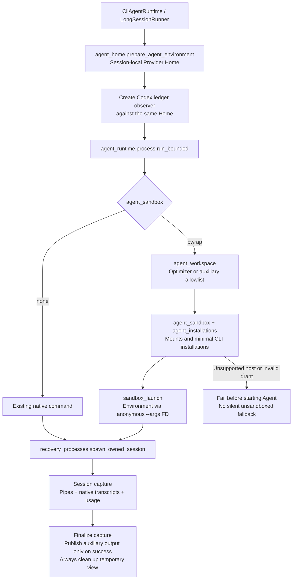

# Agent workspace isolation

AKA launches coding-agent sessions inside a Linux Bubblewrap namespace by default (`--agent-sandbox bwrap`). This isolates the coordinator-side filesystem; it is separate from the Gateway or SSH sandbox that executes GPU jobs. Native execution remains available only through an explicit `--agent-sandbox none` or `ATREX_AGENT_SANDBOX=none`; unsupported hosts or missing Bubblewrap fail instead of silently disabling isolation.

The [Supervisor GPU/Wiki Runtime](supervisor-runtime.md) handles remote requests; [Supervisor-owned handoff](supervisor-promotion.md) keeps optimization Episode Git/control state outside a persistent Agent draft. Framework Baseline and auxiliary workflows retain their scoped behavior.

## Launch lifecycle



The command and workspace retain their original absolute paths inside the namespace. Linked tools and native-session discovery retain their paths. Managed optimization Sessions run in a separate Git-free draft, not the controller's Git worktree. `HOME`, Provider config roots and XDG directories point to the isolated Home before ledger observers and capture are initialized. Recovery-owned launches pass the anonymous argument FD through their ownership wrapper; the parent closes it after spawning.

Campaign reviewer-state environment paths keep their lexical absolute form only in `bwrap` mode, so mount validation can detect symlinks. Native `none` mode retains the existing `Path.resolve()` behavior, including symlink resolution and `..` normalization. Wiki-profile paths are now Supervisor-only and no longer create Agent mounts.

Direct launches omit Bubblewrap's `--die-with-parent`, preserving the native path's process-lifetime behavior: Supervisor or spawning-thread exit alone does not kill the Agent. This does not guarantee survival of lost output pipes or automatic reattachment. Recovery handoffs retain the flag, binding the sandbox to the durable ownership wrapper rather than the original Supervisor; the existing cleanup guardian remains responsible for orphan cleanup. Timeouts and explicit interruptions still use the existing process-group termination logic in both modes.

## Usage and rollback

Campaigns use Bubblewrap by default; the explicit option below is equivalent:

```bash
python3 orchestrator/optimize.py \
  --op-dir /path/to/operator \
  --platform TARGET_GPU --sandbox-hardware REMOTE_GPU \
  --framework Triton --agent-cli claude \
  --agent-sandbox bwrap
```

The coordinator needs Linux, `bwrap` on `PATH`, and permission to create unprivileged user/mount/PID namespaces. A remote GPU Gateway does not satisfy that requirement. On macOS run the coordinator inside a Linux VM such as Lima, or explicitly select `none` to accept native execution without filesystem isolation. A container host must permit Bubblewrap namespace/proc mounts; `bwrap` never silently bypasses a failed isolation setup.

| Setting | Meaning |
| --- | --- |
| `--agent-sandbox none\|bwrap` | Default `bwrap`; explicit `none` disables filesystem isolation. `ATREX_AGENT_SANDBOX` sets the CLI default; an explicit flag wins. |
| `--bwrap-executable PATH` | Bubblewrap executable; default `bwrap`, or `ATREX_BWRAP_EXECUTABLE` |
| `--agent-read-only-path PATH` | Explicit extra read-only host path, repeatable; mounted at its original absolute path |

Additional grants are operator-authorized exceptions, not automatic dependency discovery. Broad host-home/repository roots and paths overlapping the writable workspace/session homes are rejected. Custom wrappers, external CA bundles, SSH identities, plugins or installations outside the supported layouts may need a narrowly scoped grant and corresponding client configuration. Do not grant whole credential or transcript directories to make a missing dependency disappear.

When upgrading a previously native Campaign, explicitly retain `--agent-sandbox none` if its recovery must use the same native Provider Home; omitted flags now select `bwrap`. To disable the launch boundary, stop the campaign normally and launch with `--agent-sandbox none`. Existing prompts, accepted commits and evaluation policy remain compatible. Isolated Provider sessions are not automatically imported into the operator's global Home; a recovery that requires native CLI thread state must continue in the mode/Home that created it, or start a fresh Agent invocation using the existing recovery flow.

## Filesystem and credentials

The namespace starts from an empty root, not a read-only copy of the host root. It contains:

- Read-only system runtime directories and selected OS configuration/certificate files, minimal `/dev`, a private PID namespace and `/proc`, and private `/tmp` and `/run`.
- The current Optimizer workspace at its original path, with mutable draft/scratch and read-only public inputs, canonical memory, installed HTTP client and manifest-listed Skills. Runtime-authorized sessions do not mount the whole repository tool/reference/Supervisor trees; the shell guard is mounted separately.
- A writable, per-Session Provider Home under `<workspace-parent>/.atrex-agent-homes/<key>/`. Different workspaces/Sessions receive separate copies; same-Session resume keeps its Home. Homes are outside the candidate Git tree.
- Minimal executable files, recognized npm packages/dependencies and Python installation libraries needed by the CLI. Runtime-managed sessions do not add an Agate installation mount. Discovery never restores an entire first-level directory under the operator Home. Installation aliases pointing into Provider history/auth state or the private Session storage are rejected.

Only selected login/settings files are seeded for the active backend. Claude/Qoder/Codex/Pi transcript trees, caches and arbitrary global plugins are not copied. Qoder's `.auth/user` and `machine_id` are included; its entire `.qoder` or `.qodersec` tree is not mounted. Destination directory traversal does not follow Agent-created symlinks. Existing Session-local settings are preserved on resume, and changes never write back to the operator Home.

These are copies, not live credential synchronization: refreshed host login state does not overwrite an existing Session Home. State files are private to the owning OS user and can contain credentials and raw conversations. Retain them for resume, and remove them only after that Session is stopped and no longer needed. Session capture remains outside the workspace by default and uses the same isolated Home; do not explicitly relocate capture into an Agent-writable path if it must remain private.

Environment inheritance otherwise follows the existing CLI contract. Model credentials intentionally supplied to the Agent remain usable by it. Gateway credentials are removed before launch; the Agent receives a workspace-scoped HTTP capability instead. New Homes do not copy Agate configuration, and old copies are masked for resumed Runtime-managed sessions. Environment values are passed through an anonymous `bwrap --args FD`, not `--setenv KEY secret` in the process command line. This is not protection against a privileged host operator or another process with equivalent OS credentials.

## Auxiliary sessions

Supervisor-launched auxiliary sessions receive a temporary allowlist view at their original working directory. Inputs are mounted read-only; only declared output files are copied back with bounded, no-follow reads after normal process completion with exit code zero and no policy/environment termination. Timeout, interruption, process failure or guard termination skips publication and leaves existing destination reports unchanged. Other files written in that view are discarded. The existing caller still validates report contents.

Temporary-view cleanup is attempted whether publication succeeds, fails or is skipped. If cleanup also fails while another exception is propagating, it adds a diagnostic note to that exception instead of replacing it. Otherwise it logs a warning with the residual view path without changing the returned stdout, stderr, exit status or timeout flag; a logging failure also cannot replace the result. The temporary view may remain on disk and need later cleanup. A publication error on an otherwise successful session still propagates to the caller.

| Role | Read-only inputs | Returned files |
| --- | --- | --- |
| Public problem generation | `reference.py`, `input.py`, `shapes.json`, `metadata.json` | `agent_problem.json` |
| Production policy review | `review_request.json`, `candidate/` | `dependency_review.json` |
| Baseline exit review | `crash_record.json`, `candidate/` | `resume.json` |
| Baseline correctness review | `context/` | `correctness_review.md` |

The allowlist contains at most 4,096 files / 16 MiB; each returned file is limited to 8 MiB. These roles receive no campaign Git, Gateway/private-reference, Wiki-history or recovery-state mounts. Public problem generation is the explicit trusted preprocessing exception that reads exact shapes to create the public contract; optimization sessions do not inherit its input view.

Provider-created child Agents inherit their Optimizer namespace, not a separate auxiliary allowlist. No persistent cross-Episode plan-review session is launched.

## Legacy grants and scope limits

Managed optimization Episodes use a persistent Git-free draft; the Supervisor owns candidate commits and acceptance. Some older roles and explicitly scoped helpers retain compatibility grants:

| Role or behavior | Access | Authority |
| --- | --- | --- |
| Managed optimization Episode | Draft source and engineering artifacts; no real worktree, Git, private Journal or handoff | Supervisor seals measured source after `episode-report` |
| Framework Baseline and non-managed integrations | Existing campaign Git grants; only user name/email copied from global Git configuration | Retain their existing workflow, outside the optimization-Episode contract |
| Agent calls `tools/sandbox.py` | HTTP client and per-invocation capability; no evaluator/private-input/Gateway-credential grant | Supervisor GPU/Wiki Runtime |
| Explicitly configured recovery/diagnostic helpers | Explicitly scoped telemetry and helper-state directories for append/atomic replace | Managed Episodes cannot grant access to the private worktree/store |

Writable file grants include the containing directory to support atomic replacement and lock files. Validation checks that actual directory before creating or mounting it: it must not be the operator Home or an ancestor, traverse symlinks, or overlap the `.atrex-agent-homes` root in either direction. The current Session Home is mounted only through the dedicated Home setup, never through these legacy environment grants. Use a dedicated log/state subdirectory rather than placing a granted file directly under the operator Home.

For managed optimization Episodes, Bubblewrap enforces the private worktree/Git/Journal boundary described in [Supervisor handoff and promotion](supervisor-promotion.md). Framework Baseline and non-managed integrations do not have that contract. Native mode separates working directories cooperatively but does not isolate processes sharing the operator's UID. Arbitrary GPU probe code remains untrusted; bounded Runtime projections are not a semantic data-loss-prevention guarantee for everything a probe could print.

The Agent shares the host network for model and loopback Runtime access; Gateway/Wiki/SSH operations run on the Supervisor. Filesystem isolation adds no network allowlist or cgroup resource quota. Custom operator grants and inherited environment variables remain part of the trusted launch configuration.

## Scratch lifecycle

In `bwrap` mode, a newly materialized Episode starts with an empty `scratch/`. Resuming the pre-execution `preparing` phase also resets it; same-Episode exploration/recovery does not. Only that exact directory is cleared, and a symlink is removed without touching its target. The default native mode retains its existing behavior. No new requirement to write plans or reports under `scratch/` is introduced.

## Verification

Local fixtures are kept outside this repository, following its review convention. Checks cover no-sandbox compatibility, repeated CLI parsing, unsupported-host failure, minimal installation mounts, Provider-state isolation, rejection of host-Home/Session-Home legacy grants, safe Home reseeding, anonymous argument ownership, auxiliary input/output rules and scratch symlinks. Linux subprocess checks use temporary fake Agents, including the real Codex adapter launch path, without model/GPU calls. Lifecycle checks cover direct Supervisor/spawning-thread exit, handoff survival across Supervisor exit, ownership-wrapper death cleanup, and timeout cleanup.

On Lima Ubuntu (Python 3.14.4, Bubblewrap 0.11.1), the isolation suite passes, including actual read-only mounts, hidden host files, Git worktree commits, native Session capture, recovery-wrapper FD propagation and timeout cleanup. PR1's external 111-check regression suite also passes on the native path. Installed Claude 2.1.235, Codex 0.148.0 and Qoder 1.1.28 execute `--version` inside the namespace. Pi is not installed in that VM; live authentication, model calls and GPU end-to-end campaigns were not exercised.

For a no-model smoke check on Linux, run from the repository root:

```bash
python3 - <<'PY'
import os
import sys
import tempfile
from pathlib import Path
from orchestrator.agent_runtime.process import run_bounded

with tempfile.TemporaryDirectory(prefix="aka-sandbox-smoke-") as temporary:
    workspace = Path(temporary) / "workspace"
    workspace.mkdir()
    environment = dict(os.environ, ATREX_AGENT_SANDBOX="bwrap", ATREX_SESSION_CAPTURE="0")
    output, error, code, timed_out = run_bounded(
        [sys.executable, "-c", "from pathlib import Path; Path('probe').write_text('ok'); print('ok')"],
        workspace, 20, environment,
    )
    assert code == 0 and not timed_out, (code, error)
    assert (workspace / "probe").read_text() == "ok"
    print(output.strip())
PY
```
