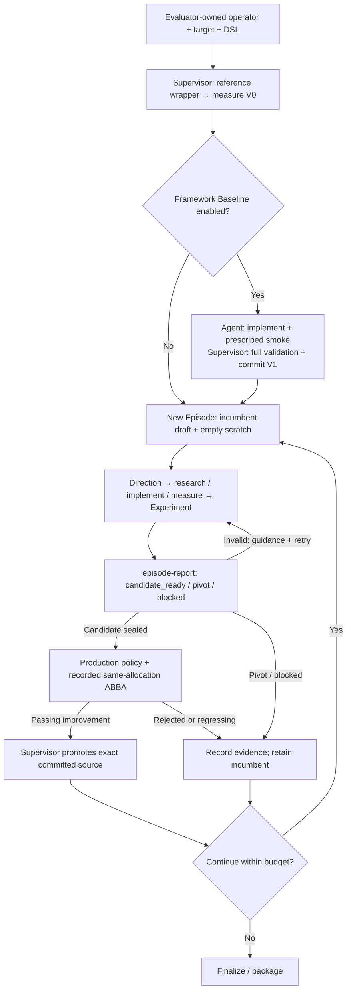
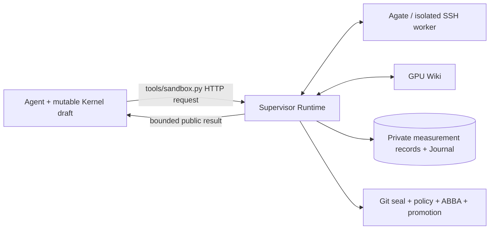

# Architecture Design

Atrex Kernel Agent runs evidence-backed GPU kernel optimization through one entry point:
`python3 orchestrator/optimize.py`. Claude, Codex, Qoder and Pi share the same Episode contract.
The Agent chooses research and implementation steps; the Supervisor owns execution authority,
durable evidence, Git, validation, promotion and recovery.

## Campaign lifecycle



There is no Setup Agent or Fast/Full Episode split. Native Atrex-Bench and SOL operators use
deterministic V0 initialization. Framework Baseline remains a bounded implementation session,
not an optimization Episode: it smoke-tests and exits; the Supervisor decides acceptance.
Public-contract generation, when required, is a separate preprocessing session, not kernel setup.

After sustained stalls, the controller can select a broader goal strategy within this same
Episode workflow. It never changes correctness or promotion gates. See
[Goal scheduling](../long_horizon/README.md#goal-scheduling). Operator-enabled
[plugins](plugins.md) expose schema-described tools through the authenticated Runtime; plugin
resources and execution remain private, while declared public Skills are copied into the workspace.
Production reviewer execution timeouts, explicitly reported by the completed Session, have a
persisted one-retry allowance with fresh isolated evidence. Unrelated OS/socket timeouts propagate
without consuming that allowance; explicit service outages wait without consuming coding Episodes.
Reviewer execution timeouts update only their separate retry budget, leaving any existing
infrastructure outage status, count, deadline and reason unchanged.

Every optimization Episode uses the same report and ABBA acceptance path. Profiling, Wiki and
custom probes answer concrete questions, not mandatory phase checklists. Directions hold plans;
Experiments hold evidence links and analysis. No separate plan/profile document or Agent-written
Phase Marker is required. Production, conversion and numerical-safety policies remain enforced.

## Execution and authority



- Agent: explore at most three Directions per Episode, one at a time; edit the candidate; record
  decisive experiments; submit a repairable report. It cannot supply trusted measurements or Git identity.
- Supervisor Runtime: authorize Session/workspace scope, supply private evaluator inputs, snapshot
  precise sources, retry infrastructure failures, bound public results, persist records and Journal.
- Evaluator/worker: correctness and performance facts. Profile duration or diagnostic Dev results
  do not replace the complete official Evaluate needed to submit a candidate.
- Supervisor: bind report → selected Experiment → passing Evaluate → exact Kernel; reuse matching
  base-plus-five-seed correctness (the Atrex-Bench Evaluate default), or run the missing untimed check,
  before accepting and committing the candidate;
  require independent policy approval in production and passing recorded ABBA; promote
  only a strict improvement. Ordinary Evaluate is not an ABBA comparison.

Agent-run ABBA is optional. Its exact acceptance command is injected from the verifier's effective
configuration. Matching recorded evidence is reused; changed inputs/options/evaluator/policy can
require another measurement. The measurement repetition policy is unchanged by workflow simplification.

Agent isolation defaults to `--agent-sandbox bwrap`, requiring Linux and Bubblewrap. It provides
a filesystem boundary with scoped Provider Homes and explicit mounts, with no silent native
fallback. Explicit `--agent-sandbox none` preserves native macOS/Linux coordination with same-UID
limitations. GPU execution isolation is a separate boundary. See
[workspace isolation](agent-workspace-isolation.md) and [Supervisor Runtime](supervisor-runtime.md).

## Agent-facing workspace

```text
workspace/
├── kernel.py                     # Mutable candidate
├── README.md / CLAUDE.md          # Task and engineering constraints
├── public operator contracts     # Native or SOL; mode-dependent visibility
├── memory/vN.json                # Supervisor-generated outcomes, read-only
├── scratch/                      # Requests, probes and temporary exact source copies
├── tools/sandbox.py              # HTTP client, not evaluator implementation
├── skills/                       # Reviewed, explicit file manifest
└── .claude|.qoder|.agents/skills/  # Backend discovery links
```

Managed Episode drafts contain no real Git metadata, private evaluator or controller Journal.
New Episodes start with empty `scratch/`; retries/resumed invocations of the same Episode preserve
the draft and scratch. Sealed candidates remain authoritative after report acceptance, even if the
Agent later edits its draft. Publication/recovery uses the seal and records integrity warnings.
Read-only enforcement is provided by bwrap; native mode remains cooperative same-UID execution.

Always installed: `gpu-measurement`, `runtime-records`, `KernelWiki`; timeline diagnostics are
also installed and PPU diagnostics are selected on PPU. Only manifest-listed files enter the view.
The old Setup/Episode-loop/gen-plan skills and external NCU skill's redundant workflow are not mounted.
Typed Profile and Supervisor profiler support remain available.

Framework Baseline's optional Codex/Qoder reviewers inspect only the bounded public operator
contract, including its semantic `reference.py`. V1 has no implementation-reference catalog,
shortlist or `reference/` packet. Missing framework/toolchain knowledge can be resolved through
at most one Wiki query. Guidance cached with the retired reference-selection schema is regenerated.

## Persistence and recovery

- Private Measurement Store: global Kernel/Record IDs, exact source, request identity, raw and public
  responses, deduplication and resumable execution. See [measurement records](measurement-records.md).
- Private Runtime Journal: stable Direction/Experiment IDs, lifecycle events, Gateway references,
  terminal report and seal. List/load tools expose authorized current/history views. See
  [Runtime Journal](runtime-journal.md).
- Controller Git/control state: incumbent, Episode branch/worktree, canonical `memory/vN.json`,
  budgets and durable checkpoints. Rejected outcomes preserve evidence without replacing the Kernel.
- Session capture: prompt, normalized conversation, Provider streams/native transcripts and usage,
  including subagents when observable. Capture is diagnostic, not acceptance authority. See
  [session observability](session-observability.md). Retained historical Phase Markers can be read;
  new Episodes do not emit them as a workflow requirement.
- Promotion audit: private evidence bound to the Git promotion. Recovery verifies the seal/audit,
  does not silently rerun a promoted candidate, and offers explicit operator repair when evidence
  is missing. See [handoff and promotion](supervisor-promotion.md).

Interrupted managed Episodes resume in place when controller identity still matches; invalid or
lost worktrees are archived as interrupted rather than invented as success. Session recovery,
measurement retry, and Campaign resume remain separate mechanisms.

## Upgrade and rollback

Upgrade at a completed Episode boundary after stopping the old Supervisor. Completed numbered
memory and private records remain readable. An unfinished historical Fast Episode is explicitly
rejected: finish it with the previous release before upgrading; do not silently change its gate.
SOL runtime relinking does not add `/atrex-bench` to an existing committed `.gitignore`;
that entry is added only when an Atrex-Bench runtime is configured. Episode-boundary
dirty-worktree checks remain strict, with no automatic ignore-file commit or exemption.
For rollback, stop the new Supervisor and restore the prior executable revision together with an
operator backup of Campaign Git/control/private state. Do not mix active processes from two versions.

Runtime relinking migrates reserved Skill names under `skills/`, `.claude/skills/`,
`.qoder/skills/` and `.agents/skills/`. The retired names are exactly `humanize`,
`humanize-gen-plan`, `humanize-refine-plan`, `humanize-rlcr`, `gen-plan`, `gpu-kernel-baseline`,
`gpu-kernel-episode-loop` and `ncu-report-skill`; PPU-only assets are also removed from discovery
when PPU is not selected. Existing real directories/files or noncanonical links at an active
backend Skill name are migrated before installing its current workspace link. Unknown names
are untouched; there is no `humanize*` wildcard cleanup.

Migration atomically moves entries (including symlinks themselves, never their targets) into
`<workspace-parent>/.atrex-supervisor-runtime/<workspace-scope>/skill-migrations/<id>/`, preserving
their original workspace-relative paths and logging each backup location. Backups are outside
the Agent workspace and Skill discovery; nothing is recursively deleted. Repeated relinking
preserves current links without creating more backups. A blocked rename or symlinked discovery
root fails closed: stop the Supervisor, repair the path/permissions or move the conflicting
entry to an operator backup, then retry. For rollback, use the full pre-upgrade workspace backup;
the logged migration copies can recover local Skill edits but are not a full Campaign snapshot.

Removed CLI: `--fast-episodes`, `--fast-trials`, Fast/Full plan-review switches and
`--long-reviewer-session`. `--setup-timeout` is replaced by `--problem-generation-timeout` for public
contract authoring only. Its default and per-attempt hard cap are 1800 seconds; the effective
timeout remains `min(configured_timeout, 1800)`. Validation failure permits one repair attempt
(at most two authoring sessions), not an unbounded retry loop. Existing valid public contracts
skip authoring. Baseline, production-policy and ABBA controls retain their own meanings.

The simplification removes redundant prompt instructions and workflow bookkeeping; it does not
assert a measured token saving or kernel speedup. Fewer mandatory probes can change search behavior;
all-Episode ABBA may increase GPU usage relative to historical Fast runs. Use controlled campaigns
to measure those effects independently of infrastructure regressions.

## Verification

Local verification on macOS/Python 3.14 covers 73 regressions using temporary fixtures outside
the repository: 29 Journal checks, 11 managed handoff/promotion checks, 24 acceptance/private-path/
Dev/audit-recovery checks, and 9 workflow checks. It exercises real Git and loopback HTTP with
a fake GPU executor, including deterministic native/SOL V0, an empty pivot followed by candidate
promotion, scratch lifecycle, source sealing, report repair, non-default exact ABBA reuse and
checkpoint repair. Curated Skill installation, PPU asset completeness, removed CLI flags and
unfinished-Fast upgrade rejection are checked. Python static checks, shell syntax and whitespace
checks pass. These checks do not execute a real coding model, GPU job or Linux Bubblewrap namespace;
those deployment checks remain necessary before a production rollout.
