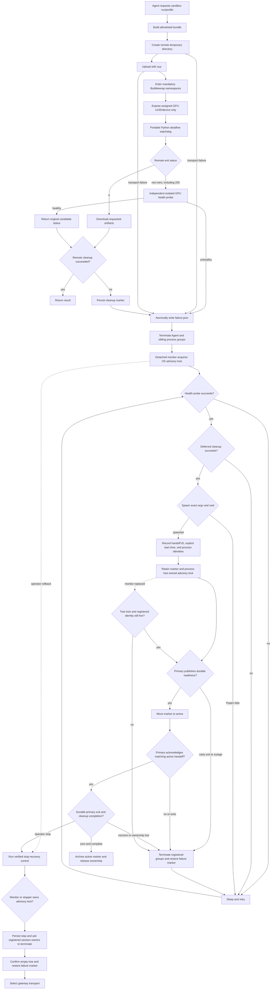

# Architecture Design

## Overview

Atrex Kernel Agent is an orchestrated system for GPU kernel implementation, profiling, and
iterative optimization. The repository has one supported entry point: `orchestrator/optimize.py`.
It owns the optimization lifecycle and launches isolated Long Horizon episodes through Claude,
Qoder, Codex, or Pi. A user may invoke that entry point directly or ask a coding agent in the
repository to translate a natural-language task into its CLI arguments and launch it.

Agent sessions propose and implement changes. The orchestrator remains authoritative for
budgets, state transitions, sandbox execution, correctness and performance gates, production
policy, rollback, aggregation, and final packaging.

Each canonical optimization version is one multi-experiment episode in a private Git worktree.
The internal `long_horizon/` engine supplies worktree isolation, Supervisor-owned journals, handoff recovery,
same-allocation ABBA verification, and squash
promotion; it is not a second CLI.

## Design Goals

- **Mechanical control**: termination and acceptance are decided by code rather than Agent
  self-assessment.
- **Evidence-driven optimization**: every Episode uses the same Direction/Experiment workflow,
  with targeted research or profiling when needed and Runtime-backed ABBA before promotion.
- **Reproducible state**: Git HEAD is the incumbent kernel; stable Direction and Experiment IDs,
  immutable Kernel/Gateway records, and canonical memory preserve intent separately from facts.
- **Execution isolation**: GPU work crosses `tools/sandbox.py`; campaign memory, plans, edits,
  and Git state remain local.
- **Evaluator integrity**: immutable ground truth and full-workload validation prevent harness
  edits or partial-shape wins from becoming accepted results.
- **Production provenance**: production mode keeps deterministic structure and campaign-state
  invariants, while the supervisor sends every candidate to an isolated policy Agent for complete
  framework, compute-provenance, dependency, loader, and manifest review.
- **Backend portability**: one Agent Runtime interface normalizes commands, events, usage, and
  process policy across supported coding CLIs.

## Project Structure

```text
.
├── orchestrator/
│   ├── optimize.py                    # CLI entry point: arguments, framework dispatch, run wiring
│   ├── campaign.py                    # Single-operator campaign: baseline, episodes, promotion
│   ├── operator_layout.py             # Supported operator layout detection
│   ├── session_io.py                  # Coding-agent sessions, dependency review, sandbox I/O
│   ├── workspace_state.py             # Canonical memory, git facts, stall counter
│   ├── workspace_runtime.py           # Workspace runtime links, agent skills, directives
│   ├── hardware.py                    # Vendor/framework identity and Gluon escalation
│   ├── constants.py                   # Shared paths, policy defaults, state filenames
│   ├── agent_runtime/                 # Claude/Qoder/Codex/Pi adapters and process policy
│   ├── telemetry/                     # Phase timing and token telemetry
│   ├── optimization_policy.py         # leaderboard/production policy gates
│   └── prompts/                       # Inspection, baseline, and episode prompts
├── long_horizon/                      # Episode worktrees, handoff protocol, ABBA verification
├── supervisor/                        # Agent-invisible Gateway/Agate execution engine
├── skills/                            # Backend-local workflows, including adaptive PPU profiling
├── tools/
│   ├── sandbox.py                     # Unified HTTP CLI: Gateway, Journal, terminal reports
│   ├── memory_manager.py              # Structured iteration memory manager
│   └── profile_*.sh / analysis tools  # NVIDIA and AMD profiling helpers
├── reference/                         # Supervisor-only workspace/evaluator/schema resources
├── gpu-wiki/                          # Structured hardware/kernel retrieval and trace mining
├── reference-projects/                # Optional source-search repositories
└── 3rdparty/                          # Profiler-analysis dependencies
```

The source tree contains Supervisor assets as well as optional Agent Skills. Only explicitly
selected Agent assets are installed in a campaign workspace; the full source tree is not mounted.

### Authority boundaries

| Boundary | Owner | Durable result |
| --- | --- | --- |
| Campaign control | `orchestrator/campaign.py` | Workspace Git history and canonical memory |
| Episode exploration | Agent proposes Directions and analysis; Supervisor owns the Journal | Direction events, Experiments, handoff, archived attempt, and telemetry |
| GPU execution | Agent-facing `tools/sandbox.py` HTTP facade plus the Supervisor-private gateway engine | Structured evaluator result and requested profile artifacts |
| Optimization knowledge | `gpu-wiki/`, then optional `reference-projects/` | Evidence references recorded by the episode |

The Agent may edit only its isolated candidate worktree. It cannot decide promotion, mutate the
incumbent directly, replace evaluator inputs, or use local host GPU execution. Conversely, the
supervisor does not generate optimization code: it validates, measures, records, and promotes
exact committed sources.

## Supported Entry Point

For interactive use, the recommended surface is a repository-scoped coding-agent prompt:

```text
Use AKA's orchestrator/optimize.py to start one optimization task for atrex-bench/xx. Put the workspace under ~/aka-opt, set the platform to H20, use the local sandbox, use claude as the Agent CLI, set max-iters to 300, specify cuda as the framework, and run in production mode.
```

The coding agent resolves the request, checks prerequisites, and invokes the same supported entry
point. It does not own campaign state transitions, acceptance, or termination, and this launch
surface does not create a second optimization workflow.

For automation and direct operation, invoke the entry point explicitly:

```bash
python orchestrator/optimize.py \
  --op-dir /path/to/operator \
  --platform TARGET_GPU \
  --sandbox-hardware REMOTE_GPU \
  --framework Triton
```

Both launch surfaces converge before campaign initialization. The orchestrator creates an isolated
Git-worktree episode for each optimization version. A fresh Agent thread may perform several related
profile/research/edit/validate cycles. Claude and Codex
support bounded same-thread recovery when the terminal handoff is incomplete; canonical state
crosses episode boundaries through Git, structured memory, Runtime Journals, and Gateway Records.

The Supervisor Journal also preserves optional Direction genealogy as immutable proposal metadata.
Retry, refinement, reimplementation, correction, port, and combination references are validated
against visible earlier/current Episode Journals before persistence. `list-directions` and
`load-direction` expose the declarations; `load-experiment` supplies their Experiment/Gateway
references. No relationship is invented for legacy records, and no Agent interpretation changes
authoritative Gate policy.

The main workspace name is deterministic. Leaderboard mode uses
`kernel_opt_<op>_<framework>_<platform>`; production mode appends `_production` so a strict
production campaign cannot silently resume permissive leaderboard history. Omitting `--framework`
launches one child process and one independent workspace for every framework supported by the
runtime-detected GPU vendor.

## Core Components

### Campaign lifecycle

`Campaign` in `orchestrator/campaign.py` is the single-operator state machine:

1. Materialize or resume a Git workspace and validate its committed V0.
2. In production mode by default, create and pin a self-contained framework-native V1.
3. Create one private branch/worktree per canonical version and run the ordinary evidence loop.
   The primary Agent uses maximum reasoning effort, without a fixed per-Episode Trial count.
4. Validate its Supervisor-owned Direction/Experiment Journal and `candidate_ready`, `pivot`, or `blocked` handoff, with
   bounded same-thread recovery for Claude and Codex.
5. Check protected paths, the exact committed `kernel.py`, and production policy while allowing
   uncommitted intermediate artifacts to remain in the episode worktree.
6. Obtain incumbent/candidate ABBA facts through the shared Runtime measurement service, reusing
   a matching completed result or measuring when none exists.
7. Squash-promote only a strict correctness-passing improvement; otherwise commit only canonical
   failure/pivot/block evidence.
8. Stop on version budget, token budget, optional stall budget, or target utilization.
9. Recheck production policy and package the final candidate.

`HEAD` is always the incumbent. A failed, regressing, or policy-violating candidate is not
allowed to replace it.

### Agent Runtime

`orchestrator/agent_runtime/` separates backend-specific command and event formats from campaign
control. Adapters expose a common request/result model containing:

- exit status and timeout state;
- normalized session identity;
- terminal token usage;
- per-event usage deltas and phase-marker receipts when supported;
- backend capability and observation-error metadata.

The process supervisor also protects the host execution boundary by rejecting dependency builds,
direct host GPU execution, and profiler use outside the sandbox.

### Workspace runtime assets

Inside Bubblewrap, HOME and CWD are both `/home/agent/workspace`; CLI configuration and native
sessions are scoped below this Home. A Supervisor-owned live copy captures the initial prompt,
complete conversation, tool I/O, and subagent transcripts. Per-invocation `token-usage.json` records
Provider counters and reconciliation status. Neither capture directory is Agent-writable. See
[Session capture and workspace isolation](../long_horizon/README.md) for layout and accounting.

`link_runtime()` publishes content-keyed asset seeds. Agent sessions use them as follows:

- `tools/` is a writable, Episode-local directory, initially containing only `sandbox.py`, a
  self-contained standard-library HTTP client. Additions, edits, and deletions survive same-Episode
  recovery; a new Episode gets its own seed copy. Existing read-only links are migrated without
  modifying shared assets. Supervisor implementations and authorization remain private.
- `skills/` always contains `gpu-measurement`, `runtime-records`, and `KernelWiki`. The optional
  `autonomous-gpu-kernel-timeline` is enabled by default. Repeatable `--agent-skill NAME` replaces
  optional defaults; `--no-agent-skills` disables optional Skills only. Neither option removes the
  mandatory Skills. `.claude/skills`, `.qoder/skills`, and `.agents/skills` all
  point to the same selection. Skill execution guidance preserves the current Runtime boundary.
- `gpu-measurement` and `runtime-records` are Agent-facing Skill templates under
  `orchestrator/agent_skills/`, not host/developer Skill installations. Their snapshots appear under
  sandbox `skills/`. GPU requests and Journal/history/report examples load on demand from the
  corresponding Skill; the injected Prompt retains only behavior requirements and routing. Execution, retrying,
  evidence persistence, and result projection remain in the Supervisor.
- `reference-projects/` is absent unless `--agent-reference-projects` is supplied.
- Wiki guidance lives only in the mandatory `KernelWiki` Skill; there is no `gpu-wiki/` mount.
- `reference/`, the full `tools/`, and Supervisor Python packages are not exposed. Root README
  and CLAUDE instructions are generated separately; no Agent needs the source templates.

Agent instructions have three owners: `reference/CLAUDE.md` defines stable correctness and
measurement-integrity constraints; the injected phase Prompt defines the task, implementation
policy, execution boundary, validation scope, and finish procedure; mounted Skills provide
tool schemas and examples on demand. Baseline shares the execution boundary without inheriting
the optimization workflow. Baseline ends after its prescribed smoke;
optimization Episodes submit repairable `episode-report` requests backed by a passing Evaluate
for the exact candidate. Report acceptance is not promotion: the Supervisor reuses matching
Runtime measurements or requests missing ones, and ordinary Evaluate cannot replace required ABBA.

The full Episode Prompt offers a lightweight workflow: understand the starting point, choose a
Direction, research a concrete question, implement and validate a candidate, then record and decide.
This is guidance within the existing phase constraints, not an additional enforced stage machine.
Plans stay in the Direction Journal; no separate draft/plan files are required. Baseline retains
its separate implementation-and-smoke procedure.

Installation mounts restore exact executable files (including resolved symlink targets), the selected
npm package and its installed runtime dependencies, and Python environment libraries/configuration.
They never restore a whole Home-level directory such as `.claude`, `.qoder`, `.local`, `.nvm`, or a
project checkout. A venv inside a project does not expose that project's source or state. Executable
aliases remain available at their original paths, but sibling Provider histories and credentials do
not; login material still uses the explicit Provider credential mounts into the session Home.
Installation sources/destinations that overlap private Runtime paths or Provider state are rejected.
Unknown launchers receive only their exact executable and shebang interpreter; missing dependencies
must be installed in a supported package/runtime layout, never fixed by mounting a broader parent.

The sandbox restores only these assets, not their private parent directory. Existing sessions retain
their asset snapshot. Supervisor profiling helpers and evaluator inputs are still injected into
GPU jobs when required. Directions, Experiments, and Episode reports use the HTTP client; Agents
do not call memory writers, Git helpers, plan validators, or phase-marker scripts.

Request failures carry an error code, cause, and next action. Agent-fixable validation/state failures
are distinguished from Supervisor infrastructure failures; `repairable` is not a replay-safety flag.
Terminal Gateway errors, including Dev failures without a result, survive the historical Record
projection. HTTP failures with uncertain outcomes must not trigger blind mutation replay. See
[Agent-facing errors](quickstart.md#agent-facing-errors) for the response contract.

### Sandbox execution

All correctness, benchmark, and profiling work crosses the Agent-side `tools/sandbox.py` HTTP
facade. The Supervisor-private gateway engine builds an explicit input allowlist, omits
optimizer-only state, submits evaluator or profiler work to the configured remote executor, and
synchronizes only the requested result artifacts. Campaign memory, plans, edits, episode state,
and Git history stay on the coordinator.

The same boundary owns output projection and the Runtime Journal. The Agent registers a Direction
before exploring it and records each decisive Experiment with a `gateway_record_ids` list. Records
may concern several Kernels or different GPU operations; no before/after pairing is required. The
Supervisor validates the references against visible Gateway history, stores
the Journal outside the Agent mount, and exposes bounded list/load tools across Episodes. The Agent
must cite at least one actual Kernel-bound Gateway Record per Experiment, including diagnostic dead
ends. Direction lifecycle and hypothesis assessment are independent: every closure selects explicit
supporting Experiments and declares unresolved/supported/refuted. Supported/refuted requires a completed
observation in every selected Experiment, not just Agent prose. Runtime validates bindings, not causal
relevance. Late Experiments extend associations without changing selected closure support. Restarting
an unchanged Direction resets its current assessment, while append-only events and canonical memory
preserve prior judgments. Legacy notes stay readable but unmeasured notes cannot justify new closures.
The Agent
cannot edit factual bindings or terminal state directly. Its final report is accepted only when all
in-progress Directions are closed and a selected Experiment cites a passing Evaluate record for the
exact current `kernel.py`. Only after validation does the Supervisor commit that source and publish
the internal handoff. Git metadata and shared object/ref stores are absent from the Agent's Bubblewrap
namespace; report requests do not contain commit IDs. Kernel/source bindings remain in Gateway records rather than being
duplicated in the Journal; a malformed report remains repairable in the same session.

All Agent operations use `tools/sandbox.py --kind <operation>`. JSON mutations use `--request-file`,
single-record reads use `--record-id`, and index exports use `--output-path` under `scratch/`.
Wiki uses `wiki-query` for natural language, `wiki-search` for structured experience retrieval,
and `wiki-hardware` for hardware facts. These dispatch to the existing scoped Wiki HTTP endpoint;
the underlying retrieval scripts and stores remain Supervisor-private. The selected KernelWiki
Skill contains the unified CLI guide; no duplicate Wiki directory is installed.

The Gateway and Wiki parsers require exact long-option names (`allow_abbrev=False`).
The HTTP boundary rejects abbreviations of policy-checked options before starting a subprocess.
Gateway workspace, hardware, endpoint and timeout overrides are stripped before Campaign values
are injected; Wiki store overrides and unsafe query-file paths are rejected. Thus an Agent cannot
use `--ur`, `--workspac`, or `--fi` to bypass those checks. Dev argv after `--` remains command data,
not Supervisor configuration.

Evaluate returns only correctness, aggregate and
opaque-per-shape latency, bounded diagnostics, and the immutable record/source identities. Profile
uses an explicit allowlist of summary, clock-lock, Kernel-duration, SOL, resource, and requested
counter fields; raw Job/transport output, request echoes, signed artifact locations, and source
correlation embedded in the Job envelope remain private. Typed Check returns bounded compiler,
launch, resource, and optional sanitizer diagnostics without claiming correctness. Typed
Disassemble returns bounded SASS/PTX text and Kernel resource facts. Both operate on the exact
`kernel.py`, inherit Runtime-selected constructor arguments, retry infrastructure failures, and
store their complete Gateway Jobs only in private evidence. Explicitly requested profile artifacts
are still synchronized into the workspace. Wiki retrieval is forced through its brief,
byte-bounded view. Dev is the sole intentionally open-text operation because its stdout is produced
by the Agent's own probe, but the Runtime bounds both output channels and marks truncation.
Arbitrary Dev probes are recorded as Dev—not Evaluate—with their command, exit code, bounded
stdout/stderr, synchronized paths, and workspace Kernel digest. Before applying those views, the
Runtime stores the exact command channels beside its request audit so observability does not require
sending raw infrastructure output back into the model context.

Wiki query telemetry is stored at
`<campaign-parent>/.atrex-supervisor-runtime/<campaign-key>/wiki-profile/`, alongside
the private per-worktree evidence. The Supervisor selects this path for every Wiki subprocess;
neither inherited environment variables nor Agent requests can override it. It is not mounted
into the Agent sandbox. All Episodes and resumed Sessions share the Campaign's persistent query
history. Completion writes a separate private `trace-retention-manifest.json` with root-relative
Wiki evidence paths; it does not copy those files or private paths into the Agent workspace.

Evaluate (including correctness-only), ABBA, Profile, Check, Disassemble, and Dev check for an
exact completed task in the current Episode and visible archived Episodes of the same Campaign.
A new full Evaluate or ABBA task performs three independent, semantically identical logical Agate calls. The Runtime
takes the median latency independently for every Shape, recomputes aggregate latency and ABBA
speedup, and returns only the final aggregate and per-Shape Baseline/Candidate values. Repetitions,
batch counts, and aggregation mechanics stay in private evidence. A later request with the same exact Kernel, Baseline when present, input domain,
and measurement parameters is rejected before Agate execution and names the previous
`gateway_record_id`, including when it was measured in an earlier Episode. This historical
duplicate check does not require the Supervisor-only result-reuse flag. The Agent can read any visible Evaluate, ABBA, Profile, Dev, Check, or
Disassemble record through the same HTTP facade without another Agate call. Reads return the
operation-specific bounded projection and opaque per-Shape facts. ABBA exposes separate Incumbent
and Candidate Kernel IDs rather than an ambiguous single ID. Every record binds its exact Candidate
Kernel directly. One explicit Kernel view lists its Gateway records; a separate source view restores
privately digest-verified source only under `scratch/`. An explicit correctness failure
in any repetition is retained rather than being hidden by a successful repetition.

Kernel identity is global, not Episode-local: identical source bytes produce the same
`kernel-<uuid>` across Episodes, Campaigns, restarts, and machines. The UUID uses a fixed
namespace and the private SHA-256 source digest, independent of operation, hardware, or
storage path. Different Gateway operations still have separate record IDs. Physical evidence
remains scoped; knowing a global Kernel ID does not grant access to another Campaign's records.
Gateway Records use independent UUID4 IDs (`gateway-<uuid>`), not a timestamp/source-prefix
combination. Experiment, Direction, Direction Event, Runtime request/response, and capture-run IDs
also use UUID4; creating another object allocates a new ID even if its text or result is identical.
Kernel IDs alone are content identities (UUID5). Old timestamp-based Kernel/Gateway IDs are not
accepted or converted. Record ordering uses its persisted timestamp, not UUID lexical order.
Episode numbers, Shape IDs, and telemetry Campaign/iteration/attempt labels remain scoped labels,
not globally unique object IDs. Remote Agate Job IDs and provider Session IDs are external identities.

Deduplication does not change execution counts: correctness-only, Profile, Check, Disassemble,
and Dev execute once. Profile selectors/counters, diagnostic options, inputs, and dependencies
are part of task identity. Dev additionally hashes the executed command and the actual uploaded
file contents, permissions, private runner/evaluator inputs, and output-collection configuration.
Host paths and archive timestamps do not identify those files; unselected scratch files do not
affect the task. Changing a Probe script is a new task even when kernel.py is unchanged. Kernel
records bind the uploaded snapshot, not a later workspace edit. Environment queries and record
reads remain repeatable. Older records without a task identity remain readable but cannot be
safely matched retroactively. ABBA's internal Dev executions belong to its outer measurement
task and are not deduplicated against Agent Dev requests.

Supervisor verification uses this same measurement service, not a second ABBA driver or result
store. A trusted request may reuse a completed record from the current or archived Episode.
The match covers operation, exact Candidate and Incumbent source, evaluator/input contract,
hardware/endpoint, environment, seeds, iteration counts, ABBA schedule, and timeouts. Output paths
and version labels do not identify a measurement. Ordinary Evaluate, custom-input tests, and
partial-Shape ABBA are not substitutes for the required full-contract comparison. Unmatched
measurement requests execute through the same batching, infrastructure retry, and three-call per-Shape median
logic. In-flight requests are not submitted twice; an infrastructure failure or unfinished execution releases the task
reservation. Corrupt cached evidence fails closed.

Cancellation without a result or error (including empty objects) is an infrastructure failure,
not a Candidate verdict. If retries are exhausted, the Gateway record and exact Kernel remain
available for audit, but no completed task-dedup entry or Supervisor measurement receipt is issued.
Cancelled jobs with partial output are not completed measurements either. Cache publication and
trusted reuse both check this boundary. Completed markers from older releases that refer to a
cancelled or infrastructure-failed record are ignored on the next request, including in authorized
Episode history; the current task can be reserved and submitted afresh without deleting old records.
Real completed negative correctness/compiler results remain eligible for deduplication.

Each completed physical ABBA Shape batch is also checkpointed immediately under the private
`abba-batches/` store. Its identity combines the exact comparison task, requested schedule, Shape
batch and measurement repetition; the three repetitions never reuse each other's samples. The store
preserves the payload, stdout/stderr and completion timestamp with an integrity digest. A restart
reuses completed batches from the current or authorized archived Episode and submits only missing
batches. Failure during final aggregation or record publication does not discard those measurements.
Explicit correctness failures remain evidence and fail the comparison; incomplete, malformed or
infrastructure-failed executions are not completed checkpoints. Existing Agate retry handling submits
fresh jobs for infrastructure failures. Missing checkpoints do not authorize bypassing the overall
comparison or its three-repetition requirement.

Unlike the main Runtime's revision-pair Registry index, AKA keeps the existing source-and-contract
identity so Supervisor verification can reuse an exact Agent measurement even across Commit labels.
No additional database or Agent tool is introduced. The final private Gateway record includes every
physical batch; the Agent-facing result and duplicate-request error remain unchanged.

The Supervisor consumes the complete persisted result, while Agents receive the bounded projection
and retain their existing duplicate-request response. Verification records the original
`gateway_record_id`, its artifact path, and whether it was reused. Production policy, committed-source
validation, and strict performance-score promotion remain independent Supervisor decisions; reusing
a measurement never means automatically accepting its Kernel. V0 and ordinary Supervisor validation
use the same completed-result reuse rule.

The remote executor is selected explicitly. Gateway URL/profile modes retain typed evaluator and
profiler requests plus their existing HTTP/OSS transports. OpenSSH mode creates a fresh
`/tmp/atrex-sandbox.*` directory and uploads the allowlisted bundle with `scp`, but never executes a
candidate in the login account's ordinary shell. The Supervisor gateway always enters a Bubblewrap
namespace that exposes a minimal read-only system tree, explicitly configured read-only runtime
directories, one assigned physical NVIDIA GPU, and the one writable job directory. Runtime bind
sources are denied when broad/sensitive, resolved on the remote host, and validated again so a
symlink cannot restore access to credentials or a host root. The physical index is resolved to a GPU
UUID; its device node and common driver nodes are the only GPU devices bound. MIG mode fails closed
until capability-node assignment is available. The namespace unshares network, PID, IPC, and
UTS namespaces, replaces `HOME` and `/tmp`, and clears the inherited environment. The remote Python
watchdog enforces the requested command deadline without relying on GNU `timeout`.

SSH aliases, keys, ports, and jump hosts are resolved by standard OpenSSH configuration. Bubblewrap
and unprivileged user namespaces are mandatory; there is no unisolated fallback. These modes are
mutually exclusive, and neither makes remote filesystem state authoritative.

### Environment failure recovery

SSH command failures, including status 255, pass through an independent isolated GPU health probe.
The default probe performs allocation, arithmetic, and synchronization. SSH campaigns persist an
additional trusted framework/SOL runtime preflight and run it before initialization, even with an
explicit architecture. Recovery polling replays both probes, so an incompatible evaluator does not
repeatedly restart the optimizer merely because CUDA device properties are readable. Native bundled
evaluator contracts and candidate correctness remain the real evaluator's responsibility.
A healthy probe preserves the original exit status as a candidate/tool failure. A transfer exception,
or a failed probe after a failed command, atomically transitions the optimizer to
`environment_blocked` and records a private marker. The coding-session process guard watches that
marker and terminates the complete Agent process group. Supervisor-owned sandbox processes poll the
same marker, terminate their own process groups, and cancel queued ABBA futures; SSH ABBA batches run
serially on the assigned GPU, and SSH auto-framework dispatch is rejected. A remote directory that
could not be deleted is recorded separately and becomes a
required recovery action rather than being forgotten.

Only the outer recovery owner starts `tools/monitor_optimize_tasks.py`. The detached monitor holds an
OS advisory lock, repeats the configured health probe, removes every deferred remote workspace, and
then replays the exact original argument array and working directory. Recovery state is keyed by the
resolved target, init, runtime binds, assigned GPU, health probe, and a unique invocation identity;
existing metadata is validated before reuse. After `Popen`, the monitor retains the marker as
`restarting.json` while it supervises operator resolution, architecture/submodule setup, campaign
construction, and workspace resume. An early exit restores `failure.json`; the durable campaign
resume signal begins a two-phase transition: the monitor moves the marker to `active.json`, then the
same registered primary must observe that marker and persist an acknowledgement. The monitor remains
alive until the recovered optimizer exits. The marker records a fresh handoff ID and explicit start
time, so the initialization timeout is independent of the older outage marker mtime. A second advisory
lock is inherited by the restart process tree. The root and each controlled independent session start
behind a stable wrapper, gated primary, and cleanup guardian in a separate session. All three
kernel-start-time-qualified identities are written to the handoff registry before the actual command
can run. The wrapper persists the primary result immediately, cleans same-group descendants, and only
then persists completion. If the wrapper dies after recording the result, the guardian retains the
lock, cleans the target group, and commits the same completion record. Every protocol write fsyncs its
temporary file before replacement, and every critical replace or unlink fsyncs the affected directory.
A replacement monitor can therefore adopt a live interrupted handoff and distinguish proven cleanup
from an ownerless interruption without signalling a reused raw diagnostic PID or depending on periodic
descendant snapshots. Resolved
environment-only recovery options are replayed, and `monitor.pid` is removed by its matching lock
owner on exit. Existing V1 snapshots and Long Horizon active episode state provide the restart
boundary. User
interrupts, budget termination, and failures followed by a healthy probe never create a monitor.

An interrupted SOL V0 with committed sources reuses that source commit and retries measurement;
changed, missing, or staged sources fail closed without being overwritten. Long Horizon usage is
durably recorded after each coding invocation, before propagating an environment failure and before
GPU verification. Cumulative per-run receipts and token totals share one atomic state replacement:
replaying a receipt does not double count, and recovery retains actual token usage without consuming
an episode outcome. Partial reported usage is counted; unavailable usage is not fabricated.
Claude `system/task_progress` and `system/task_notification` counters are not new response usage.
Adapters exclude them from response deltas while preserving tool phase receipts; native subagent
responses remain included in the unified Session usage report.



The motivating failure mode is an unattended optimization losing a GPU host after hours of work:
previously it either consumed candidate budget for an infrastructure fault or required a human to
reconstruct the exact launch. Success means candidate failures retain their status, confirmed
environment failures stop all active work, no uploaded workspace survives recovery, only one monitor
runs, and the exact command resumes automatically. The tradeoffs are an additional SSH/upload and
namespace startup cost, a Bubblewrap requirement, no network inside candidate jobs, and explicit
read-only binds for runtimes outside the minimal system tree.

Rollback is configuration-only: run `.atrex_environment/<command-id>/stop-recovery.sh` and require
its verified zero status, archive that private directory for diagnosis, and relaunch the same command
with `--sandbox-url` or `--sandbox-profile` instead of `--sandbox-ssh`. Each stop first writes an
immutable request that is handled by the live monitor, or by the stopper after it acquires the monitor
lock; it succeeds only after the identity-owned process tree is empty and `stopped.json` is committed
under that lock. Resume clears only its locked request snapshot, so a later stop cannot be erased. The
persistent tombstone also blocks a detached monitor that had not reached the lock when stop was
requested.
`monitor.pid` is diagnostic and must not be signalled as a rollback mechanism. No candidate Git
commit or canonical memory needs to be reverted. Run the generated `recover.sh` (or pass `--resume`
while starting the monitor) to clear the tombstone under the monitor lock. If automatic restart is
undesired but SSH should remain enabled, use the same verified stop path and then run
`python tools/monitor_optimize_tasks.py --state-dir STATE_DIR --resume --once --no-restart` after
cleaning any listed remote workspaces.

### Full-workload optimization

SOL and native Atrex-Bench operators run one campaign over the complete workload set. Every
candidate is validated for full-workload correctness and compared by its full-workload geomean.
Production makes generalized input handling a mode policy rather than an operator opt-in. A native
operator's user-provided `agent_problem.json` is validated and used directly. When only detailed
`shapes.json` exists, a dedicated clean problem-authoring session reads the evaluator inputs in an
ephemeral directory and derives the public contract before any baseline or optimization session runs.
Only the resulting generalized domain, invariants, safe aggregate distribution, and synthetic
development cases enter the campaign workspace.

The sandbox injects exact shapes and evaluator metadata only at the official remote evaluation
boundary. Profiling selects an opaque id from canonical memory and injects only that real shape into
the ephemeral remote profile job; the complete hidden shape table never enters the workspace.
Optimization feedback retains aggregate results plus real per-shape latency keyed by opaque shape id,
while withholding shape inputs, per-case failure details, and raw evaluator logs. The Atrex-Bench
runtime is copied into the workspace without linking its checkout-level `data/` tree. Sandbox private
shape injection, opaque-shape profiling, and generalized result masking require the persisted workspace
mode to be `production`. Leaderboard always retains legacy exact-shape exposure, regardless of whether
the source operator also contains a public problem contract.

### Production policy

`optimization_mode=leaderboard` allows evidence-backed framework changes and compatible
third-party libraries. `optimization_mode=production` is fail-closed:

- the selected framework is a hard constraint;
- every candidate is reviewed by an independent Agent according to actual use, without import
  allowlists or package-name rejection; toolchain/launch plumbing may be accepted, while prebuilt
  compute, alternate frameworks, PyTorch compute fallbacks, hidden dispatch, and external code are
  rejected;
- deterministic checks retain only syntax, self-containment, single-file versioning, immutable
  campaign state, and the Triton-to-Gluon phase latch;
- `kernel.py` and `solution.json` are copied into a bounded temporary workspace for every complete
  production-candidate review;
- a missing, malformed, incomplete, or evidence-mutating Agent verdict fails closed;
- violating episode candidates are rejected before promotion and recorded as failed memory.

Independently of optimization mode, Triton campaigns enter a mandatory Triton-to-Gluon episode after
the configured stall threshold. The episode receives an explicit conversion directive and
TTGIR/conversion-sheet workflow. Conversion remains latched until a committed Gluon candidate passes
correctness and performance-parity gates.

### Long Horizon episode engine

`Campaign.run()` in `orchestrator/campaign.py` invokes the internal Long Horizon engine. It creates
an isolated branch and Git worktree from the incumbent for each episode. The Agent records
structured experiments in a journal and publishes one terminal handoff: `candidate_ready`,
`pivot`, or `blocked`.

The Supervisor commits only the measured `kernel.py` selected by a valid report, checks protected
paths, and enforces production policy. The Agent never manages Git; scratch source copies and the
Gateway Kernel reader provide rollback. Temporary artifacts may remain in the worktree.
Candidates must have passing Evaluate evidence for the exact source and then pass the required
same-allocation ABBA policy using the Runtime record. Accepted candidates are squash-promoted with
canonical memory; rejected and non-candidate episodes advance memory without changing the incumbent.
Every round's numbered memory is checked against committed `HEAD` before state advances. Active
episode state supports crash recovery.

## End-to-End Flow

### 1. Resolve the operator and runtime

`--op-dir` supplies all operator-specific ground truth. The orchestrator detects SOL or native
Atrex-Bench format, probes the runtime GPU architecture, resolves the framework set, initializes
required submodules, and creates a framework/hardware-suffixed workspace below `--workspace` or
the current directory.

### 2. Establish V0

SOL and native Atrex-Bench operators receive a mechanically seeded PyTorch reference wrapper and
immutable evaluator inputs. The supervisor writes the README, commits the source baseline, runs one
official full-workload base-seed evaluator, writes `memory/v0.json` plus a concise report, and commits
that measurement separately. Memory points to the stable source commit, so no commit-hash amend loop
is possible. Unsupported or incomplete operator layouts fail validation before launch; there is no
Setup Agent or Setup recovery session. Public contract authoring, when required by production mode,
remains a separate step with its own `--problem-generation-timeout`.
V0 profiling, multi-seed validation, and ABBA are intentionally deferred.

### 3. Establish the framework baseline

Production mode runs a dedicated framework-baseline session by default
(`--framework-baseline=auto`). For a supervisor-seeded reference V0 it skips the redundant pre-V1
policy review and pre-creates a minimal native `solution.json`. Before the implementation Agent starts,
the supervisor gives the bounded public contract, immutable reference, input builder, and V0 evidence to
the enabled isolated Codex and Qoder reviewers, in parallel when both are enabled. Their
correctness-only reviews are cached under
`.atrex_long_horizon/framework_baseline/`, reconciled in the V1 prompt, and never receive private shapes or
permission to edit the candidate. Each reviewer may nominate at most two paths from a mechanically bounded
local reference catalog. The supervisor prefers reviewer consensus, publishes no more than two exact paths,
and prevents V1 from recursively browsing sibling references. The coding Agent then implements one
correctness-first framework candidate and iterates only on three native smoke ids chosen across the V0 latency
distribution. It does not run the full workload, multi-seed, benchmark, memory writer, or Git commit.
After the Agent exits, the supervisor runs the complete policy review concurrently with one combined
evaluator call that measures base-seed performance and checks five additional correctness cases. It writes
canonical memory, commits V1, and pins that commit for optimization. `always` enables this stage in
leaderboard mode; `never` starts from V0.

V1 uses exit-triggered recovery rather than continuous journaling. A non-zero Agent exit, timeout,
or runtime exception causes one local snapshot of the candidate, debug artifacts, Git state, and
terminal tails under `.atrex_long_horizon/framework_baseline/`. A separate read-only progress
supervisor summarizes them into `resume.json`; only that supervisor falls back through the configured
Agent CLI, Codex, then Qoder. The outer V1 implementation stays on `--agent-cli`. Process restart
preserves the interrupted worktree and restores the latest candidate snapshot when necessary.

### 4. Explore one episode per version

Every post-baseline Episode uses the same evidence loop. The Agent may advance up to three
Directions, one at a time; there is no fixed number of candidate trials per Episode:

```text
understand -> choose Direction -> targeted research/diagnostics when needed
           -> implement -> Evaluate -> record Experiment -> continue or handoff
```

GPU commands run remotely; the Supervisor persists Journals and Gateway Records, while source edits
and Git remain local. A
`candidate_ready` handoff is not authoritative: the supervisor validates protected paths, policy,
the worktree's exact committed `kernel.py`, and the candidate commit, then applies the
incumbent/candidate ABBA gate. A rejected candidate, `pivot`, or `blocked` outcome
advances canonical memory without changing the incumbent. Active episode state is restart-safe and
reuses the registered worktree with its intermediate files after a supervisor restart.

For progress visibility, the supervisor creates ignored `memory/live.json` at episode start and the
journal command refreshes it after every decisive experiment. This live view is explicitly
non-canonical; a numbered `memory/v<N>.json` is written after terminal handoff processing and
verification, then checked for valid committed contents before state advances.

### 5. Finalize

At termination, production mode rechecks policy and SOL campaigns emit a directly submittable
output.

## Workspace State

```text
kernel_opt_<name>_<framework>_<platform>[_production]/
├── kernel.py
├── README.md
├── memory/v<N>.json
├── scratch/                         # Temporary requests and optional diagnostics
└── .atrex_long_horizon/               # Episode state, journals, telemetry, verification
```

Not every campaign uses every artifact. Git plus unmasked `memory/v<N>.json` files are the durable
optimization history. `.atrex_long_horizon/` and temporary verification payloads are excluded
from main-workspace commits; their recoverable local state remains on disk.

V0 measurements are recorded in `memory/v0.json`; no separate baseline report is generated.
`episode-report` submits the Agent's terminal intent; the Supervisor combines it with the Journal
and verification outcome to generate `memory/vN.json`. Neither report carries Git commit fields.
Source provenance, candidate commits, promotion, and recovery remain Supervisor-owned Git/state data.
Promotion audits are stored only at
`<campaign-parent>/.atrex-supervisor-runtime/<campaign-key>/promotions/long_horizon_e<NNNN>.json`.
The Supervisor durably writes the audit before committing and binds its SHA-256 in the promotion
Commit message. Recovery validates that binding plus the Episode identity and parent Commit;
an audit file alone is not proof of promotion. The private retention manifest includes these files.
Legacy committed audits are copied to private storage without rewriting Git history. The Agent's
read-only `memory/` mount exposes only canonical `vN.json` reports, never old audit files or the
Supervisor's live progress mirror.
The accepted framework baseline's commit, Kernel blob, and version are pinned privately in
`<campaign-parent>/.atrex-supervisor-runtime/<campaign-key>/framework_baseline.json`.
The Supervisor validates this pin during recovery and shares it across Episode worktrees.
Generated workspaces have no `.gitignore`: the Supervisor installs shared exclusion rules in
Git `info/exclude`, which is hidden from Agents along with all other Git metadata.

The Agent mounts a persistent, Git-free file view rather than the Supervisor's worktree. It has
no `.git` placeholder, `.orchestrator_mode.json`, or `gpu-wiki/` entry. Gateway and Journal queries
use this view directly, including atomic replacements of `kernel.py` and live `scratch/` files.
Report submission publishes candidate files to the private worktree before the Supervisor validates
and commits them; session exit also saves candidate files and scratch diagnostics there for audit.
An interrupted session retains its file view for recovery. A trusted change to the worktree's
candidate replaces the corresponding draft on next start. Only candidate files and scratch can
be published: fabricated Git metadata, policies, or internal handoffs are never imported.
Mode, DSL, and backend identity are stored in private `optimization-policy.json`, shared across
Episode worktrees. The Supervisor supplies that policy to Gateway privately; Agent rules remain
in the generated Prompt and `CLAUDE.md`. Legacy untracked mode files are migrated on resume.

Evaluation and profile drivers live in Supervisor-private `supervisor/runners/`, not in the Agent
workspace. The Supervisor injects them only into remote command bundles
(including ABBA and OpenSSH). Typed Evaluate/Profile submit source contracts directly. Agent calls
use `python3 tools/sandbox.py --kind run` or `--kind profile`; no driver filename is required.
Profile results are returned directly and persisted in Gateway Records. Downloads are opt-in with
`--sync scratch/<destination>`; neither plans nor profiles require a dedicated workspace directory.

## Profiling and Telemetry

- NVIDIA profiling uses `tools/profile_nvidia.sh` and Nsight Compute.
- AMD profiling uses `tools/profile_kernel.sh`, rocprofv3, ATT, PMC, and assembly extraction.
- PPU profiling uses `skills/ppu-acu-joint-profile/` as an evidence router: ACU-only device analysis,
  standalone adaptive timeline analysis, and bounded joint analysis are separate selectable modes.
  PPU alone uses a per-iteration evidence gate: the episode agent may skip a new PPU profile when
  source or compiler inspection, the probe-free benchmark, or still-valid PPU evidence already
  answers the current question. Otherwise it chooses the least intrusive decisive route and stops
  when that route answers the question. Timeline writers and sites remain hypothesis-driven;
  optional joint analysis uses an independent probe-free ACU launch, and full-block lifetime
  coverage remains opt-in tail evidence.
- A PPU terminal journal may select still-valid ACU, timeline, joint, candidate-comparison, or
  measured-envelope conclusions as `accepted_ppu_diagnostics`. The supervisor recomputes the outer
  and transitive artifact hashes, then invokes the schema-specific validator; only decision-grade
  evidence with a matching authoritative kernel, binding payload, schema, evidence id, and accepted
  validation state is retained. Comparison identity and invalidation conditions remain explicit in
  the row. Canonical memory writes revalidate each row against the episode worktree on promoted,
  rejected, and interrupted paths. Invalid optional rows are excluded with a reason rather than
  aborting the campaign. JSON receipts are limited to 64 MiB; their hash and parsed metadata come
  from the same read, while raw artifact hashes are streamed. The supervisor then adds stable
  memory and artifact references to canonical `memory/v<N>.json`. A later episode can therefore
  decide whether to reuse the bounded conclusion without loading the raw episode archive.
- Supervisor-private `tools/memory_manager.py` manages iteration records; it is not an Agent tool.
- Episodes attribute wall time and token usage to profile, research, planning, implementation,
  correctness, benchmark, and recording phases when the backend emits complete markers and usage
  deltas.
- Missing or inconsistent observations are retained with explicit partial/unavailable measurement
  labels rather than fabricated values.

## Critical Constraints

- Hardware specifications must come from `gpu-wiki` with auditable source references.
- Profile when it resolves an uncertainty that can inform the next edit. On PPU, follow
  `ppu-acu-joint-profile` and collect new PPU profiler evidence
  only when its per-iteration decision rule says the unresolved fact can change the next edit.
- Ground-truth evaluator inputs are immutable.
- Correctness must pass before performance conclusions or promotion.
- Every accepted candidate must be represented by Git and structured memory.
- `masked: true` memory is excluded from active planning.
- Production candidates must be self-contained in their selected framework.
