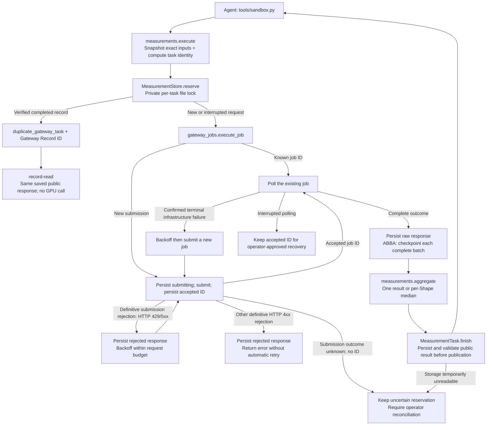

# Measurement records and execution recovery

GPU work can finish even when the Agent connection, local publication or Supervisor process fails. Without a durable association between the exact inputs and the returned result, retrying can spend another GPU allocation, while reusing a cancelled or incomplete response can turn an infrastructure failure into permanent Candidate rejection.

The Campaign Runtime retains measurement facts outside Agent workspaces and recognizes identical tasks across Sessions and Episodes. Measurement records capture execution evidence; Episode scheduling, Supervisor Git operations, Journal/report generation and acceptance decisions are separate responsibilities. [Trusted acceptance](supervisor-promotion.md) may reuse a completed exact task, while Agent duplicates still receive an error and Record ID.

## Lifecycle



These boundaries are implemented in `supervisor/measurements.py`, `measurement_records.py`, `gateway_jobs.py` and `abba_checkpoints.py`. `orchestrator/supervisor_runtime.py` owns authorization, private storage and the enclosing deadline. The Agent client does not retry HTTP requests automatically.

## Records and identity

For a Campaign workspace configured as `/work/campaign`, storage is under `/work/.atrex-supervisor-runtime/<workspace-key>/measurements/`, not inside an Episode worktree:

```text
measurements/
├── kernels/kernel-<32 hex>/kernel.py
├── records/gateway-<32 hex>/
│   ├── request.json                  # Semantic request, input/evaluator hashes
│   ├── inputs/                       # Exact Kernel, contract and submitted local inputs
│   ├── repetition-1/
│   │   ├── executor.json             # Bounded raw executor streams
│   │   ├── jobs/<request-hash>/       # Accepted ID, raw outcomes and retry state
│   │   └── abba-batches/             # Completed physical ABBA batch checkpoints
│   └── record.json                   # Bound request + Kernel identities + public response
└── tasks/<request-hash>.json          # Dedup/resume index; separate lock file
```

The configured Campaign root, not an individual Episode path, scopes lookups and deduplication. Moving that root changes its storage key. A library-created Runtime without `RuntimeConfig.workspace` uses temporary storage and does not promise restart recovery. Bubblewrap hides Supervisor storage; native mode still has the operator user's filesystem authority. No retention cleanup is automatic. Private records can contain hidden Shapes and inputs and must not be uploaded as Agent artifacts.

- `kernel-…` is deterministic from the exact `kernel.py` bytes. Identical bytes retain the same ID across Episodes and stores. The underlying SHA-256 remains an internal integrity check, not the Agent-facing ID. Auxiliary source/input files are also part of the task identity, not of this single-file Kernel ID.
- `gateway-…` is a fresh UUID for a new logical request. It binds the Kernel IDs, operation, request digest and stored public result. ABBA records bind both candidate and baseline IDs.
- The task identity includes source/input bytes, operation, measurement options, hardware/transport settings, evaluator code hashes and the Supervisor repetition policy. Changed source, inputs or measurement conditions create a different task. Episode version labels, workspace paths and output publication paths do not make a new measurement.
- ABBA baseline paths are normalized before input validation and recording: `./baseline.py` and `baseline.py` identify the same input and task. Absolute paths, parent traversal and workspace-root paths remain invalid.
- The evaluator bundle materializes selected symlink/hardlink files as regular-file snapshots. Its identity hashes their contents and modes, not host link targets or archive timestamps; duplicate file names and link/special-file entries in unnormalized bundles remain invalid. This does not relax the Agent workspace's symlink restrictions.
- Evaluate, ABBA, Profile, Dev, Check and Disassemble are recorded. `env` and Wiki remain queries with their existing diagnostics; they are not Kernel measurements. Standalone operator/verifier execution retains its existing interface and has no Campaign record-query API.

Task reservations are protected by OS file locks, released on process exit. A second live owner cannot dispatch an identical request. Completed records are integrity-checked before reuse. Old/malformed IDs, missing records and identity/digest mismatches invalidate only the stale index, allowing a new reservation while retaining the old evidence. Temporary storage errors instead stop dispatch and preserve the reference; they do not justify duplicate GPU work. Supervisor request audit files (`request-*.json`) are diagnostics, not measurement records, and are not imported into this store.

## Agent interface

Responses use operation-specific result markers and CLI exit codes. Structured result markers include `gateway_record_id` and `kernel_id`; ABBA also includes `baseline_kernel_id`. Arbitrary Dev stdout need not be evaluator output: a separate `[sandbox] RECORD_JSON=` line carries the operation, status and IDs. A Dev probe before Kernel creation has a Gateway Record but no Kernel ID. Raw Gateway envelopes and private inputs never become the record-read result.

Recording preserves non-marker stdout lines already allowed by the Supervisor's result projection, including warnings, progress notes and diagnostics, in their original order. With one measurement, only the record identities are injected into result markers; stdout is not replaced by a marker-only response. Hidden-case filtering, path redaction and output limits still apply before recording.

```bash
python3 tools/sandbox.py --kind run --no-sync
python3 tools/sandbox.py --kind record-read --record-id gateway-0123456789abcdef0123456789abcdef
python3 tools/sandbox.py --kind kernel-read --kernel-id kernel-0123456789abcdef0123456789abcdef --output-path scratch/previous.py
python3 tools/sandbox.py --kind kernel-records --kernel-id kernel-0123456789abcdef0123456789abcdef
```

`record-read` returns exactly the saved Agent-visible `exit_code`, `stdout` and `stderr`, including a failed measurement's exit code. It does not run the GPU again or republish old Profile files. `kernel-read` writes only to a regular path inside `scratch/` and returns a success message. `kernel-records` lists Gateway Record IDs, operation and timestamp, not all result bodies. IDs in examples are placeholders; use IDs returned in the current Campaign.

`kernel-records` reads at most 16 KiB of each canonical `record.json`, decoding only the metadata preceding `request`/`response`. It skips unreadable, malformed or oversized headers and logs a skipped-record count in the Supervisor, so one damaged record cannot block other listings. A listed ID is a metadata reference, not proof that its response body is intact: `record-read` and deduplication still perform full integrity validation. No secondary index or record-format migration is required.

An identical completed request is rejected with exit code 2:

```json
{"error":{"code":"duplicate_gateway_task","message":"Identical Gateway task is already recorded","gateway_record_id":"gateway-0123456789abcdef0123456789abcdef","next_action":"Read the recorded result: python3 tools/sandbox.py --kind record-read --record-id gateway-0123456789abcdef0123456789abcdef"}}
```

The duplicate response is not a Kernel failure. Read the result instead of changing version labels or resubmitting to obtain another random sample. Requests whose first execution is still running return a duplicate notice without a readable record ID and should wait for the original request.

## Failure and recovery policy

| Evidence | Action |
| --- | --- |
| Accepted job ID, polling interrupted | Retain the ID; recovery polls that same job before considering another submission |
| Submission explicitly rejected with HTTP 429/5xx, including the Agate CLI's corresponding HTTP error | Persist `rejected`, then retry submission with the existing bounded backoff; never leave a sticky `submitting` marker |
| Other definitive HTTP 4xx submission rejection, or Agate CLI argument-parsing error | Persist `rejected` and return the diagnostic without automatic retries; not a Candidate-failure cache entry |
| Terminal `error_class=infra` or `failure_origin=infrastructure` | New job after 5, 10, 20, 40, then 60-second backoff, within request budgets |
| `logs_unavailable`, including `backend_state=succeeded` | Terminal infrastructure failure: resubmit a new job, not repeated get on the failed ID |
| `command_timeout` or cancelled-before-result without an error | At most one additional submission; never a permanent Candidate-failure cache entry |
| Explicit Candidate/compilation/correctness/validation rejection | Preserve the rejection and deduplicate; repairing inputs/source creates a new task |
| Empty, malformed, unclassified or incomplete result | Not a reusable measurement; preserve available evidence |
| POST interrupted before an accepted ID is durably saved | Outcome unknown; retain reservation and require operator reconciliation, never blindly resubmit |

Submission rejections share the 5, 10, 20, 40, then 60-second backoff and enclosing deadline with terminal infrastructure retries. If that budget expires, the definitive rejection remains recoverable: a later identical request may submit again without deleting its checkpoint. This classification requires an actual HTTP rejection response or its recognizable CLI representation, not merely a nonzero exit code or an `infra` label. An accepted job ID takes precedence over error status; polling failures retain that ID. Lost connections, timeouts and malformed replies without acceptance or rejection evidence still leave an uncertain submission.

Retryable failures do not bypass the request deadline, revocation or process cleanup. Separately, a request rejected in the Supervisor's local queue before any dispatch returns a safe-to-retry HTTP 429. A later repetition timing out before its own dispatch is **not** a claim that the overall request submitted no job: it follows the post-dispatch 503 path. Agents should not convert transport/unknown-outcome failures into retry loops. After operator inspection, an unchanged request can recover known job IDs and completed ABBA batches. Old `submitting` checkpoints with a saved, recognizable CLI rejection can recover automatically; bare markers with no saved response still require operator reconciliation. A no-ID uncertain submission cannot be safely repaired by deleting its index blindly.

Each complete ABBA batch is persisted before the next batch starts. The checkpoint requires the exact schedule, expected Shape coverage, valid latencies for successful runs and explicit correctness results for rejected runs. Incomplete runs never become checkpoints. Recovery keeps completed batches in the same logical record/repetition; it does not reconstruct an ABBA comparison from unrelated standalone Evaluate measurements.

## Optional repeated measurement

Atrex-Bench full and correctness-only Evaluate default to six correctness cases per Shape (base
plus five additional seeds). Extra cases add correctness work, not performance timing runs.
Explicit Shape smoke defaults to one case; `--multi-seed N` overrides the count. Resolved seed/mode
policy enters task identity, so old implicit-single-seed records are not reused under the new default.
Before sealing a report, the Supervisor may reuse a successful full or correctness-only six-case
record when all correctness inputs/policies match; only timing iterations and performance repetitions
may differ. This does not relax Agent-request deduplication or ABBA acceptance identity.

SOL-ExecBench does not use this six-case equivalence. Its acceptance request is the standard full
`workload.jsonl` evaluation with no typed mode and no additional seeds. Reuse therefore requires the
exact saved request identity, including the trusted harness, workload contract and optional
`config.json`.

The default is **one** measurement. Operators may set `ATREX_AKA_MEASUREMENT_REPETITIONS=3` before starting the Campaign. Only `1` and `3` are accepted; the Agent cannot set this policy through request environment flags.

Three repeats apply to full Evaluate and whole ABBA comparisons. The Runtime takes each Shape's median over the three completed measurements, then recomputes geometric/arithmetic means. ABBA aggregates candidate and baseline separately and recomputes their speedup. Correctness-only Evaluate, Profile, Dev, Check and Disassemble remain single-operation requests. A rejected or incomplete repetition cannot become a successful median. Legacy evaluation logs receive the aggregate used in the Agent response, not just the final physical repetition.

After successful repeats, the aggregate replaces only the final result marker in the last repetition's projected stdout; that repetition's other stdout lines and stderr are retained. Earlier repetitions' executor streams remain in their private `executor.json` files. `record-read` returns the saved response with the same diagnostics and aggregate.

This increases GPU cost and wall time; repeats are sequential and do not multiply the enclosing deadline automatically. For repeated or multi-batch work, configure `ATREX_AKA_REQUEST_TIMEOUT_SECONDS` for the whole operation. The repetition count enters the dedup key, so switching policy does not silently reuse a result measured with another count. Dynamic changes in the remote environment behind the same target name cannot be inferred from a local request hash; use a new Campaign/storage scope when intentionally requalifying such an environment.

## Validation and rollback

Regression fixtures run outside the repository, per project convention. They exercise a local fake Gateway and real Supervisor subprocess/HTTP paths: all six measurement operations, exact source/result reads, bounded metadata-only listings that skip unreadable headers, cross-Session dedup, immutable identity checks, corrupt-index recovery, transient storage failure, accepted-ID polling, new-job infrastructure retry, cancellation/timeout budgets, ABBA checkpoints, default single execution and per-Shape median aggregation. Submission regressions cover HTTP/CLI rejection, bounded backoff, restart after rejection, recovery of saved legacy CLI rejections, and retained uncertainty after a lost POST response. Output checks cover non-marker diagnostics, last-marker-only aggregation, identical record reads and continued filtering of hidden-case failure logs. Coverage also includes Runtime authorization, hidden-result projection, deadlines and publication failures. These checks are not production GPU queue-time evidence or a real-model optimization-quality benchmark.

For operator smoke checks, run an ordinary evaluation in a test Campaign, read its returned Record ID, issue the identical request again and confirm that the Gateway job count does not increase. Change Kernel source and confirm a new Record ID. For repeated mode, set the policy to 3 before Campaign startup and inspect the three private repetition directories. Test interruption only against a controlled Gateway; retain the accepted job IDs before restarting.

Rollback: stop the Campaign and preserve its workspace, private records and request diagnostics. Restore a previously validated release or pinned revision with its matching configuration. Before resuming, check compatibility with the saved Journals, numbered memory files and Kernel commits, and reconcile accepted or uncertain Gateway jobs. A release without measurement-record support cannot use this store for deduplication or recovery; do not blindly resubmit unfinished work. Setting repetitions to 1 disables repeated measurement, not deduplication or recording; there is no switch that grants Agents direct Gateway credentials. Storage growth, duplicate-call rejection and retry cost are deliberate trade-offs.
