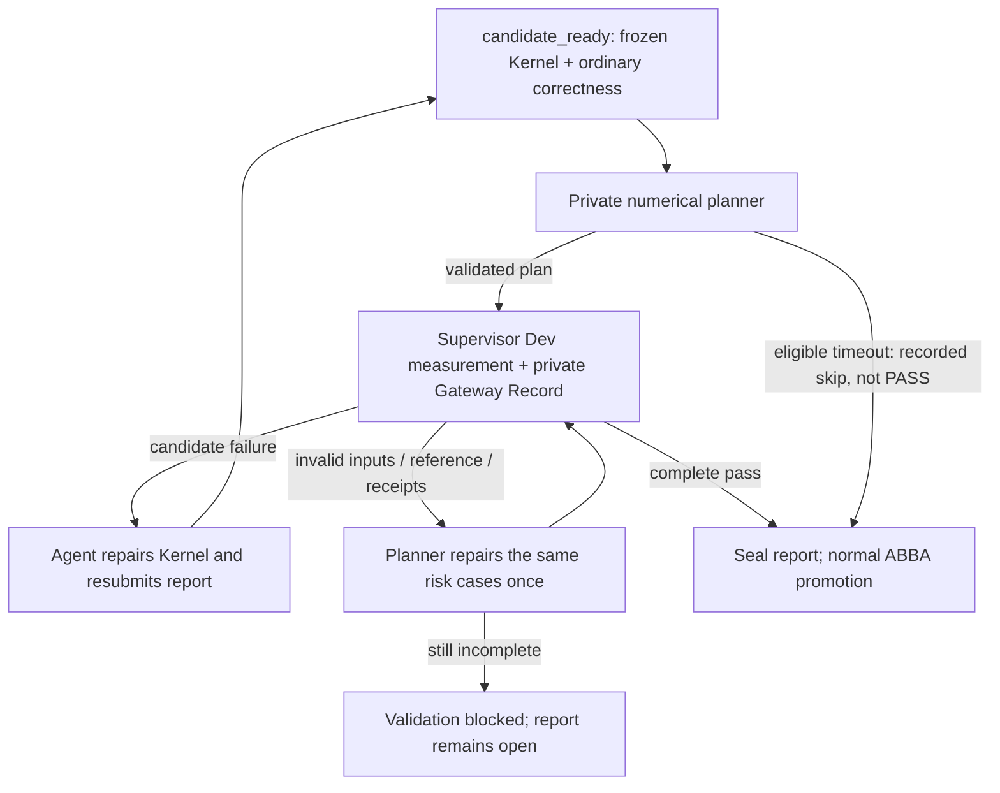

# Supplemental numerical validation

Production candidates retain ordinary full-contract correctness, dependency/framework review and ABBA promotion gates. The Supervisor additionally asks a numerical planner for bounded, executable risk probes. Planner opinions never reject a Kernel; measured candidate failures do. Leaderboard mode is unchanged. There is one Episode workflow, not Fast/Full modes.

## Contract and ownership

- `orchestrator/numerical_policy.py` snapshots exact candidate bytes and trusted inputs outside the Agent workspace. Episode manifests remain pinned and candidate commits remain Kernel-only. Hidden Shape data is never supplied to the planner. Its auxiliary session has no Runtime capability or GPU tools; Bubblewrap uses a dedicated read-only input allowlist when enabled.
- The planner writes a declarative plan: at most three cases, actual nested tensor ABI paths, supported generators and public input constraints. It cannot provide Python, an evaluator, private Shape IDs or thresholds. Supported distributions include constant, uniform, log-uniform, sparse, alternating, ramp, packed bytes and near-constant. Unspecified input leaves retain the original generator's values.
- `long_horizon/remote_numerical.py` executes up to three representative matching Shapes, two seeds and all declared ranks per case, using the canonical evaluator. Receipts bind case, selected Shapes, seeds, ranks and observed coverage. A complete failing workload can disprove correctness; a PASS requires all selected coverage. No eligible Shapes yields an explicit unsupported advisory, not a passing test.
- Supplemental floating outputs use relative L2 `||candidate-reference||₂ / max(||reference||₂, 1e-12)`: non-FP4 threshold `1e-3`, FP4 threshold `0.2`. Structural, dtype, finite-value, mutation and exact non-floating checks remain evaluator-owned. Ordinary allclose/FP4 policy is unchanged.
- Native `input.py`/`reference.py`/`shapes.json` is required for these constructors. SOL contracts without that ABI receive a recorded unsupported advisory; their full-workload correctness and ABBA remain mandatory.

## Report and repair

`SupervisorRuntime._validate_candidate_correctness` invokes the numerical gate after ordinary correctness and before report sealing. Measured failures return `candidate_numerical_failed` with public distributions, metrics and Gateway Record IDs. Repair the candidate, measure it, record its Experiment and resubmit `episode-report`. Plans survive candidate edits and Supervisor restarts; changing the candidate does not let a planner waive the retained tests. Recovery also checks the sealed commit, not mutable draft bytes.

Reference non-finite outputs, invalid generation or incomplete receipts return to the planner for one plan-repair attempt. The case IDs must be preserved. Unresolved validation yields `candidate_numerical_pending`, not a Kernel correctness failure. Baselines get up to two supplemental Kernel-repair turns; Episodes retain their existing continuation budget.

Each planner uses `--production-review-timeout` (default 600 seconds). A bounded plan recovered from a timeout remains untrusted until schema/evidence validation and execution. Without a usable plan, a timeout permits a recorded `skipped_planner_timeout` only after ordinary correctness passed, evidence is unchanged and no measured supplemental candidate failure remains. Malformed non-timeout responses do not receive this exemption.

GPU probes use the same private MeasurementStore and exact-task reuse as other Supervisor requests. A case has a 540-second evaluator deadline inside a 600-second Dev allocation. Confirmed service outages use the existing 30-minute retry waits; uncertain submissions are not blindly replayed. Nested requests share the parent report's deadline and revocation. Total outage waiting is otherwise unbounded while the controller remains active.

## Evidence and limits

Plans, planner session captures, full diagnostics and validation records live under `<Supervisor scope>/numerical/<workspace key>/`. Individual GPU requests retain Kernel/request/result evidence in `<Supervisor scope>/measurements/`. The Agent receives only the bounded receipt/repair projection; neither raw evaluator exceptions nor private Shape kwargs are returned.

Additional model calls and GPU probes are a real cost. Representative probes are not exhaustive proofs and no reduction in false accepts is claimed from local regression checks. Native coordination (`--agent-sandbox none`, still the default) is not an OS security boundary. This change does not enable Bubblewrap by default, restore Agent Git access, restore old plan/profile files, or replace ordinary correctness/ABBA with model judgment.

Rollback means returning to the previous revision at an Episode boundary; retain private evidence for audit. Do not delete retained plans to get a failing candidate admitted.

## Local verification

The integration was checked with 37 local numerical/control-flow regressions and 125 existing plugin, retry-state, output-projection and configuration regressions. Numerical checks cover retained plans across repairs/restarts, failure versus incomplete coverage, planner timeout recovery, immutable input snapshots, repairable report rejection, parent revocation, evaluator bundle identity and real MeasurementStore exact-request reuse. Static undefined-name and whitespace checks also pass. Regression scripts remain outside the repository.

Model and GPU executors were replaced by test doubles in these checks. No live-model/GPU campaign or new Bubblewrap end-to-end run was performed; these checks do not establish numerical coverage or production cost.
