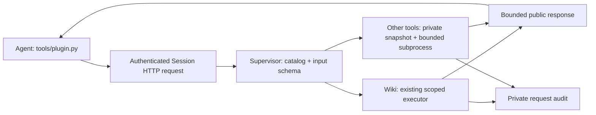

# Supervisor-owned plugins

AKA discovers operator-installed `plugins/*/plugin.json`. Plugins can declare tools, public
Skills, instructions, and private resource dependencies. They are trusted Supervisor code,
not Agent-installable extensions. GPU Wiki is supplied as `gpu-wiki.query`.

## Execution boundary



Only the standard-library clients and explicitly declared public Skills enter the workspace.
Plugin source, resource trees, environment variables and locks stay outside it. The client has
no `--workspace`, executable, endpoint, resource-root or environment override. The existing
Session capability, serialization, queue deadline, revocation and subprocess cleanup apply.

`plugin_runtime/` retains the reusable manifest/schema/JSON execution library. AKA does not use
its standalone resource-link installer: `orchestrator/plugins.py` copies bounded, no-follow Skill
files and exposes only workspace-relative Skill paths. Built-in Skills cannot be replaced.
Custom instructions are injected for `episode` and `framework_baseline`; there are no Setup or
Fast phases. Built-in Wiki guidance comes from the Episode/conversion and Framework Baseline
prompts plus the mounted `skills/KernelWiki/SKILL.md`. AKA's `orchestrator.plugins.PluginRegistry`
intentionally skips the `gpu-wiki` manifest instruction templates, avoiding a duplicate workflow.
`plugins/gpu-wiki/instructions.md` and `framework_baseline.md` remain available to standalone
consumers through `plugin_runtime.PluginRegistry.instructions()`; AKA neither injects them nor
writes `.atrex_plugins/instructions.md` into the Agent workspace. Plugin discovery/call guidance
is still injected when plugins are installed, and `gpu-wiki.query` remains available through
the HTTP client. An empty catalog adds no plugin instructions to the Prompt.

## Agent usage

Inside a live Session:

```bash
python3 tools/plugin.py list
python3 tools/plugin.py call gpu-wiki.query --input scratch/wiki_request.json
```

Example request:

```json
{"request":"Target hardware B200, DSL triton. Optimize operator rmsnorm and retrieve techniques and pitfalls.","max_records":6,"max_bytes":20000}
```

The catalog returns tool descriptions/input and output schemas, plus public Skill locations.
`--input -` accepts JSON from stdin. The client bounds both the input and encoded HTTP envelope.
A missing Session capability does not fall back to direct execution.

Wiki calls reuse `sandbox.py --kind wiki-query`'s scoped executor, private query audit and bounded
projection. `max_bytes` may narrow but not raise the 128 KiB query limit; `exclude` is supported.
The response retains `query_id`, `records`, `notes` and emitted `wiki_id` values. Record material
use with `record-experiment`, not a separate Wiki log. Direct Wiki scripts remain operator tools.

## Operator manifest

A tool exchanges JSON on stdin/stdout and declares a timeout (1–3600 seconds):

```json
{
  "id": "local-docs",
  "version": "1.0.0",
  "api_version": 1,
  "tools": {
    "query": {
      "description": "Retrieve local reference facts.",
      "command": ["{python}", "{plugin_root}/query.py"],
      "input_schema": "input.json",
      "output_schema": "output.json",
      "timeout_seconds": 30
    }
  },
  "instructions": {"common": "instructions.md"},
  "resources": {"local-docs-data": {"path": "data", "mount": false}},
  "skills": {"local-docs": {"path": "skills/local-docs"}}
}
```

Tools and Skills are independently optional; at least one is required. Skill directories must
contain `SKILL.md` unless marked optional. Resource and Skill paths are relative to the plugin.
All resources remain private in AKA, including legacy declarations with `mount: true`.
Environment declarations apply only to the tool subprocess; they are not injected into Agent
sessions. `{workspace}` there denotes the private request snapshot.

Input/output schemas support `type`, `description`, `properties`, `required`,
`additionalProperties`, `items`, `enum`, `minLength`, `minimum` and `maximum`.
Unknown schema keywords fail during discovery. Requests are validated before execution; generic
plugin output is schema-validated and bounded to 256 KiB. Tool implementations are responsible
for returning public data only: schema validation is not a secret scrubber.

## Persistence and failures

A private `<Supervisor scope>/plugins/.atrex_plugins/lock.json` pins versions, source, schemas,
instructions, resources and Skills. Existing campaigns acquire this lock on their first startup
with plugins. Restart checks reject changed dependencies; restore the pinned version or create
a new Campaign. Agent edits to a workspace `.atrex_plugins` directory cannot change the lock.
Generic subprocesses load and rehash only the selected plugin, checking its identity, commands,
source and declared resources/Skills against the Supervisor's private startup snapshot before
dispatch. Unrelated plugins and Wiki stores are not rescanned. Selected-plugin data is still
rehashed on every call; a cached fingerprint is not treated as proof that mutable files remain
unchanged. Declare any file dependency as a resource so it participates in that check.
Catalog-wide environment declarations are rendered from the Supervisor's cached manifests;
the scoped Wiki task ID and audit path still take precedence. Full catalog validation remains
part of Supervisor startup and restart.

Input errors are repairable 400 responses. Confirmed pre-dispatch queue expiry retains the safe
429/backoff response. Post-dispatch failure or malformed output is an unknown-outcome 503; private
tracebacks and stderr are not returned. Do not add client-side retries. Request output and status
are recorded in the Supervisor audit. Plugins do not create Gateway measurement records or
authorize Kernel promotion.

Generic child tools share the Supervisor-owned process group, so request revocation and deadlines
kill descendants. The standalone library keeps its own process-group cleanup. An inner tool
timeout terminates the supervised group and is reported as an execution failure.

To roll back, stop the Campaign before switching revisions. The plugin installer does not modify
operator source/resources. Private locks and audits can be retained for investigation.
