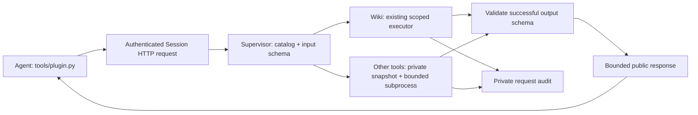

# Supervisor-owned plugins

AKA discovers operator-installed `plugins/*/plugin.json`. Plugins can declare tools, public
Skills, instructions, and private resource dependencies. They are trusted Supervisor code,
not Agent-installable extensions. GPU Wiki is supplied as `gpu-wiki.query`.

## Execution boundary



Only the standard-library clients and explicitly declared public Skills enter the workspace.
Plugin source, resource trees, environment variables and locks stay outside it. The client has
no `--workspace`, executable, endpoint, resource-root or environment override. The existing
Session capability, serialization, queue deadline, revocation and subprocess cleanup apply.

`plugin_runtime/` provides manifest discovery, dependency pinning, schemas and generic subprocess
execution for the Supervisor. `orchestrator/plugins.py` copies bounded, no-follow Skill files and
exposes only workspace-relative Skill paths; there is no standalone resource-link installer.
Built-in Skills cannot be replaced.
Custom instructions are injected for `episode` and `framework_baseline`; there are no Setup or
Fast phases. Built-in Wiki guidance comes from the Episode/conversion and Framework Baseline
prompts plus the mounted `skills/KernelWiki/SKILL.md`. The Wiki plugin declares its existing
Supervisor route, schemas and dependencies, without a second adapter or instruction templates.
No `.atrex_plugins/instructions.md` is written into the Agent workspace. Plugin discovery/call guidance
is still injected when plugins are installed, and `gpu-wiki.query` remains available through
the HTTP client. An empty catalog adds no plugin instructions to the Prompt.

## Agent usage

Inside a live Session:

```bash
python3 tools/plugin.py list
python3 tools/plugin.py call gpu-wiki.query --input scratch/wiki_request.json
```

Example request:

```json
{"request":"Target hardware B200, DSL triton. Optimize operator rmsnorm and retrieve techniques and pitfalls.","max_records":6,"max_bytes":20000}
```

The catalog returns tool descriptions/input and output schemas, plus public Skill locations.
`--input -` accepts JSON from stdin. The client bounds both the input and encoded HTTP envelope.
A missing Session capability does not fall back to direct execution.

Wiki calls reuse `sandbox.py --kind wiki-query`'s scoped executor, private query audit and bounded
projection; successful plugin responses are validated against the declared output schema before
returning to the Agent. Malformed JSON or schema drift produces a non-repairable 503 naming the
plugin and its output-contract failure, with details retained privately. A successful result that
exceeds the public output limit instead produces a repairable 400 with narrowing guidance.
Failed Wiki execution keeps its existing exit code and bounded diagnostics;
those failure envelopes are not successful output-schema instances.
`max_bytes` may narrow but not raise the 128 KiB query limit; `exclude` is supported.
The response retains `query_id`, `records`, `notes` and emitted `wiki_id` values. Record material
use with `record-experiment`, not a separate Wiki log. Direct Wiki scripts remain operator tools.

## Operator manifest

A tool exchanges JSON on stdin/stdout and declares a timeout (1–3600 seconds):

```json
{
  "id": "local-docs",
  "version": "1.0.0",
  "api_version": 1,
  "tools": {
    "query": {
      "description": "Retrieve local reference facts.",
      "command": ["{python}", "{plugin_root}/query.py"],
      "input_schema": "input.json",
      "output_schema": "output.json",
      "timeout_seconds": 30
    }
  },
  "instructions": {"common": "instructions.md"},
  "resources": {"local-docs-data": {"path": "data", "mount": false}},
  "skills": {"local-docs": {"path": "skills/local-docs"}}
}
```

Tools and Skills are independently optional; at least one is required. Skill directories must
contain `SKILL.md` unless marked optional. Resource and Skill paths are relative to the plugin.
All resources remain private in AKA, including legacy declarations with `mount: true`.
Environment declarations apply only to the tool subprocess; they are not injected into Agent
sessions. `{workspace}` there denotes the private request snapshot. Other named
placeholders require explicit caller context; unresolved `{name}` placeholders after
rendering reject the declaration before execution. Errors identify the plugin and
environment key, not the potentially secret rendered value.

Tools declare exactly one execution mechanism. Custom tools use `command`; the built-in
`gpu-wiki.query` instead declares `"runtime_tool": "wiki-query"`. This fixed route is not a URL or
arbitrary handler hook; unknown Runtime tools and a simultaneous `command` are rejected during
discovery. Calling it through the generic subprocess library fails closed; both Agent clients
use the same scoped Wiki executor. The private snapshot pins this routing declaration as well
as commands and resources.

Input/output schemas support `type`, `description`, `properties`, `required`,
`additionalProperties`, `items`, `enum`, `minLength`, `minimum` and `maximum`.
Unknown schema keywords fail during discovery. Requests are validated before execution;
successful output from both built-in routed and generic tools is schema-validated and bounded
to 256 KiB. Tool implementations are responsible
for returning public data only: schema validation is not a secret scrubber.

## Persistence and failures

A private `<Supervisor scope>/plugins/.atrex_plugins/lock.json` pins versions, source, schemas,
instructions, resources and Skills. Existing campaigns acquire this lock on their first startup
with plugins. Restart checks reject changed dependencies; restore the pinned version or create
a new Campaign. Agent edits to a workspace `.atrex_plugins` directory cannot change the lock.
Generic subprocesses load and rehash only the selected plugin, checking its identity, commands,
source and declared resources/Skills against the Supervisor's private startup snapshot before
dispatch. Unrelated plugins and Wiki stores are not rescanned. Selected-plugin data is still
rehashed on every call; a cached fingerprint is not treated as proof that mutable files remain
unchanged. Declare any file dependency as a resource so it participates in that check.
Catalog-wide environment declarations are rendered from the Supervisor's cached manifests;
the scoped Wiki task ID and audit path still take precedence. Full catalog validation remains
part of Supervisor startup and restart.

Fingerprint I/O is bounded for each catalog construction (including a selected-plugin reload):
16 MiB per file, 256 MiB total, 16,384 directory entries/metadata reads, and 64 directory levels.
Manifest/schema/instruction documents are limited to 1 MiB. Hashes stream 64 KiB chunks; file
sizes are checked before reading and limits remain enforced if a file grows. FIFOs, sockets,
devices and symlinks inside dependency trees are rejected. Operator-declared root aliases may
resolve to a directory or regular file. Missing optional roots have a stable sentinel; other
read/scan failures abort catalog construction rather than silently omitting evidence. Ignored
Git/cache paths cannot hold declared schemas or instruction files.

The source tree hashes its manifest, schemas and instructions once; parsing metadata is still a
separate bounded read. All resource/Skill roots share the same budget, including repeated reads
of overlapping declarations. Reduce/narrow a dependency if a limit is exceeded; no partial
fingerprint is accepted. Campaign and Episode workspace linking reuse the Supervisor catalog;
standalone `link_runtime` callers without one still construct a bounded catalog. There is no
persistent mtime-only cache, so same-size/same-mtime content changes remain detectable. These
limits bound local traversal and bytes, not kernel-level I/O latency on an unhealthy network
filesystem. See [measured startup cost and reproduction](plugin-fingerprint-cost.md).

Input errors are repairable 400 responses. Confirmed pre-dispatch queue expiry retains the safe
429/backoff response. Completed plugin calls have two distinct output failures:

- `plugin_result_too_large`: repairable 400. The call already ran; narrow the question or reduce
  supported `max_records`/`max_bytes` before submitting an adjusted request. A mutating call may
  already have taken effect; check its effects first. This does not mean "no job was submitted".
- `plugin_output_invalid`: non-repairable 503 naming the tool. It completed but returned malformed
  JSON or violated its output schema. The plugin operator must fix the contract; repeatedly
  changing arguments or resubmitting the same call is not a remedy.

The private executor preserves these classifications across the subprocess boundary. Actual
tool process failures, interrupted execution and unrecognized executor errors remain an
unknown-outcome 503; private tracebacks and stderr are not returned. "Repairable" is advice to
adjust the next request, not permission for automatic replay. Do not add client-side retries.
Request output and status
are recorded in the Supervisor audit. Plugins do not create Gateway measurement records or
authorize Kernel promotion.

Generic child tools share the Supervisor-owned process group, so request revocation and deadlines
kill descendants. An inner tool timeout terminates the supervised group and is reported as an
execution failure.

To roll back, stop the Campaign before switching revisions. Skill installation does not modify
operator source/resources. Private locks and audits can be retained for investigation; do not
delete a lock to bypass a changed catalog. The routed Wiki declaration and bounded tree hash
format change existing fingerprints: restore the pinned revision or start a new Campaign with
the new catalog. Old locks are never silently converted.
