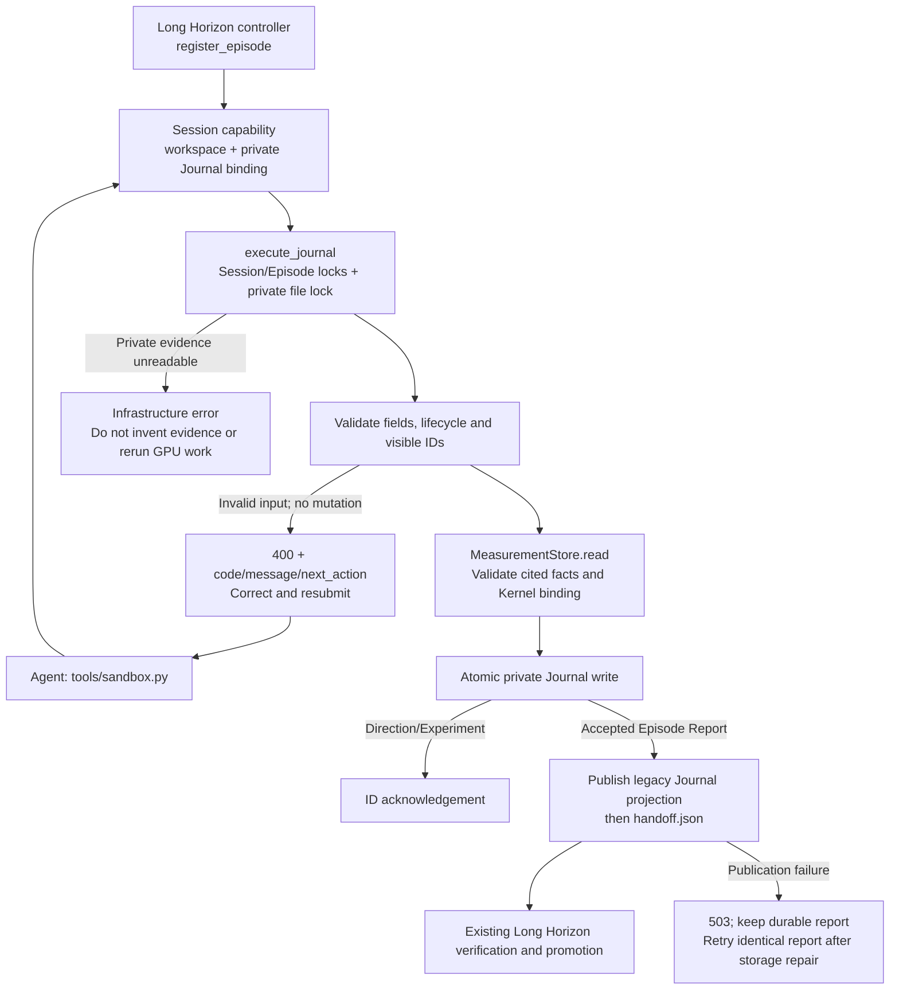

# Runtime Journal and Episode Reports

Long-running optimization needs both immutable measurement facts and the Agent's evolving interpretation. Gateway Records already bind exact Kernel source to results; this interface adds durable research Directions, structured Experiments and terminal reports that reference those records instead of repeating measurement values in prose.

The users are optimization Agents recording and retrieving evidence, and operators inspecting or recovering interrupted Episodes. Successful writes are persisted before acknowledgement. Validation errors identify the bad fields or lifecycle state so the Agent can correct a report within the same Session. This reduces reliance on an end-of-Episode reconstruction; it does not make Agent-authored analysis scientifically authoritative.

## Scope and compatibility

The controller registers each Long Horizon Episode with its trusted number, workspace, base Commit and branch. Only its optimizer Sessions receive Journal access. Setup, Framework Baseline and auxiliary reviewers retain their existing interfaces. Agents cannot register an Episode, choose a Journal path, or select another Campaign in an HTTP request.

The existing local Journal remains supported and is still the default in Episode prompts. The mounted `runtime-records` Skill offers the new path. Choose one interface before recording Experiments; a Runtime write is rejected if the local Journal already contains experiments or has been finalized. Legacy Journals are not automatically migrated to Direction/Experiment IDs.

Keep Setup, Fast/Full, plan/profile artifacts, Wiki attribution, Phase Markers, Git operations, verification and promotion unchanged. The Agent still creates its candidate Commit. Runtime report validation reads that Commit but never commits, resets or promotes Git state. Fast Episodes retain their required experiment/evaluation counts and permitted-operation rules. The new interface's explicit behavior changes are evidence-linked Direction lifecycle checks and permission to submit an empty pivot/blocked report when no exploration was started.

## Lifecycle and failure paths

`orchestrator/supervisor_runtime.py` authenticates, binds and dispatches. `supervisor/journal.py` validates requests, resolves measurement records and saves the private Episode document. `direction_lifecycle.py` replays legal state transitions; `direction_genealogy.py` validates optional ancestry. `tools/sandbox.py` only parses arguments and sends HTTP. Per-Episode locks serialize multiple Sessions, and OS file locks reject concurrent writers from another controller without blocking all Campaign requests.

## Objects and API

| Object | Content | Ownership |
| --- | --- | --- |
| Direction | Hypothesis, rationale, plan, lifecycle, explicit assessment and ancestry | Agent proposes/interprets; Runtime validates and persists |
| Experiment | Change, Gateway Record IDs, evidence narrative, analysis and action | Agent-authored interpretation; referenced measurements validated by Runtime |
| Gateway Record | Exact request/Kernel binding and saved projected response | Existing Measurement Store |
| Episode Report | Terminal status, summary, selected Experiment, existing candidate Commit or blocker | Agent submits; Runtime validates; Supervisor independently decides acceptance |

All calls use `POST /v1/journal/execute` and the existing Session bearer. The Agent CLI is:

| Command | Input | Successful output |
| --- | --- | --- |
| `update-direction` | `--request-file FILE` | `status`, `direction_id` |
| `record-experiment` | `--request-file FILE` | `status`, `experiment_id` |
| `list-directions`, `list-experiments` | `--output-path scratch/FILE` | `status`, `file`, `count`; index written to file |
| `load-direction`, `load-experiment` | `--record-id ID` | Complete public record as JSON |
| `episode-report` | `--request-file FILE` | `status: accepted`, message |

The HTTP payload uses `operation` plus exactly one of `request`, `file`, `direction_id`, or `experiment_id`. Operations are `direction_update`, `experiment_record`, `directions_list`, `experiments_list`, `direction_load`, `experiment_load`, and `episode_report`. Successful HTTP responses use the existing `exit_code/stdout/stderr` envelope; the CLI prints the JSON in stdout. Malformed input returns a structured HTTP 400, private-state/publication failures a 503; post-write failures must not be reported as safe input retries. Transport loss can leave a write's outcome unknown.

Field-by-field examples are maintained in [the mounted Journal reference](../skills/runtime-records/references/journal.md); saved measurement readers are covered in [the record reference](../skills/runtime-records/references/records.md). Request bodies are capped at 2 MiB, private Episode Journals and exported indexes at 16 MiB. Long text and list fields have smaller per-field limits reported by validation.

### Directions and evidence

Propose any number of useful ideas, but start at most three distinct Directions in one Episode and only one at a time. Complete/abandon/block/defer requires a started Direction, explicit supporting Experiment IDs and `hypothesis_status=unresolved|supported|refuted`. Closed Directions can be restarted or reassessed; previous events remain unchanged. Lifecycle completion does not imply a proven hypothesis.

Each Experiment cites at least one visible Kernel-bound Evaluate/ABBA/Profile/Dev/Check/Disassemble record. Failed diagnostics may document an unresolved blocker; Env/Wiki and unbound Dev are not Kernel evidence. Supported/refuted closure requires a completed observation in every selected Experiment. Runtime checks records and bindings, not causal relevance. Late evidence can attach to a closed Direction without silently reopening it or replacing selected support. Optional Wiki attribution follows the existing diagnostic-only schema.

Queries fold the current Journal plus finalized earlier Runtime Journals in this Campaign, including non-winning explorations. Unfinished previous Episodes, future Episodes and unrelated Campaigns are excluded. Stable global Direction/Experiment IDs and immutable ancestry avoid reconstructing identity from Episode-local indexes. List outputs are snapshots, not automatically refreshed files.

### Reports and old consumers

No Direction may remain in progress at handoff. `candidate_ready` requires a current-Episode selected Experiment, a passing full Evaluate record for byte-identical `kernel.py`, and the Agent's existing full `candidate_commit`. The existing worktree validator checks HEAD, branch, source match and permitted diff. Custom-input, Shape-subset, correctness-only, Profile or ABBA alone are insufficient for that report binding; independent verification remains unchanged.

The private report is saved first. Runtime then publishes a schema-1 compatibility Journal for existing Long Horizon consumers and atomically publishes `handoff.json` last. It maps Experiment IDs to the old selected index and derives evaluation fields from Gateway Records. Canonical memory remains Supervisor-generated. Identical accepted reports are idempotent and can repair a failed publication; conflicting terminal reports and subsequent mutations are rejected. Report rejection before persistence leaves the Journal open and writes no handoff.

## Storage, limits and rollback

Private documents live beside the existing Measurement Store at `<Supervisor scope>/journals/episodes/eNNNNNNNN/journal.json`; they are outside the Agent workspace and hidden in Bubblewrap mode. Native mode still has the operator UID's filesystem authority. The legacy Journal/handoff projection is visible compatibility state, not a replacement private fact store or a new security claim about native mode. Requests never accept private storage paths. Scratch exports use descriptor-based publication so symlinks cannot redirect writes outside the allowed workspace.

Atomic document replacement favors simplicity but rewrites one bounded Episode document per update. History queries read finalized Journals and validate referenced records; very long Campaigns may need indexing later. Interpretation still depends on Agent submissions, and damaged history fails closed rather than silently discarding evidence. There is no automatic retention cleanup or retry of ambiguous mutations.

Regression fixtures are kept outside the repository. They exercise a local fake GPU Gateway plus real HTTP/client, Git and filesystem paths: durable write/query, cross-Episode history, source/result binding, invalid-report repair, exact report replay, conflicting reports, privacy, scoped concurrent requests, legacy projection/validation and unchanged measurement APIs. These checks do not claim real-model optimization gains or production GPU qualification.

Local verification covered 27 Journal regressions, 102 existing measurement/Gateway regressions and 4 existing Wiki-attribution checks. In particular, the compatibility projection passes the existing Long Horizon completion check and memory compiler, Fast-mode minimums remain enforced, and candidate reports reject correctness-only or Shape-subset evidence. No new test modules are included in the source tree.

To roll back, stop the Campaign and preserve private Journals/Measurements, workspace Journals and Git state. Finish an active Runtime-Journal Episode before reverting if possible. Restore a previously validated revision/configuration; old consumers can read the schema-1 terminal projection, but cannot continue private Direction IDs or repair private report publication. Do not switch an in-progress Episode between protocols or discard its evidence to force a restart.
