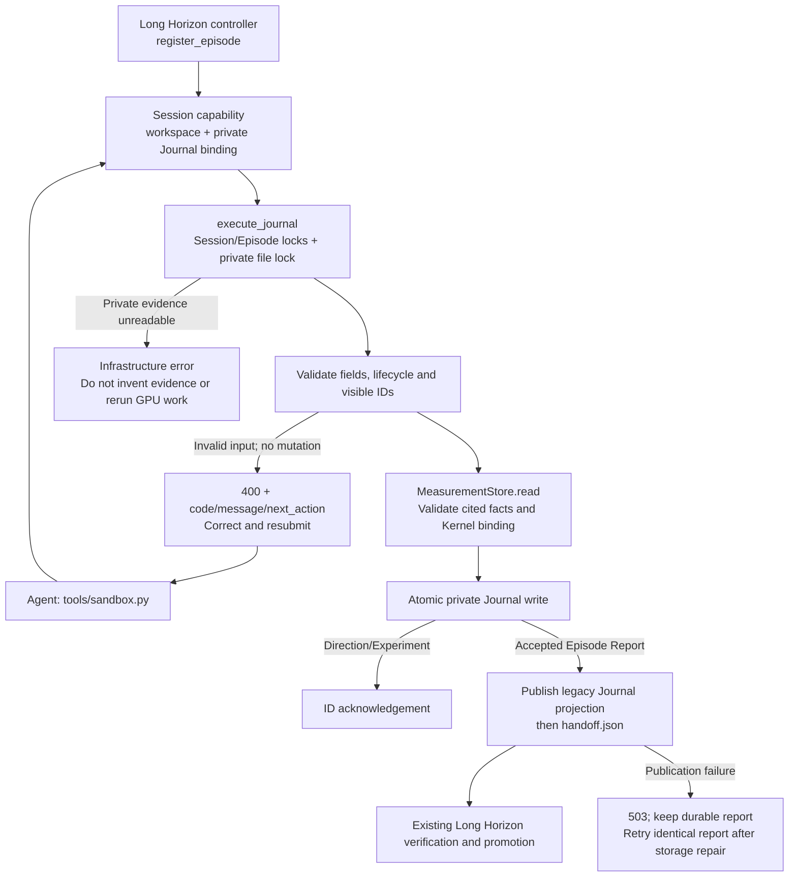

# Runtime Journal and Episode Reports

Long-running optimization needs both immutable measurement facts and the Agent's evolving interpretation. Gateway Records already bind exact Kernel source to results; this interface adds durable research Directions, structured Experiments and terminal reports that reference those records instead of repeating measurement values in prose.

The users are optimization Agents recording and retrieving evidence, and operators inspecting or recovering interrupted Episodes. Successful writes are persisted before acknowledgement. Validation errors identify the bad fields or lifecycle state so the Agent can correct a report within the same Session. This reduces reliance on an end-of-Episode reconstruction; it does not make Agent-authored analysis scientifically authoritative.

## Scope and compatibility

The controller registers each Long Horizon Episode with its trusted number, workspace, base Commit and branch. Only its optimizer Sessions receive Journal access. Framework Baseline and auxiliary reviewers retain their existing interfaces. Agents cannot register an Episode, choose a Journal path, or select another Campaign in an HTTP request.

Long Horizon registers each optimization Episode through the Campaign API with no minimum experiment count. Re-registration must preserve the bound policy; existing bindings fail closed on a mismatch.

New Long Horizon Episodes use Runtime Journal and Supervisor-created candidate commits; see [handoff and promotion](supervisor-promotion.md). Low-level local Journal APIs remain available to legacy integrations, but an unfinished legacy Episode must finish using its original version/configuration. Legacy Journals are not automatically migrated to Direction/Experiment IDs.

Protocol mixing returns HTTP 400 with `journal_protocol_conflict` and `repairable=false`: changing request arguments cannot switch this Episode to Runtime Journal. The Agent must continue the legacy append/finalize and handoff commands from its Episode prompt, preserving existing evidence. An already-finalized Journal only needs its remaining handoff steps; do not erase history to bypass the rejection.

The Supervisor validates exact measured source and creates the candidate commit; Agents supply no Commit ID. All outcomes require valid report fields and no in-progress Direction. An empty pivot or blocked report is permitted when no Direction needs closing; blocked additionally requires a concrete blocker. Candidate reports require a selected passing full Evaluate. Plans/profile files and Phase Markers are not required.

## Lifecycle and failure paths

`orchestrator/supervisor_runtime.py` authenticates, binds and dispatches. `supervisor/journal.py` validates requests, resolves measurement records and saves the private Episode document. `direction_lifecycle.py` replays legal state transitions; `direction_genealogy.py` validates optional ancestry. `tools/sandbox.py` only parses arguments and sends HTTP. Per-Episode locks serialize multiple Sessions, and OS file locks reject concurrent writers from another controller without blocking all Campaign requests.

## Objects and API

| Object | Content | Ownership |
| --- | --- | --- |
| Direction | Hypothesis, rationale, plan, lifecycle, explicit assessment and ancestry | Agent proposes/interprets; Runtime validates and persists |
| Experiment | Change, Gateway Record IDs, evidence narrative, analysis and action | Agent-authored interpretation; referenced measurements validated by Runtime |
| Gateway Record | Exact request/Kernel binding and saved projected response | Existing Measurement Store |
| Episode Report | Terminal status, summary, selected Experiment or blocker | Agent submits; Runtime validates; Supervisor independently decides acceptance |

All calls use `POST /v1/journal/execute` and the existing Session bearer. The Agent CLI is:

| Command | Input | Successful output |
| --- | --- | --- |
| `update-direction` | `--request-file FILE` | `status`, `direction_id` |
| `record-experiment` | `--request-file FILE` | `status`, `experiment_id` |
| `list-directions`, `list-experiments` | `--output-path scratch/FILE` | `status`, `file`, `count`; index written to file |
| `load-direction`, `load-experiment` | `--record-id ID` | Complete public record as JSON |
| `episode-report` | `--request-file FILE` | `status: accepted`, message |

The HTTP payload uses `operation` plus exactly one of `request`, `file`, `direction_id`, or `experiment_id`. Operations are `direction_update`, `experiment_record`, `directions_list`, `experiments_list`, `direction_load`, `experiment_load`, and `episode_report`. Successful HTTP responses use the existing `exit_code/stdout/stderr` envelope; the CLI prints the JSON in stdout. Malformed input returns a structured HTTP 400, private-state/publication failures a 503; post-write failures must not be reported as safe input retries. Transport loss can leave a write's outcome unknown.

Field-by-field examples are maintained in [the mounted Journal reference](../skills/runtime-records/references/journal.md); saved measurement readers are covered in [the record reference](../skills/runtime-records/references/records.md). Complete encoded request bodies are capped at 2 MiB. Journal request files are capped at 2,093,056 bytes (2 MiB minus a 4 KiB envelope reserve); the client also checks the final encoded body to account for JSON expansion. Oversized requests are rejected locally with instructions to shorten text or lists, before sending HTTP. Private Episode Journals and exported indexes are capped at 16 MiB. Long text and list fields have smaller per-field limits reported by validation.

### Directions and evidence

Propose any number of useful ideas, but start at most three distinct Directions in one Episode and only one at a time. Complete/abandon/block/defer requires a started Direction, explicit supporting Experiment IDs and `hypothesis_status=unresolved|supported|refuted`. Closed Directions can be restarted or reassessed; previous events remain unchanged. Lifecycle completion does not imply a proven hypothesis.

Optional ancestry has three kinds, each with a distinct purpose: `refinement` narrows or extends an earlier hypothesis; `correction` records a revised hypothesis without rewriting history and may explicitly supersede one parent; `combination` joins ideas from at least two distinct parent Directions. These are Agent-authored interpretations, not claims of measured benefit. An unchanged hypothesis reuses its existing Direction ID, with `start` used to resume a closed Direction; changing its implementation belongs in an Experiment. Cross-Campaign/DSL porting is not a Journal workflow. Parents must be visible in this Campaign, and declared ancestry cannot be changed later.

Each Experiment cites at least one visible Kernel-bound Evaluate/ABBA/Profile/Dev/Check/Disassemble record. Failed diagnostics may document an unresolved blocker; Env/Wiki and unbound Dev are not Kernel evidence. Supported/refuted closure requires a completed observation in every selected Experiment. Runtime checks records and bindings, not causal relevance. Late evidence can attach to a closed Direction without silently reopening it or replacing selected support. Optional Wiki attribution follows the existing diagnostic-only schema.

The Journal's private evidence reader derives full-evaluation eligibility from stored request options without carrying the raw request/options/inputs into its evidence view. Journal responses and compatibility reports are assembled separately; the eligibility flag is internal, not an Agent-facing field.

Queries fold the current Journal plus finalized earlier Runtime Journals in this Campaign, including non-winning explorations. Unfinished previous Episodes, future Episodes and unrelated Campaigns are excluded. Stable global Direction/Experiment IDs and immutable ancestry avoid reconstructing identity from Episode-local indexes. List outputs are snapshots, not automatically refreshed files.

### Reports and old consumers

No Direction may remain in progress at handoff. `candidate_ready` requires a current-Episode selected Experiment, a passing full Evaluate record for byte-identical `kernel.py`, and a Supervisor-created candidate commit. The existing worktree validator checks HEAD, branch, source match and permitted diff. Custom-input, Shape-subset, correctness-only, Profile or ABBA alone are insufficient for that report binding; acceptance requires policy-matched recorded ABBA.

After report/evidence validation and before creating the candidate commit or finalizing the Journal, the Supervisor looks for a successful full or correctness-only Atrex-Bench Evaluate with six correctness cases and matching frozen Kernel, complete input/Shape contract, evaluator, tolerances, target and environment. Ordinary Evaluate now supplies six cases by default. Only timing iterations, performance repetitions and full versus correctness-only mode may differ for this correctness-only reuse; custom inputs, explicit Shape subsets, fewer seeds and old records without the resolved policy cannot substitute. If none qualifies, the Supervisor requests `--kind run --mode correctness_only --multi-seed 5 --no-sync`, without timing or performance repetitions. The private Journal stores the successful Record ID under `acceptance_checks.multi_seed_correctness`; the Agent need not add an extra check to its Experiment. Agent duplicate-request errors remain unchanged; this equivalence is controller-only.

A confirmed correctness rejection returns repairable `candidate_correctness_failed` with the public Record ID and instructions to repair source/evidence and resubmit. The Journal remains in progress and the Supervisor creates no candidate commit. Infrastructure/unknown outcomes are not relabeled as candidate failures or accepted as passes. Execution retains the reporting Session's authorization and deadline. Pivot/blocked reports and identical replays of an accepted report submit no validation jobs. ABBA performance acceptance and Baseline-specific policies remain separate.

After all validation, the Supervisor seals the exact candidate source, then saves the private report. Runtime then publishes a schema-1 compatibility Journal for existing Long Horizon consumers and atomically publishes `handoff.json` last. It maps Experiment IDs to the old selected index and derives evaluation fields from Gateway Records. Canonical memory remains Supervisor-generated. Identical accepted reports are idempotent and can repair a failed publication; conflicting terminal reports and subsequent mutations are rejected. Report rejection before persistence leaves the Journal open and writes no handoff.

Ordinary report validation failures remain HTTP 400 with `repairable=true`. `error.message` identifies the invalid field, lifecycle state or evidence requirement, and `error.next_action` explains how to correct and resubmit. Field-shape errors also list missing, unexpected and allowed fields. Correct the report or the indicated prerequisite, then call `episode-report` again in the same Session; only an accepted report ends the Episode. This is distinct from a `journal_protocol_conflict`, which requires continuing the existing legacy workflow rather than changing report arguments.

The workspace's `runtime_journal_projection` flag is only a claim. Completion checks, including interrupted-handoff recovery, read the existing private Journal from the controller's Campaign scope and verify its schema, Episode/base Commit/branch identity, terminal state, finalization and candidate Commit. Experiment IDs must be nonempty strings, unique within each document, and match exactly between the private Journal and its projection; omitted or unknown Experiments are rejected before downstream counting and memory compilation. This verifies identity and completeness, not equality of every projected field. Empty pivot/blocked reports require that verification and an empty private Experiment list. Missing, corrupt, unfinalized or mismatched private state fails closed; validation never creates a Journal to authorize the exception. Legacy terminal validation remains strict by default.

## Storage, limits and rollback

Private documents live beside the existing Measurement Store at `<Supervisor scope>/journals/episodes/eNNNNNNNN/journal.json`; they are outside the Agent workspace and hidden in Bubblewrap mode. Native mode still has the operator UID's filesystem authority. The legacy Journal/handoff projection is controller-only compatibility state for managed Episodes, not a replacement private fact store or a new security claim about native mode. Requests never accept private storage paths. Scratch exports use descriptor-based publication so symlinks cannot redirect writes outside the allowed workspace.

Before mutations, Runtime reads the legacy Journal without following symlinks. A symlink, invalid path component or non-regular file returns a repairable 400 with workspace-path repair instructions; no Journal mutation is applied. A missing legacy Journal remains valid. Storage-access failures, including I/O errors, remain non-repairable 503 infrastructure blockers rather than requests to rewrite evidence.

Atomic document replacement favors simplicity but rewrites one bounded Episode document per update. History queries read finalized Journals and validate referenced records; very long Campaigns may need indexing later. Interpretation still depends on Agent submissions, and damaged history fails closed rather than silently discarding evidence. There is no automatic retention cleanup or retry of ambiguous mutations.

Regression fixtures are kept outside the repository. They exercise a local fake GPU Gateway plus real HTTP/client, Git and filesystem paths: durable write/query, cross-Episode history, source/result binding, invalid-report repair, exact report replay, conflicting reports, privacy, scoped concurrent requests, legacy projection/validation and unchanged measurement APIs. These checks do not claim real-model optimization gains or production GPU qualification.

Local regression coverage exercises durable Journal operations, report repair/replay, measurement bindings, controller-verified projections, omitted/unknown/duplicate Experiment IDs, Direction lifecycle/ancestry, empty terminal outcomes, private-input masking and sealed-source acceptance. Test fixtures remain outside the repository. Historical minimum-count policy can still be validated when explicitly registered, but the unified Campaign does not configure such a count.
