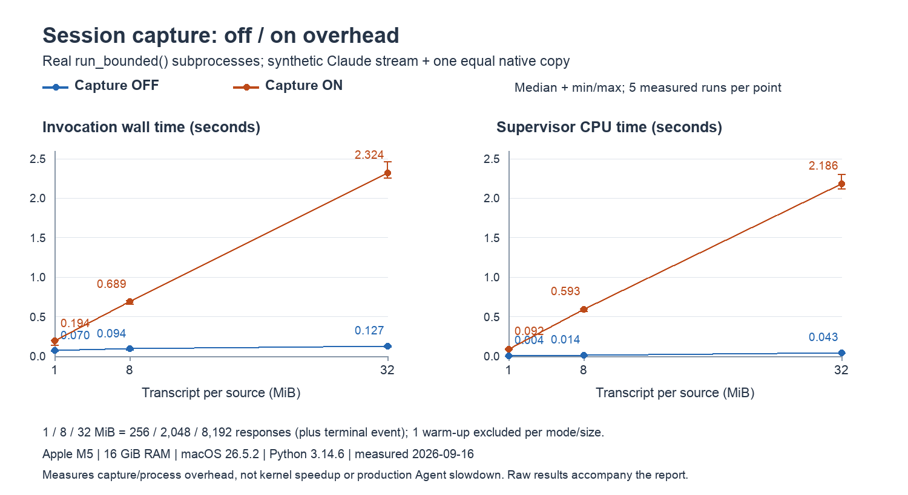

# Session capture performance evidence

This benchmark compares capture disabled (`ATREX_SESSION_CAPTURE=0`) with capture enabled (`=1`) on the same implementation. The disabled arm exercises the previous `Popen.communicate()` path; the enabled arm includes live capture and finalization. It measures the overhead introduced by default-on capture, not Kernel performance or an Agent's optimization quality.



Points are medians of five measured invocations; whiskers show the observed minimum and maximum, not confidence intervals. Lines connect measured points only.

## Results

All times are seconds. Peak RSS is MiB. Each arrow is **capture off → capture on**.

| Transcript per source (MiB) | Responses | Invocation wall time (s) | Supervisor CPU time (s) | Peak Supervisor RSS (MiB) |
| ---: | ---: | ---: | ---: | ---: |
| 1 | 256 | 0.070 → 0.194 | 0.004 → 0.092 | 31.2 → 41.5 |
| 8 | 2,048 | 0.094 → 0.689 | 0.014 → 0.593 | 55.7 → 141.6 |
| 32 | 8,192 | 0.127 → 2.324 | 0.043 → 2.186 | 139.9 → 471.8 |

At 32 MiB per source, capture adds about **2.20 seconds wall time**, **2.14 seconds Supervisor CPU**, and **332 MiB peak RSS** relative to the disabled path in this workload. This is a material cost, not evidence that capture is free. Archive construction and parsing produce in-memory objects as well as persisted bytes; the diagnostic byte cap is not a peak-memory cap. Concurrent sessions may amplify this resource cost.

All 36 invocations (30 measured plus six warm-ups) exited successfully, with no timeout or stderr. Returned stdout matched the fixture byte-for-byte. Every enabled invocation reported complete capture and the expected exact usage; no diagnostic limits were reached. The usage checks use synthetic counters and do not constitute a live-provider accounting audit.

[Raw results](assets/session-capture-performance.json) include every sample and warm-up, byte counts and stdout/fixture hashes, capture validity, the environment, script SHA-256, and hashes of the measured implementation files. No test module or plotting script is added to the repository.

## Interpretation for real Agent sessions

The benchmark emits hundreds to thousands of responses in a burst, without waiting for model generation. In the intended AKA workload, where an individual model response takes tens of seconds to minutes, the same transcript accumulates over a much longer interval. The approximately 2.20 seconds of additional wall time at 32 MiB is for the **entire 8,192-response synthetic invocation**, not for each response. Its large off/on ratio therefore should not be read as the slowdown of a real Agent session.

Capture reads and processes output concurrently with the CLI, so some of its work can overlap model generation and tool waits; final projection still adds synchronous work at completion. For model-latency-bound runs with sufficient CPU and memory, we therefore **expect Capture to contribute a small fraction of overall AKA wall time rather than be a major latency bottleneck**. This is a workload-based expectation, not an end-to-end result established by this benchmark. Seconds of burst-processing overhead do not prove negligible impact in every deployment: long-running polling, slow storage, and resource contention can add costs, and the measured memory increase still matters when many sessions run concurrently.

## Environment and measurement scope

- Measured on **2026-09-16**, Apple M5, 10 logical CPUs, 16 GiB RAM, macOS 26.5.2 arm64, CPython 3.14.6.
- Checkout base: `8d220f1875ef7ea29cd61e39498e613278b4c9b4`, with this change's Pi/Qoder accounting fixes applied. The raw file's `source_sha256` identifies the actual measured Python files independently of subsequent documentation edits.
- Workload sizes: **1, 8, 32 MiB per source**, respectively 256, 2,048, and 8,192 final assistant responses. Each response is exactly 4,096 bytes, followed by one small terminal event. Each invocation writes one identical native transcript and stdout: the 32 MiB point therefore presents approximately **64 MiB across the two sources**, not 32 MiB total.
- Both arms run the same real child process via `run_bounded()`, with a fresh workspace and provider home. The home contains 64 unrelated small transcript files to exercise scoped discovery. No real Agent CLI, model, GPU, credentials, or network is used; the child emits synthetic Claude-format events.
- One warm-up per size and mode is excluded. Five measured runs per size and mode use alternating off/on ordering. Every sample runs in a fresh Supervisor Python process.
- The wall timer surrounds the complete `run_bounded()` call: capture startup, process execution, pipe/native reads, discovery, writes, final native sync, and conversation projection. Python imports, fixture/home preparation, and post-run assertions are outside it.
- CPU uses `time.process_time()`: Supervisor CPU across its threads, excluding child-process CPU. Peak RSS uses `resource.getrusage(RUSAGE_SELF)` for the fresh Supervisor process, including its imports; it is not the RSS delta over the timed interval.
- Files are on the workstation's local temporary storage. Filesystem caches are warm; there is no cache flush or CPU isolation. The implementation polls native files at 1 Hz; short invocations may only reach the final native sync.

This burst-output benchmark exposes capture overhead without hiding it behind model/network wait time. Its off/on ratios are **not** production Agent slowdown ratios. It does not cover long-running discovery, large resumed histories, many subagents, all provider formats, Linux storage, or concurrent Campaigns. The three points cannot establish asymptotic complexity. Those conditions require additional measurements before claiming negligible production overhead. Operators can use [the capture kill switch](session-observability.md#disable-capture-and-roll-back) if the extra resource cost is unacceptable.

## Reproduction

Run from the AKA checkout containing this change. Python 3.11+ and the standard library suffice; using the measured Python/OS gives a closer comparison. The helper is created in a temporary directory, not committed. It needs no installed provider CLI.

<details>
<summary>Copy-paste benchmark command (includes the complete helper)</summary>

```bash
benchmark_dir="$(mktemp -d)"
cat > "$benchmark_dir/benchmark.py" <<'PY'
"""Synthetic run_bounded capture A/B; no model, GPU, credentials or test monkeypatches."""
import argparse
import hashlib
import json
import os
import platform
import resource
import statistics
import subprocess
import sys
import tempfile
import time
from datetime import datetime, timezone
from pathlib import Path

CHILD = """import pathlib,sys
payload = pathlib.Path(sys.argv[1]).read_bytes()
native = pathlib.Path(sys.argv[2])
native.parent.mkdir(parents=True, exist_ok=True)
native.write_bytes(payload)
sys.stdout.buffer.write(payload)
sys.stdout.buffer.flush()
"""


def sample(checkout, fixture, enabled):
    sys.path.insert(0, str(checkout))
    from orchestrator.agent_runtime.process import run_bounded
    with tempfile.TemporaryDirectory(prefix='sample-', dir=fixture.parent) as temporary:
        root = Path(temporary).resolve()
        workspace, home = root / 'workspace', root / 'home'
        workspace.mkdir()
        home.mkdir()
        native = home / '.claude/projects/bench/bench-session.jsonl'
        # Fixed background discovery workload; unrelated content is never captured.
        for i in range(64):
            path = home / f'.claude/projects/unrelated/other-{i}.jsonl'
            path.parent.mkdir(parents=True, exist_ok=True)
            path.write_text('{"type":"user","message":{"role":"user","content":"unrelated"}}\n')
        env = {'PATH': os.environ.get('PATH', ''), 'HOME': str(home),
               'ATREX_AGENT_CLI': 'claude', 'ATREX_SESSION_CAPTURE': str(enabled),
               'ATREX_SESSION_CAPTURE_DIR': str(root / 'capture')}
        command = [sys.executable, '-c', CHILD, str(fixture), str(native),
                   '--session-id', 'bench-session', 'synthetic capture benchmark']
        cpu_start, start = time.process_time(), time.perf_counter()
        stdout, stderr, status, timed_out = run_bounded(command, workspace, 120, env)
        elapsed, cpu = time.perf_counter() - start, time.process_time() - cpu_start
        row = {'capture': bool(enabled), 'wall_seconds': elapsed, 'supervisor_cpu_seconds': cpu,
               'peak_rss_mib': resource.getrusage(resource.RUSAGE_SELF).ru_maxrss / (1024**2 if sys.platform == 'darwin' else 1024),
               'stdout_bytes': len(stdout.encode()), 'stdout_sha256': hashlib.sha256(stdout.encode()).hexdigest(),
               'exit_status': status, 'timed_out': timed_out, 'stderr_bytes': len(stderr.encode()),
               'artifact_bytes': sum(p.stat().st_size for p in (root / 'capture').rglob('*') if p.is_file())}
        assert status == 0 and not timed_out and not stderr
        assert stdout.encode() == fixture.read_bytes()
        if enabled:
            report = json.loads(next((root / 'capture').glob('run-*/token-usage.json')).read_text())
            row.update(capture_complete=report['capture_complete'], total_tokens=report['total']['total_tokens'],
                       measurement=report['total']['measurement'])
            assert row['capture_complete'] and row['measurement'] == 'exact'
        return row


def make_fixture(path, mib):
    records = []
    counters = {'input_tokens': 100, 'output_tokens': 20, 'cache_read_input_tokens': 0,
                'cache_creation_input_tokens': 0}
    # Exactly 4096 bytes per response; two identical source copies in each run.
    for i in range(mib * 256):
        event = {'type':'assistant', 'message':{'id':f'msg-{i:06}', 'role':'assistant',
                 'content':[{'type':'text', 'text':''}], 'usage':counters}}
        base = json.dumps(event, separators=(',', ':'))
        event['message']['content'][0]['text'] = 'x' * (4096 - len(base.encode()) - 1)
        line = json.dumps(event, separators=(',', ':')) + '\n'
        assert len(line.encode()) == 4096
        records.append(line)
    records.append(json.dumps({'type':'result', 'modelUsage':{'synthetic':{key:value*mib*256 for key,value in counters.items()}}})+'\n')
    path.write_text(''.join(records))


def main():
    parser = argparse.ArgumentParser()
    parser.add_argument('--checkout', type=Path, required=True)
    parser.add_argument('--output', type=Path)
    parser.add_argument('--sample', type=Path)
    parser.add_argument('--capture', type=int, choices=(0,1))
    args = parser.parse_args()
    checkout = args.checkout.resolve()
    if args.sample:
        print(json.dumps(sample(checkout, args.sample.resolve(), args.capture)))
        return
    output = args.output.resolve()
    output.parent.mkdir(parents=True, exist_ok=True)
    data = {'started_at':datetime.now(timezone.utc).isoformat(),
            'environment':{'platform':platform.platform(), 'machine':platform.machine(),
              'python':sys.version, 'logical_cpus':os.cpu_count(), 'python_executable':sys.executable},
            'checkout_head':subprocess.check_output(['git','rev-parse','HEAD'],cwd=checkout,text=True).strip(),
            'tracked_diff_sha256':hashlib.sha256(subprocess.check_output(['git','diff'],cwd=checkout)).hexdigest(),
            'sizes_mib':[1,8,32], 'repetitions':5, 'warmups_per_mode_per_size':1,
            'workload':{'bytes_per_response':4096, 'native_copies':1, 'unrelated_native_files':64,
                        'fresh_process_per_sample':True, 'timeout_seconds':120},
            'benchmark_script_sha256':hashlib.sha256(Path(__file__).read_bytes()).hexdigest(),
            'samples':[], 'warmups':[]}
    if sys.platform == 'darwin':
        for name, key in [('machdep.cpu.brand_string', 'cpu_model'), ('hw.memsize', 'physical_memory_bytes')]:
            data['environment'][key] = subprocess.check_output(['sysctl', '-n', name], text=True).strip()
    data['source_sha256'] = {
        str(path.relative_to(checkout)): hashlib.sha256(path.read_bytes()).hexdigest()
        for path in sorted((checkout / 'orchestrator').rglob('*.py'))
        if path.name.startswith('session_') or path.parent.name == 'agent_runtime'
    }
    with tempfile.TemporaryDirectory(prefix='fixtures-',dir=output.parent) as tmp:
        for size in data['sizes_mib']:
            fixture = Path(tmp) / f'{size}.jsonl'
            make_fixture(fixture,size)
            for repetition in range(6):
                # Alternate paired ordering to reduce monotonic drift bias.
                for enabled in ((0,1) if repetition % 2 == 0 else (1,0)):
                    result = subprocess.run([sys.executable,__file__,'--checkout',str(checkout),
                       '--sample',str(fixture),'--capture',str(enabled)], text=True,capture_output=True,check=True)
                    row = json.loads(result.stdout)
                    row.update(size_mib=size,repetition=repetition,fixture_sha256=hashlib.sha256(fixture.read_bytes()).hexdigest())
                    assert not enabled or row['total_tokens'] == size*256*120
                    data['warmups' if repetition == 0 else 'samples'].append(row)
                    output.write_text(json.dumps(data,indent=2)+'\n')
                    print(f'{size} MiB capture={enabled} repeat={repetition}: wall={row["wall_seconds"]:.3f}s cpu={row["supervisor_cpu_seconds"]:.3f}s',flush=True)
    data['finished_at']=datetime.now(timezone.utc).isoformat()
    output.write_text(json.dumps(data,indent=2)+'\n')
    for size in data['sizes_mib']:
        for enabled in (False,True):
            rows=[r for r in data['samples'] if r['size_mib']==size and r['capture']==enabled]
            print(size,enabled,{k:statistics.median(r[k] for r in rows) for k in ('wall_seconds','supervisor_cpu_seconds','peak_rss_mib')})


if __name__ == '__main__':
    main()
PY

python3 "$benchmark_dir/benchmark.py" \
  --checkout "$PWD" \
  --output "$benchmark_dir/results.json"

printf 'Raw results: %s\n' "$benchmark_dir/results.json"
```

</details>

The command prints every sample and the median wall/CPU/RSS results. To independently reproduce the plotted values from either the new output or the checked-in raw data:

```bash
python3 - docs/assets/session-capture-performance.json <<'PY'
import json
import statistics
import sys

with open(sys.argv[1]) as source:
    data = json.load(source)
for size in data["sizes_mib"]:
    for enabled in (False, True):
        rows = [r for r in data["samples"]
                if r["size_mib"] == size and r["capture"] == enabled]
        print(f"{size} MiB capture={'on' if enabled else 'off'} n={len(rows)}")
        for key in ("wall_seconds", "supervisor_cpu_seconds", "peak_rss_mib"):
            values = [row[key] for row in rows]
            print(f"  {key}: median={statistics.median(values):.6f}"
                  f" min={min(values):.6f} max={max(values):.6f}")
PY
```

Replace the JSON path with `"$benchmark_dir/results.json"` to summarize a new run. Keep its raw output and environment when comparing results across machines.
