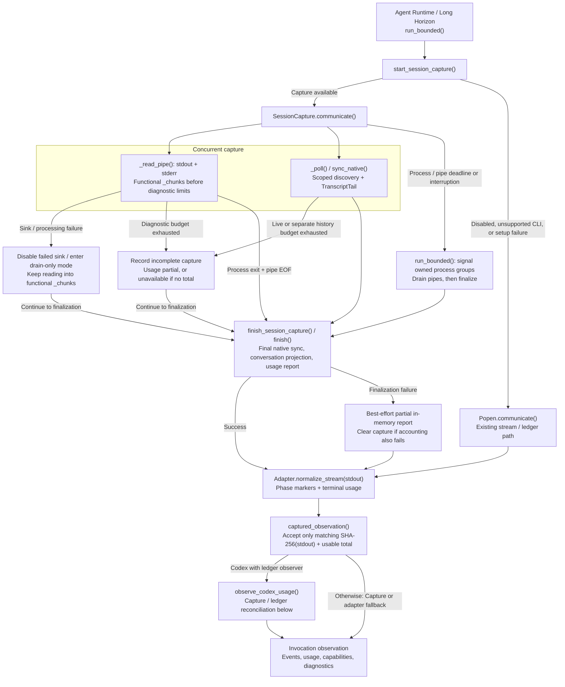
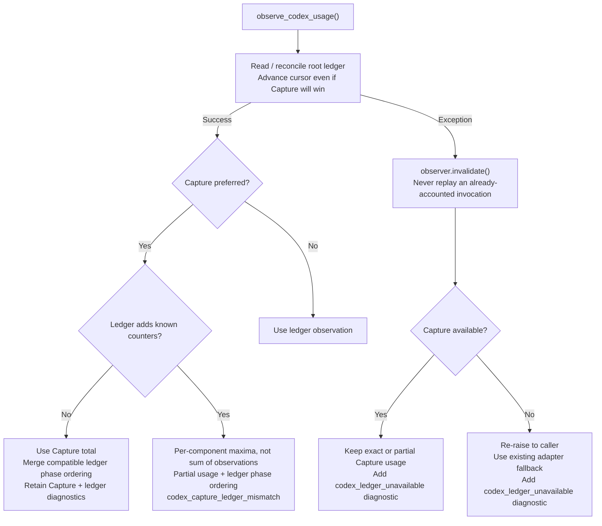

# Session observability

Coding sessions now save an invocation-scoped conversation and provider usage report while the CLI runs. This is an observation-only addition to the existing Agent runtime and Long Horizon runner: it does not introduce an HTTP service, require Bubblewrap, change Agent prompts, or move Git, evaluation, Journal, or promotion responsibilities.

## Motivation, users, and observable benefit

[PR #89's motivation](https://github.com/alibaba/atrex-kernel-agent/pull/89) is to improve process observability and evidence reliability while reducing Agent-side harness work. This PR extracts only the observation component. Before this change, `run_bounded()` buffered the process streams until completion, and `LongSessionRunner.run()` returned only the last 4,000 characters of each combined stdout/stderr stream. That result alone could not reconstruct an earlier tool failure or distinguish the complete conversation of one retry from another. Provider-native files and the existing Codex ledger could supply additional evidence, but there was no common invocation archive collecting the prompt, root/child conversations, and usage across backends. This is an implementation-level limitation, not a claim that all earlier traces or usage were absent.

The target users are Campaign operators diagnosing failed or stalled runs, researchers attributing costs across retries and subagents, and maintainers comparing provider adapters. The benefit is inspectable evidence, not a claimed reduction in Kernel latency or Token consumption.

| Acceptance check | Observable result |
| --- | --- |
| Supported invocation, writable storage, within capture limits | One invocation directory with the initial/resume prompt, exported conversation, process status, and usage report; no need to wait for the whole Episode to finish. |
| Same-session retry/resume | A separate invocation directory; newly appended native records and invocation-local usage rather than replayed history. |
| Duplicate stream/native records or exported child usage | Counters reconcile without counting duplicate copies; uncertain coverage is explicitly `partial` or `unavailable`. |
| Capture disabled | No new capture directory or capture monitor/readers; functional stdout/stderr, exit status, and existing stream/ledger accounting remain available. |

Recorded-format fixtures and real local subprocesses verify these contracts. A [capture-off/on benchmark](session-capture-performance.md) measures process latency, Supervisor CPU time, and peak memory at three transcript sizes, with raw samples and reproduction commands. It is a synthetic capture-workload measurement, not a production Agent slowdown or Token-saving claim; diagnosis time and end-to-end savings have not been benchmarked.

## Capture lifecycle

The diagrams describe the current implementation. Capture observes the existing process lifecycle; it does not decide whether a Kernel is accepted or an Episode is promoted. Failure branches preserve the process outcome while reporting incomplete observation.



`_chunks` supplies the functional process output; `_retained_chunks` and native copies supply bounded diagnostics. A failed pipe sink is disabled independently; unexpected diagnostic-processing failures switch that reader to drain-only mode. Both paths keep collecting functional output. Native-file failures mark incomplete coverage rather than terminating the CLI. Timeout/interruption still follows `run_bounded()`'s existing process-group signaling and finalization path.

### Codex reconciliation and failure paths



Capture is preferred when it provides exact usage, observed usage deltas, or incomplete capture coverage. Before choosing it, reconciliation checks whether the ledger supplies a larger counter or a component absent from Capture. In that case, per-component maxima and a total at least as large as either observation and the sum of the merged components preserve known evidence without adding potentially overlapping totals. The result is `partial` with `codex_capture_ledger_mismatch`, retaining the ledger's root phase ordering. This does not establish an exact total for unseen child requests. Otherwise the Capture total is kept, with compatible ledger phase ordering when available. Capture-health and ledger diagnostics remain separate from the process exit status.

Functional output waits for both pipe readers to reach EOF. A configured timeout covers the process wait and pipe drain together; timeout/interruption signals the owned process groups, including the original group if its leader has already exited. Without a configured deadline, a descendant holding a pipe open can delay completion, as with `Popen.communicate()`. Every failed ledger observation invalidates its cursor before Capture or stream fallback; caller-side failures such as thread lookup invalidate it as well.

### Code map

| Responsibility | Implementation |
| --- | --- |
| Process execution, timeout/interruption, finalization hook | [`run_bounded()`](../orchestrator/agent_runtime/process.py) |
| Capture setup, pipe readers, monitor, finalization, stdout-bound observation | [`session_capture.py`](../orchestrator/session_capture.py) |
| Current-session and descendant transcript discovery | [`session_native.py`](../orchestrator/session_native.py) |
| Incremental native reads, invocation-local limits, separate resume-history scan | [`session_tail.py`](../orchestrator/session_tail.py) |
| De-duplicated conversation projection | [`session_transcript.py`](../orchestrator/session_transcript.py) |
| Provider counters, reconciliation, partial/unavailable usage | [`session_usage.py`](../orchestrator/session_usage.py) |
| Stream normalization and Capture/Ledger selection | [`adapter.py`](../orchestrator/agent_runtime/adapter.py), [`codex_ledger.py`](../orchestrator/agent_runtime/codex_ledger.py) |
| Conservative merge of overlapping usage evidence | [`merge_token_usage_evidence()`](../orchestrator/agent_runtime/model.py) |
| Observation consumers and Codex exception fallback | [`agent_runtime/runtime.py`](../orchestrator/agent_runtime/runtime.py), [`long_horizon/main_adapter.py`](../long_horizon/main_adapter.py), [`long_horizon/session.py`](../long_horizon/session.py) |

## Where records live

Long Horizon writes into its existing Episode archive, so records survive removal of the Episode worktree:

```text
<campaign>/.atrex_long_horizon/episodes/eNNNN/sessions/
  run-<uuid>/
    conversation.jsonl
    token-usage.json
    provider/
      stdout.stream-json
      stderr.log
      native/               # selected provider transcripts, if available
```

Other invocations through the Agent runtime, including framework-baseline and policy-review sessions, default to `<workspace-parent>/.atrex-session-traces/<workspace-name>/run-<uuid>/`. The default is outside the candidate Git workspace and does not add trace files to candidate commits.

Set `ATREX_SESSION_CAPTURE_DIR` to override that root for standalone invocations. Relative paths resolve against the invocation workspace. Long Horizon selects its Episode-specific archive directory. Every invocation, including same-session repair/resume, gets a new `run-<uuid>`; the provider session ID can remain the same.

## Disable capture and roll back

Capture is enabled by default. To disable it, launch the existing optimization command with this environment variable:

```bash
export ATREX_SESSION_CAPTURE=0
# Run the same orchestrator or Long Horizon command with its usual arguments.
```

The exact value `0` (ignoring surrounding whitespace) disables capture; unset or any other value keeps it enabled. The switch is read from each invocation's effective environment and takes precedence over `ATREX_SESSION_CAPTURE_DIR`, including Long Horizon's Episode-specific destination. It is checked before capture-directory creation, native discovery, or capture-thread startup. The previous invocation's in-memory capture observation is cleared, so it cannot be reused accidentally. `run_bounded()` then uses `Popen.communicate()`, and accounting uses the existing adapter/Codex-ledger path; additional native child accounting supplied by Capture is no longer available.

This is a launch-time switch, not a live toggle. Exporting it in another shell does not alter a running Campaign: stop the affected runner through its normal shutdown path, then restart/resume it with the variable set. Already-running invocations are not retroactively changed. Re-enable capture for subsequent launches with `unset ATREX_SESSION_CAPTURE` or `export ATREX_SESSION_CAPTURE=1`.

Disabling capture does not delete existing archives, change provider credentials/HOME, disable CLI-native persistence, or disable the pre-existing Episode archives/ledger. In particular, Qoder's native persistence remains enabled; the switch is not a full reversal of the adapter changes. For a complete rollback, stop affected runners, redeploy the previously approved pre-PR revision (or revert this PR's commits), and restart using the existing recovery procedure. Preserve existing archives for diagnosis; rolling back code does not require deleting Campaign state.

## Conversation

`conversation.jsonl` starts with session metadata and the exact prompt passed to the CLI. During execution it appends provider events and newly discovered native messages. At exit it is atomically rebuilt into a de-duplicated reading view, retaining provider-reported reasoning, messages, tool requests/results, subagent content, and terminal status.

The provider directory retains the corresponding stream and native records. Claude's `system/thinking_tokens` progress notifications are omitted from both persisted views; actual reasoning text is retained. Native subagent JSONL does not need an AKA session header. A resume copies only records added during that invocation, not the previously captured conversation again.

This records what the provider exports. It cannot recover unexported internal prompts, hidden reasoning, or calls that the CLI never reports.

## Usage

`token-usage.json` is refreshed during execution and finalized at exit. It includes:

- Invocation/session identity, timestamps, exit status, timeout status, and available Campaign/Episode/invocation labels.
- Per-response provider counters and their source/agent identity, plus per-agent and total counters.
- Disjoint uncached input, cache-read, cache-write, and output token buckets.
- Separate Qoder credits when the provider emits them; credits are never converted to tokens.
- Reconciliation basis, missing usage, capture warnings, and structured `capture_complete`.

The measurement states are:

| State | Meaning |
| --- | --- |
| `exact` | The backend's authoritative terminal counters are available under its accounting contract, with complete capture; backends that reconcile native counters have passed that reconciliation. |
| `partial` | Some counters exist, but coverage or reconciliation is incomplete. |
| `unavailable` | No usable token total was exported; this is not zero usage. |

Repeated stream/native copies of the same response are counted once. Claude cumulative task-progress notifications are not new responses. Codex cumulative rollout counters are reduced to invocation deltas; cached input is not added twice. Root terminal totals are not blindly added to child usage because the terminal may already include children.

Claude uses the latest `result.usage` for the persisted total, Runtime return value and Campaign token budget, with or without Capture. `result.modelUsage` has a wider scope (including internal queries such as session titles); it is neither a fallback nor an amount added to this total. A difference between these fields does not by itself mark usage partial. Raw provider events still retain both fields. Native child transcripts, per-response counters and `by_agent` totals remain diagnostic evidence and are not added to `result.usage`; their sum can therefore differ from the chosen total. If `result.usage` is unavailable, only observed, deduplicated main-session responses provide a `partial` fallback; without those, usage is `unavailable`. Capture failures and incomplete evidence remain visible rather than being relabeled exact.

Pi Capture and its adapter share the final-event usage parser: `message_end` (assistant/tool result) and `compaction_end.result.usage` both contribute to the invocation total. A complete stream ending in `agent_settled` preserves exact accounting, including compaction. Pi native entry IDs are not shared response IDs, so stream and native totals are not added together. The complete stream is preferred; if native evidence supplies larger or missing counters, component maxima preserve that evidence with `partial` status and `pi_stream_native_usage_mismatch`. Native-only or unsettled observations remain partial. This is conservative reconciliation, not an exact reconstruction of unseen child calls; the report uses one source's response rows rather than presenting duplicate copies as separate bills.

Qoder all-zero token placeholders are treated as unavailable, matching its adapter. A credits-only result therefore has `total_tokens: null`, `measurement: "unavailable"`, and separately recorded credits, not zero consumed tokens. Positive exported native token counters are still retained as partial evidence when the terminal has no usable token total.

Existing Phase Marker ordering is retained. Native-only child usage is not assigned an invented position in the root phase sequence. It contributes to the total only where the backend's accounting contract includes it; Claude does not add it separately. Detailed per-response counters remain available in the usage report even when phase attribution is incomplete.

If Codex ledger reconciliation fails, the ledger cursor is invalidated before fallback, regardless of whether Capture is exact, partial, or unavailable. Available Capture usage is preserved; otherwise the caller keeps its existing stream fallback. The invocation observation reports `codex_ledger_unavailable:<ExceptionType>` and does not qualify for usage-verified resume. A later call cannot replay this invocation through the invalidated cursor. A successful Capture does not hide ledger failures.

The supported native sources are Claude, Codex, Qoder, and Pi. Existing provider-home configuration is respected; this change does not remount credentials or replace HOME. Qoder no longer receives `--no-session-persistence`, so its native session files can be captured. Optional external reviewer helpers or arbitrary model processes bypassing the shared Agent runtime are not automatically covered unless their calls appear in the selected provider transcripts.

## Failure and privacy boundaries

Trade-offs include additional disk writes, native-file discovery/parsing, memory for diagnostic buffers, and final conversation projection. Limits apply per invocation, not to the total disk usage of a long Campaign; operators still need a retention policy. Provider format changes, missing child exports, or interrupted capture can reduce accounting coverage. Capture failure handling is best effort, with the reader-join and ledger-fallback boundaries described above; the kill switch restores the non-capture execution path when those risks are unacceptable.

Capture uses incremental reads, bounded transcript discovery, and no-follow regular-file reads. Default limits are 64 MiB per file, 128 MiB retained per invocation, 2 MiB per line, 4,096 discovered files, and 200,000 retained records. Exceeding a limit records partial coverage; it does not terminate the Agent or reject its result.

Native per-file limits count bytes captured during this invocation, not the absolute offset of a resumed transcript. Pre-invocation history is scanned once under a separate budget with the same limits, shared across history files. History bytes and records never consume the live capture allowance. If that scan is capped, capture still starts at the original snapshot boundary; history is not replayed as new content. Usage reconciliation is marked incomplete, and missing Codex baseline counters are not treated as zero.

An oversized native line is skipped through its newline, including across polling calls, and later valid records are still captured. The gap marks coverage incomplete; skipped bytes still consume the per-file/session read budget, preventing an unbounded scan of oversized input. Total-byte and record-count exhaustion can still stop a file's capture. Inode changes, truncation, and no-follow checks remain fail-closed.

These limits apply to diagnostic capture, not to the stdout/stderr returned to the existing Runtime parsers. Diagnostic-limit exhaustion does not discard oversized lines, late phase receipts, terminal results, or Codex thread IDs from functional output. As with the previous `Popen.communicate()` path, functional output remains buffered in memory without a capture-imposed cap, and normal completion waits for EOF instead of returning after a fixed reader-join interval. A pipe-drain timeout raises `TimeoutExpired` into the existing termination path rather than silently returning a prefix. The final conversation is rebuilt only from the bounded diagnostic copy; finalization does not restore omitted output into the archive.

If a persistence sink fails, the pipe reader keeps draining the child's output to EOF. Setup/finalization failures are logged without replacing the CLI outcome. Existing process timeout, dependency guards, termination, and resume policy remain in place. A forcibly killed observer cannot write a final status; surviving files may still say `running`.

Each capture directory is created with mode `0700`. Only the current session and identified descendants are copied, not unrelated transcripts or credential files. Prompt, reasoning, and tool output may nevertheless contain sensitive content: these are local diagnostic files, not sanitized public artifacts. This PR adds no security isolation against the Agent running as the same OS user. The existing trace-retention manifest and upload policy are unchanged.

## Verification

The CLI import/argument smoke check requires no GPU or model credentials:

```bash
python3 orchestrator/optimize.py --help
```

Regression tests are maintained outside this repository. Local validation uses recorded-format fixtures and real Python subprocesses instead of paid Agent CLIs. It covers native children, duplicate/cumulative counters, resume deltas, phase ordering, scoped shared-home discovery, capture limits, complete functional stdout/stderr, pipe draining after write/parser failures, ledger-failure diagnostics and resume qualification, normal exit, timeout, Long Horizon invocation archives, and the kill switch (including destination precedence, stale-observation clearing, environment propagation, and stream/ledger fallback). Boundary regressions also cover a larger ledger versus incomplete Capture, partial-fallback cursor invalidation, output arriving more than five seconds after the root exits, timeout/interruption after leader exit, and oversized native lines spanning multiple polls. The CLI smoke check alone does not verify these behaviors.

Provider-accounting regressions additionally check Pi compaction (120 + 60 = 180 exact tokens), Pi stream/native copies without shared IDs (120, not 240), repeated independent Pi responses, native/stream arrival order, native-only and resumed observations, and Qoder credits-only zero placeholders. Real subprocess checks verify the persisted usage report and the accounting returned to callers, not only the parser in isolation.

Claude checks cover a larger `modelUsage` alongside a smaller `result.usage`, diagnostic child counters, missing terminal usage, cumulative terminal events, capture-on/off consistency, and replay of a real Session whose main responses total 1,304,284 tokens while `modelUsage` reports 1,308,204. Under the chosen contract both capture paths retain 1,304,284; the additional internal-call counters are not included in the Campaign budget.
