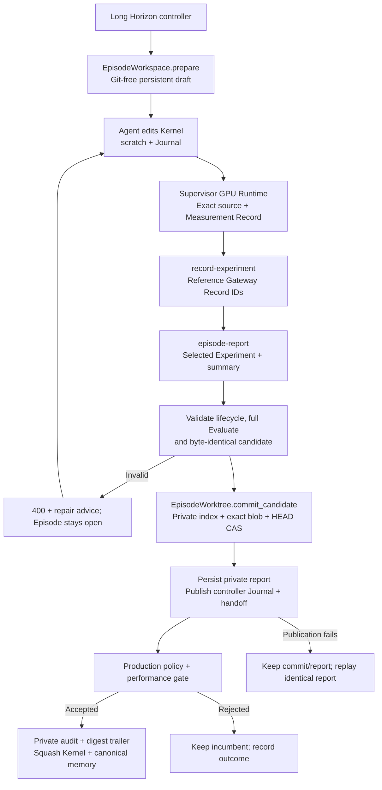

# Supervisor-owned Episode handoff and promotion

An optimization Agent should choose and explain a candidate, not supply Git state as proof that it was measured. Long Horizon therefore gives each new optimization Episode a persistent Git-free draft and keeps the real worktree, Journal projection and promotion audit under controller ownership. The report binds the selected Experiment to exact measured source before any candidate commit is created.

## Boundary and retained workflow

Optimization Episodes use one workflow: Direction/Experiment Journal, repairable report, sealed candidate, production policy when enabled, and recorded ABBA acceptance. Deterministic V0 and Framework Baseline are separate initialization stages.

New Long Horizon optimization Episodes use Runtime Journal and `episode-report`; the Agent no longer commits candidates, writes handoffs, or chooses a branch. Low-level legacy Journal APIs remain available for existing integrations. Do not switch an unfinished legacy-Journal Episode into the new mode: finish it using its original code/configuration, or archive it before starting a new Episode.

Native Linux/macOS execution remains supported. Native mode is a cooperative separation of working directories, **not a security boundary against the operator's own UID**. Use `--agent-sandbox bwrap` on Linux for filesystem enforcement: only the draft, scoped assets, Session Home and declared helper paths enter the namespace. The real worktree, Git common directory and private store are not mounted, including through extra installation or path grants.

Managed Session startup requires a resolvable Git common directory. If discovery fails, no capability is registered, no Agent environment is yielded and no draft is published; repair the controller worktree's Git metadata before retrying. Unmanaged non-Git Sessions retain their existing behavior.

## Lifecycle



Code boundaries: `orchestrator/episode_workspace.py` materializes/publishes the draft; `SupervisorRuntime.register_episode/session` binds it; `supervisor/journal.py` validates and submits; `long_horizon/git_episode.py` seals and promotes. `recorded_verifier.py` consumes recorded ABBA and the existing score gate. `promotion_audit.py` and `audit_recovery.py` bind recovery to an already committed promotion.

The commit tree is built from the exact bytes validated against the selected Experiment, not a second read of mutable Agent source. Only `kernel.py` can differ from the Episode baseline. A temporary index avoids mixing staged files into the commit; compare-and-swap refuses concurrent HEAD changes. Repeating the same report after a commit/write interruption reuses the matching HEAD instead of creating another commit. No Agent-provided Commit ID is accepted in managed Episodes.

Private report persistence precedes compatibility publication. A rejected report may be corrected and resubmitted. Once accepted, only identical replay is allowed. Subsequent draft edits do not change the sealed candidate: Session publication retains the source bound to the private report and commit, leaves the Agent draft untouched, and records an integrity warning in the private draft state and operator log if the draft differs or cannot be read. Completion/recovery restores a differing controller copy from the verified seal before policy review. Acceptance read the committed bytes, never the later draft. Invalid report digests, Git identity/ancestry changes and protected-file modifications remain blocking errors.

## Agent-visible workspace

```text
workspace/
├── kernel.py                         # Writable candidate
├── README.md / CLAUDE.md              # Public immutable instructions
├── public operator/evaluator files   # Existing layout; no additional private Shapes
├── memory/vN.json                    # Read-only canonical history
├── tools/ / skills/ / reference/     # Existing linked assets
├── scratch/                         # Temporary requests, probes and source copies
└── .atrex_long_horizon/telemetry.jsonl # Phase markers, not control state
```

There is no real `.git`, private Journal, handoff, promotion audit or evaluator checkout in this draft. Provider Home/session capture retain their existing lifecycle. Codex receives `--skip-git-repo-check` for managed drafts.

Drafts live at `<Supervisor scope>/journals/episodes/eNNNNNNNN/agent/workspace/`. The controller worktree remains separate. Resume reuses the draft; controller-side baseline/conversion changes refresh its Kernel. On Session exit, bounded no-follow reads publish in-progress Kernel and diagnostic files back to the private worktree for existing archival/telemetry consumers. After an accepted candidate report, the sealed Kernel takes precedence over the draft. Public evaluator inputs are copied from the controller again when staging GPU requests, not trusted from the draft. Diagnostic publication is an upsert, not a mirror of deletions.

## Acceptance and reuse

| Phase | Required authoritative evidence |
| --- | --- |
| Candidate report | Selected current-Episode Experiment cites a passing standard full Evaluate of exact current source |
| Acceptance | Same-allocation ABBA of exact committed incumbent/candidate under the configured evaluator/target/policy |
| Production review | Independent policy reviewer over the exact sealed candidate |

Trusted acceptance invokes the same Measurement Store as the Agent. A completed, cacheable record is reusable only when its **entire task identity** matches: operation, source/input bytes, evaluator code, target, options and repetition policy. Ordinary Evaluate never substitutes for ABBA. Cancelled, incomplete or uncertain outcomes are not accepted as cached measurements. Different request options, including a different baseline input path, can legitimately require a new record.

Agent duplicate behavior is unchanged: return the duplicate-task error and existing Gateway Record ID. The reuse switch exists only as an internal Python method, not an HTTP field or Agent CLI option. Verification stores its Gateway Record ID and reuse flag. To make an Agent ABBA eligible for exact reuse, use the same policy and `scratch/incumbent.py` baseline path; the Supervisor independently supplies the committed incumbent bytes.

Each Episode prompt includes the effective acceptance command, generated by the same `RecordedABBAValidator.request_argv()` used at acceptance: configured comparison repeats, per-run timeout, Shape batch size and baseline path. It also gives a `kernel-read` command for the exact committed incumbent, plus the Runtime's frozen measurement repetition policy and allocation timeout. This works after edits/resume and does not reveal private evaluator inputs. Agent-run ABBA remains optional. Reuse is conditional on complete task identity, not a promise that every acceptance adds zero GPU submissions; changes to source, inputs, evaluator or policy require a different record.


Standalone Dev probes may run without a draft `kernel.py`; their Gateway Record then has no candidate Kernel binding and does not trigger policy prewarm. Operations that require a candidate still reject missing source before GPU submission with an actionable input error.

## Promotion evidence and recovery

New promotion audits live in `<Supervisor scope>/promotions/long_horizon_eNNNN.json`, not Agent memory. The Git promotion carries an `AKA-Promotion-Audit: sha256:...` trailer binding the exact audit bytes. Only Kernel and canonical numbered memory are committed. Legacy promotions with committed memory audit files remain readable.

A crash before commit can leave an audit file but does not prove promotion. A crash after commit is recognized only with matching parent, Episode/version/branch and audit digest. Missing/corrupt evidence pauses recovery without dropping the active checkpoint or resetting the promotion. The error prints exact operator commands:

```bash
python3 -m long_horizon.audit_recovery --workspace WORKSPACE --promotion-commit FULL_HEAD \
  restore --file /path/to/original-audit.json
# Only if the audit is missing and no backup exists:
python3 -m long_horizon.audit_recovery --workspace WORKSPACE --promotion-commit FULL_HEAD \
  acknowledge-missing --reason 'Operator explanation'
```

Stop the Campaign before repair. Restore requires bytes matching the committed digest. Acknowledgement is explicitly `audit_unverifiable`, not a fabricated successful Gate, and cannot waive corruption or identity mismatch. Resume then records that operator decision.

Repair remains available when the active checkpoint has advanced beyond `promoted`, including after the Episode outcome was recorded. Authorization depends on that checkpoint's promotion binding matching the exact supplied HEAD, not its phase. Repair leaves the checkpoint phase, outcome and counters unchanged; without a matching active checkpoint it is refused.

## Verification, limits and rollback

Validation uses temporary fixtures outside the source tree, real Git/HTTP/filesystem operations and a fake GPU executor. Coverage includes exact source sealing, report repair/replay, duplicate-vs-trusted-reuse behavior, private evidence binding and recovery. Current workflow verification is summarized in [design](design.md#verification). No live-model or production-GPU performance claim follows from these checks.

Verification includes non-default rendered acceptance commands and exact-identity reuse, post-report draft drift, immutable candidate validation, protected paths, kernel-optional Dev and promotion-audit recovery. These are local control-flow regressions, not production performance measurements.

Draft copies cost disk space and publication I/O; limits remain 16 MiB per file and 4096 files / 64 MiB per diagnostic tree. Native mode retains same-UID authority. See [workflow migration](design.md#upgrade-and-rollback) before updating active Campaigns.
