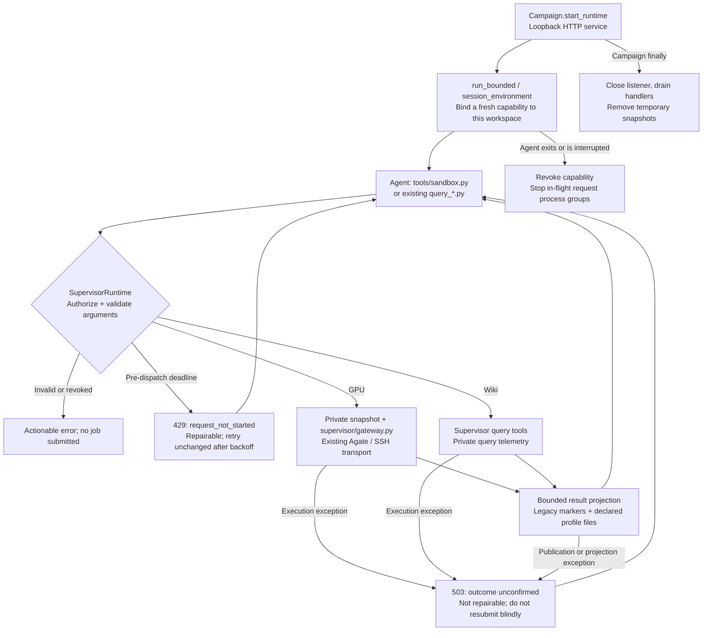

# Supervisor GPU/Wiki Runtime

The Campaign now owns GPU and Wiki execution. Agent sessions keep the familiar `python3 tools/sandbox.py ...` interface, but that script is a standard-library HTTP client. Packaging, endpoint selection, credentials, private evaluator inputs and result projection run in the Supervisor. Operators still launch `orchestrator/optimize.py`; no separate service command is required.

The GPU/Wiki service owns execution and credentials. [Measurement records and recovery](measurement-records.md) add private source/results, deduplication and reliability. [Runtime Journal](runtime-journal.md) and [Supervisor-owned handoff](supervisor-promotion.md) bind selected evidence to controller-created candidate commits. Optimization Episodes use a single Direction/Experiment/report workflow; see [design](design.md).

## Lifecycle and authority



`Campaign.agent_environment()` starts the listener lazily. `run_bounded()` creates an invocation-scoped capability against the actual Episode worktree, including when the Campaign uses several disposable worktrees. It removes Supervisor Gateway credentials/configuration and supplies only `ATREX_AKA_RUNTIME_URL` and `ATREX_AKA_RUNTIME_TOKEN`. Auxiliary reviewer/problem-generation sessions receive no GPU/Wiki capability. Agent-created children within the same invocation may use that invocation's capability.

The bearer deliberately delegates this workspace's GPU/Wiki authority to the Session and its children. It is fresh for each invocation and revoked on exit, not rotated per request. Anyone who captures the live token can exercise that authority until revocation; neither environment variables nor loopback HTTP isolate mutually untrusted processes running as the same host user. Do not dump the Agent environment, and use separate OS identities/containers for untrusted host tenants. The client sends credentials only to an HTTP `127.0.0.1` origin with an explicit port, without proxies or redirects. Supervisor error logs redact the current Session token; this is not a general crash-dump or transcript secret scrubber.

The owner is registered before the listener thread starts. A failed thread start removes the registry entry, closes the socket and cleans up temporary storage.

The managed `session_environment()` helper requires a registered Runtime owner. Missing, empty or stale owners fail without yielding an environment; there is no fallback that exposes the caller's unsanitized Gateway credentials.

The service listens on `127.0.0.1` with a random port. Its authenticated endpoints are:

| Endpoint | JSON request |
| --- | --- |
| `POST /v1/gateway/execute` | `{"argv": ["--kind", "run", "--no-sync"]}` |
| `POST /v1/wiki/query` | `{"tool": "query_hardware", "argv": ["--list", "products"]}` |
| `POST /v1/plugins/execute` | `{"action":"list"}` or `{"action":"call","tool":"gpu-wiki.query","input":{"request":"..."}}` |

`GET /healthz` is an unauthenticated liveness check without Campaign data. Responses preserve the CLI boundary: `{"exit_code": 0, "stdout": "...", "stderr": "..."}`. The client prints those streams and returns the exit code; Agents do not need to write HTTP requests or handle bearer tokens themselves.

The capability, not an Agent-supplied path, selects the workspace. Legacy full-name endpoint flags are stripped so existing prompts remain valid; prefix abbreviations are rejected, and downstream parsers disable abbreviations. Supervisor-only preflight/health controls and Wiki store overrides are rejected. Wiki `--file` accepts only a bounded regular file within the authorized workspace. Symlinks and `..` traversal cannot grant arbitrary host reads or writes.

## GPU operations

The Supervisor installs its canonical `profile_driver.py` into each private GPU request snapshot before recording inputs and building the worker bundle. Compatibility Profile routes can execute it through Dev/SSH without exposing the driver in the managed Agent workspace. An Agent-supplied file with that name cannot replace it.

Profile uses the Typed route by default for both public and hidden Shapes. Use `--kind profile --profile-shape-id ID`, not the Evaluate-only `--shape-id`. The Supervisor selects exactly one private case: the explicit ID, otherwise legacy `PROFILE_SHAPE_ID`, otherwise the first sorted Shape. Direct HTTP sends this restricted reference contract; the Agate CLI receives an equivalent private single-Shape reference directory rather than reopening the full contract. Unknown IDs fail before GPU submission, without exposing Shape parameters.

Hidden-Shape Typed Profile responses expose opaque Shape IDs and bounded Kernel metrics, not raw requests, Shape contracts, metadata, profiler artifacts or free-form hidden-case diagnostics. `--sync scratch/profile` publishes only a projected `gateway_profile.json`. Raw job responses and artifact references remain in the Supervisor's private measurement store. Non-hidden Profile retains raw artifact synchronization. Profile task identity includes the single-Shape routing contract, so older Dev-route records are not reused as Typed measurements.

The visible Kernel list is capped at 32 entries. `kernel_count`, `total_duration_us`, `dominant_kernel` and duration shares still describe the full Kernel list returned by the profiler; `kernels_omitted` reports excluded entries. Repeated projection preserves these aggregates, so the immediate response, saved Record and synchronized summary agree.

Dev/SSH remains a compatibility path for custom commands/wrappers, auxiliary inputs, driver-specific `PROFILE_*` controls, and unsupported source contracts or Gateway interfaces. Hidden Shapes alone do not trigger fallback. A recognized hidden-Shape driver receives the selected private case only in its remote bundle. Other Typed-only options fail instead of being silently ignored by a fallback.

Read the mounted `gpu-measurement` Skill for Agent-facing examples. Existing evaluator commands retain their syntax and result markers:

```bash
python3 tools/sandbox.py --kind run --no-sync -- python3 test_kernel.py --version v2 --no-memory
python3 tools/sandbox.py --kind run --mode correctness_only --no-sync
python3 tools/sandbox.py --kind run --baseline-path scratch/base.py --comparison-repeats 2 --no-sync
python3 tools/sandbox.py --kind profile --profile-level sol --no-sync
python3 tools/sandbox.py --kind dev --input scratch/probe.py --no-sync -- python3 scratch/probe.py
python3 tools/sandbox.py --kind check --sanitize memcheck --no-sync
python3 tools/sandbox.py --kind disassemble --format ptx --no-sync
python3 tools/sandbox.py --kind env
```

| Operation | Behavior and Agent result |
| --- | --- |
| Evaluate (`run`) | Atrex-Bench defaults to six correctness cases; compact `[test_kernel] RESULT_JSON=` with correctness, latency, per-Shape measurements and actionable diagnostics |
| ABBA (`run --baseline-path`) | Reuses the existing same-allocation AB/BA runner; compact `[sandbox] ABBA_JSON=` with baseline/candidate per-Shape metrics and speedup; does not select or promote a Kernel |
| Profile | Typed NCU/rocprof result, hottest Kernel/resource/SOL facts and requested counters via `[sandbox] PROFILE_JSON=`; legacy Profile commands and declared file synchronization remain supported |
| Dev | Bounded stdout/stderr and command exit status for an explicitly declared GPU probe, not necessarily an evaluation |
| Check | Typed compilation/sanitizer diagnostics via `[sandbox] CHECK_JSON=` |
| Disassemble | Typed resource facts and bounded assembly via `[sandbox] DISASSEMBLE_JSON=` |
| Env | Available Gateway environments or requested capabilities; not an arbitrary endpoint/configuration query |

Profile supports Kernel name/regex, source correlation, launch skip/count, Shape selection and counters. Profile/Check/Disassemble accept `--requirement` and `--deps-mode`. Check/Disassemble/Env require a Gateway exposing those typed APIs; they do not add an SSH implementation or upgrade an older local Gateway server. Unsupported Gateway capabilities remain explicit errors.

Evaluate can use `--input-path` and `--shapes-path` for an exploratory custom-input request, or `--mode correctness_only`; these do not replace the canonical acceptance contract. ABBA uses the complete canonical contract and rejects custom command/input/Shape/seed overrides. Native ABBA batches still use the existing runner/aggregation semantics; this PR adds neither three-repeat median aggregation nor new acceptance criteria.

A completed ABBA comparison with `correct: false` retains its nonzero exit code and public `ABBA_JSON` result in generalized/production mode. Agents can inspect baseline/candidate correctness and available per-Shape metrics; raw logs and any comparison exception text remain withheld. Infrastructure failures without a valid comparison result still return the existing operator-inspection hint, not a fabricated ABBA result.

Top-level `--version`, `--multi-seed`, `--shape-id` and `--timed-runs` are `--kind run` shorthand controls and cannot be combined with an explicit command. Use either `--kind run --multi-seed 3` or `--kind run -- python3 test_kernel.py --multi-seed 3`, not both styles in one request. The HTTP Runtime rejects mixed placement before starting the executor, and the standalone private executor applies the same validation. Shorthand controls also prevent Dev fallback when the typed request cannot honor them, including an explicitly supplied `--multi-seed 0`. ABBA retains its existing `--version`/`--timed-runs` support without a command.

Agent-authored `--input-path`, `--shapes-path` and `--baseline-path` files use descriptor-relative, per-component no-follow reads, including in the standalone executor. The final open is nonblocking and rejects non-regular files; reads stop at the byte limit plus one before checking size and UTF-8. Symlink/path replacement cannot redirect the pinned descriptors, and oversized files or FIFOs cannot trigger an unbounded read or block waiting for a writer. This does not freeze in-place Agent writes; HTTP requests still use Supervisor-owned snapshots.

Check/Disassemble and ABBA convert expected validation, I/O and execution failures into bounded `sandbox: ...` CLI errors rather than Python tracebacks. ABBA validates each nonblank `workload.jsonl` record as an object with a unique, non-empty string `uuid`; malformed records identify the physical line number and ask the operator to repair the workload contract before GPU submission. Failed ABBA child processes report the batch number, exit code and up to 4,000 characters of nested stderr, preserving its beginning and end when truncated. Timeouts or malformed results also retain bounded stderr and warn against blind resubmission. Existing generalized-result projection still withholds private diagnostics from Agents.

The Gateway retains its supported-contract Dev fallback. Invalid explicit custom-input or new typed options fail rather than silently running a different request. Physical job execution now polls known IDs and retries confirmed terminal infrastructure failures under the [measurement recovery policy](measurement-records.md#failure-and-recovery-policy). There is no HTTP-level blind resubmission: a broken connection can leave an unknown remote outcome. The existing independent Supervisor verifier invokes `supervisor/gateway.py` directly and retains its full diagnostic format and promotion rules; Campaign Record IDs and deduplication apply to the managed HTTP route, not standalone verifier calls.

`find_agate()` returns `None` only when no explicit executable is configured and default discovery finds no client; an explicit Gateway URL can still use direct HTTP. An invalid `ATREX_AGATE_EXECUTABLE` instead raises `GatewayConfigurationError`, with no alternate executable or HTTP fallback. Managed Gateway requests check the frozen executor environment before staging or reserving a measurement and return HTTP 503, `repairable: false`, `error.code: "gateway_configuration_invalid"`, and an operator repair hint. This is a known pre-dispatch configuration failure, not an unknown job outcome. Record queries, CLI help and SSH execution do not require an Agate client. The standalone Gateway CLI converts the same error to a traceback-free `sandbox:` diagnostic. Neither response exposes the configured private path.

## Wiki

The mounted `KernelWiki` Skill comes exclusively from `skills/KernelWiki` and describes the same stores and query semantics as the existing Wiki. The legacy external KernelWiki submodule and its startup initialization are removed; queries use the repository's `gpu-wiki/kernel_wiki` and `gpu-wiki/hardware_wiki` JSON stores. Agent calls to `gpu-wiki/tools/query_nl.py`, `query_wiki.py` and `query_hardware.py` are forwarded automatically; `wiki-query`, `wiki-search` and `wiki-hardware` aliases are also available through `tools/sandbox.py`.

Retrieval, bridge execution and query telemetry run on the Supervisor. Agents can provide a query or a workspace-local query file, not a host store root or retained bridge workspace. `query_id`/`wiki_id` attribution still uses the existing Journal; no new feedback or Journal protocol is introduced.

## Files, diagnostics and limits

GPU execution uses a regular-file snapshot, not the mutable Agent directory. Provider homes, Git, control state, benchmark checkout and linked assets are excluded; trusted evaluator code/private inputs are supplied separately. Arbitrary Dev commands retain the existing explicit `--input` packaging rules. Only a successful executor exit can publish requested files below `profiles/` or `scratch/`. Failed jobs retain their private diagnostics and legacy evaluator log, but do not copy partial outputs into the Agent workspace. Source, Git and control files cannot be replaced by remote output publication.

Before recording request identity or dispatching a job, the Supervisor replaces `test_kernel.py`
with the repository's evaluator: `reference/atrex_bench_test_kernel.py` for Atrex-Bench or
`reference/test_kernel.py` for SOL. SOL snapshots also take `config.json` from the controller
worktree's V0 commit, not the Agent draft, mutable worktree, index or later commits. If V0 had no
config, an Agent-added copy is omitted. Missing Git provenance, invalid JSON, non-regular blobs
or oversized configs fail before dispatch. Worktree files are not rewritten by this staging step.
SOL acceptance additionally checks the recorded harness digest against the repository copy.
These guarantees assume trusted Supervisor code and Git storage; native mode is not isolation
from an adversarial process with the same host UID.

All requested sync paths share one 64 MiB byte budget and a 4,096-entry traversal bound; overlapping selections do not charge the same file twice. Each no-follow read is limited to the smaller of 16 MiB and the remaining byte budget, plus one byte for overflow detection. Operator diagnostics distinguish the per-file limit from the cumulative limit and identify the file and remaining sync budget. If both limits bind equally, the diagnostic reports the cumulative limit. Validated payloads are spooled privately, and all size/path checks finish before any requested Agent file is published. Validation failure leaves these outputs untouched. Publication is atomic per file, not a multi-file transaction: an I/O failure during final publication can still leave some files updated and returns an unknown-outcome error. The evaluator log is appended separately even for failed correctness results.

Completed request diagnostics are stored outside the candidate tree, under `<campaign-parent>/.atrex-supervisor-runtime/<workspace-key>/request-<uuid>.json`. These contain bounded command output, invocation arguments, timestamp and exit code for operator debugging. The separate `measurements/` store retains exact submitted inputs, physical job state and public results; its `record-read`, `kernel-read` and `kernel-records` queries never expose the private raw envelope. See [records and identity](measurement-records.md#records-and-identity). Private evidence can contain hidden evaluation details; protect it like Session traces. Temporary executor workspaces are deleted after completion, but retained evidence has no automatic cleanup.

Limits are 2 MiB per HTTP request, 512 argv entries, 16 active request processes, 4,096 files / 64 MiB per snapshot and 16 MiB per input file. Raw stdout is limited to 4 MiB for safe parsing, stderr to a 128 KiB diagnostic prefix; runaway output spooling is interrupted at 64 MiB. An oversized stdout is an unconfirmed outcome, not a successfully parsed prefix. Agent projections are at most 384 KiB stdout / 16 KiB stderr (Wiki stdout: 256 KiB), with explicit truncation or an error when a structured result cannot fit. Profile/assembly have additional per-field limits. Exact private paths and generalized failure details are withheld; raw arbitrary Dev output is not a semantic data-loss-prevention boundary.

Only request decoding and pre-execution validation errors return HTTP 400 with a repair hint: the executor has not started, so no job was submitted by that rejected request. Missing/revoked capabilities return 401, including revocation detected while waiting before dispatch. Session-lock/process-slot queue timeouts and request deadlines detected before executor creation instead return HTTP 429 with `repairable: true`, `error.code: "request_not_started"`, `Retry-After: 5` and `retry_after_seconds: 5`. No executor or job was started by this rejected request; the Agent may retry the same arguments after backoff without operator intervention. The thin client prints this response but does not automatically resubmit. Both 429 and unknown-outcome 503 use CLI exit 75, so callers must follow the structured response rather than infer retry safety from the exit code alone.

Once execution can have started, exceptions in execution, diagnostic persistence, output publication, projection, response encoding or temporary-directory cleanup return HTTP 503 with `repairable: false` and an unknown-outcome warning. A GPU job may already have completed even if returning its result failed; Agents must report the blocker rather than modify arguments and resubmit blindly. Dedicated pre-dispatch exception types select the 429/401 paths, not matching exception-message text. Supervisor exceptions, including programming errors, are logged with full tracebacks and a request ID through `orchestrator.supervisor_runtime`; without configured handlers, Python's `logging.lastResort` writes errors to Supervisor stderr. Operators should retain that stderr and not disable this logger. The authenticated response's `X-Request-ID` also identifies the private diagnostic file when one was written. Agent responses never contain these tracebacks. Ordinary executor exits still return HTTP 200 with the projected stdout/stderr and exit code, including nonzero exit codes.

Different capabilities do not share an execution lock. A single capability serializes its requests. Closing a Session revokes its capability; in-flight processes are terminated, allowing the existing Gateway signal handler a bounded cleanup window before forced termination. Campaign close stops the listener and joins handlers. This does not guarantee that a remote job has stopped if cancellation or the network fails.

Without an explicit override, the managed Runtime derives its request budget as `Gateway execution timeout + configured remote queue grace + 120 seconds`. The default is `600 + 14,400 + 120 = 15,120 seconds` (4h 12m), restoring the prior default allowance instead of cutting it to 30 minutes. Remote grace comes from `ATREX_SANDBOX_QUEUE_WAIT_GRACE`; the Runtime validates and freezes it at startup, then passes the same value to Gateway subprocesses. This is a compatibility default, not a measured production p99 or a guarantee that every queued job will finish. No production queue-plus-run percentile evidence currently justifies a shorter default.

The deadline is measured from HTTP dispatch, including time spent waiting for the Session lock, staging and a process slot. Waiting for either lock/slot is separately capped at 60 seconds and checks revocation; this local wait cap is distinct from the remote GPU queue grace. A running executor emits an operator warning every 60 seconds with its request ID, elapsed time and remaining deadline (not an inferred remote job state). At the deadline it receives SIGTERM, followed by at most five seconds of grace and SIGKILL. Remote cancellation is best-effort: a running executor's timeout remains an unknown-outcome 503, unlike a confirmed pre-dispatch timeout's repairable 429. Neither response triggers automatic client resubmission. Bounded local publication/cleanup runs after execution; this is not a hard wall-clock bound on blocked filesystem operations.

Operators can set positive finite `ATREX_AKA_REQUEST_TIMEOUT_SECONDS` and `ATREX_AKA_QUEUE_TIMEOUT_SECONDS` before starting the Campaign; library callers use `RuntimeConfig.request_timeout` (`None` selects the derived default) and `queue_timeout`. Empty, malformed, non-finite or non-positive environment values stop Campaign Runtime startup with a concise error naming the variable and explaining how to correct or unset it, without a Python traceback. Unset variables keep the defaults. An explicit request timeout is the whole-request limit, not an addition to the derived budget, and can deliberately shorten or extend it. The queue timeout applies to each of the two sequential waiting stages, not to their combined duration: with the default 60 seconds, Session-lock and process-slot waiting can total nearly 120 seconds before execution, plus staging time. Both waits and staging consume the same overall request deadline. These Supervisor settings do not change standalone verifier/Gateway deadlines.

The derived budget is not multiplied automatically by batch count. ABBA batches run serially, and ordinary Evaluate can require multiple waves of four workers. Their combined queue/run time can exceed a single-job allowance even after restoring the old default. For such workloads, set `ATREX_AKA_REQUEST_TIMEOUT_SECONDS` for the entire operation, accounting for sequential batches/waves and staging; increasing only an individual job's queue grace is not a whole-operation guarantee. Production queue/run measurements are needed before choosing a tighter default.

## Python module interfaces

The shared interfaces used by this Runtime have public names; helpers used only within their defining modules retain underscores. These Python interfaces do not add Agent permissions or HTTP endpoints:

| Module | Shared interface |
| --- | --- |
| `supervisor.gateway` | Request construction: `build_typed_request`, `build_typed_agate_command`; execution: `find_agate`, `run_direct_job`, `run_agate_with_cancel_retry`, `configured_queue_wait_grace`, `gateway_job_timeout`; data handling: `parse_job_response`, `read_workspace_override`, `private_reference_dir`, `read_json_object`, `shape_id_sort_key`, `batch_shape_ids`, `bounded_actionable_diagnostic` |
| `supervisor.projection` | `bounded_text`, alongside the existing public result projections |
| `orchestrator.agent_home` | `open_private_directory`: context-managed, no-follow directory descriptor |
| `orchestrator.session_tail` | `read_regular_bytes`: bounded regular-file reads without following symlinks |
| `long_horizon.verifier` | `parse_abba_payload`, `merge_abba_batch_payloads`, `verification_schedule` |

Operations receive the running Gateway module instance so CLI execution as `__main__` shares job tracking and cancellation state rather than importing a second executor instance. Gateway application imports are grouped immediately after the repository-path bootstrap required for direct script execution, not interspersed with constants.

## Platform, compatibility and rollback

Agent execution defaults to `none` on Linux/macOS. HTTP routing and authorization are still used, but native execution is **not filesystem isolation**: an unsandboxed Agent retains the operating-system access of its user. Opt-in `--agent-sandbox bwrap` (or `ATREX_AGENT_SANDBOX=bwrap`) requires a Linux coordinator with Bubblewrap; macOS users can run it inside Lima. Explicit bwrap requests never silently fall back to native execution.

With `--agent-sandbox bwrap`, the Agent does not receive the private evaluator checkout, private reference directory, Supervisor storage or Gateway credentials. Existing workspace evaluator copies needed by the independent verifier are masked, and old Agate configuration copies in resumed Provider Homes are also masked. The shared host network permits loopback Runtime and model access. Managed optimization Episodes use Git-free drafts; their Git, Journal, handoff and promotion audit are controller-only. Framework Baseline retains its separate initialization boundary; explicitly configured helper grants remain. Explicit operator grants remain trusted exceptions.

Standalone operator diagnostics now use the private executable, from the AKA checkout:

```bash
python3 supervisor/gateway.py --workspace /path/to/campaign --hardware REMOTE_GPU \
  --url https://your-gateway --kind run --no-sync -- python3 test_kernel.py --no-memory
```

`tools/sandbox.py` outside a live Agent Session fails explicitly instead of taking over operator credentials. Library users creating `Campaign` objects must call `close_runtime()` in `finally`; `optimize.py` already does so. A Supervisor restart creates a fresh listener/capability for a new Agent invocation; old tokens are not durable recovery credentials. Existing recovery may need to restart the Agent rather than reuse an orphaned process with a dead listener.

There is no switch that silently restores direct Agent Gateway access. To roll back, stop the Campaign and revert this revision to its PR2 base before resuming. Existing Kernel commits, numbered memory and Journal schemas are unchanged. Keep private request diagnostics for investigation. Changing to `--agent-sandbox none` disables filesystem isolation, not HTTP routing.

## Verification

Tests are kept outside the repository in accordance with the project's review convention. Local integration checks exercise the actual HTTP service, thin client and private Gateway subprocess against a fake Agate server: Evaluate, ABBA, Profile, Dev, Check, Disassemble, Env, real local Wiki hardware lookup, authorization/argument/path failures, explicit-input errors, output overflow and in-flight capability revocation. Fault injection after execution checks that audit writes, output publication, projection, response encoding and cleanup cannot become repairable 400s; the client returns exit 75 without resubmitting, while malformed requests still return 400 before dispatch. They use no model or GPU allocation.

Additional checks cover bounded Session-lock/process-slot waits, execution deadlines and progress notices, failed-job output isolation, cumulative sync budgets and validate-before-publish behavior, owner registration/startup rollback, loopback-only credential delivery, request-ID correlation, token redaction and stderr traceback delivery without configured logging handlers.

Pre-dispatch timeout checks assert 429, the backoff header/body, zero executor/Gateway submissions and successful manual retry after capacity is released. Revocation while queued stays 401; post-dispatch failures stay non-repairable 503 even if their message resembles a queue error. The CLI surfaces the confirmed-not-started response without automatic retries.

Deadline checks cover the 15,120-second default, custom/zero remote grace, frozen parent/child configuration, explicit whole-request overrides and a simulated execution lasting beyond 30 minutes. Campaign environment checks cover unset defaults, valid overrides and invalid values rejected before Runtime creation with a traceback-free diagnostic; unrelated constructor errors remain visible. These are control-flow regressions, not production queue-time measurements or p99 evidence.

PR1 Session-capture and PR2 auxiliary publication/probe regressions are also checked. Linux smoke testing uses actual Bubblewrap with a temporary workspace and fake Gateway, checking HTTP/Wiki access and the absence of private files/credentials. This does not establish live Provider authentication, remote GPU compilation/profiling correctness or production performance; those require a separate environment-specific end-to-end run.
