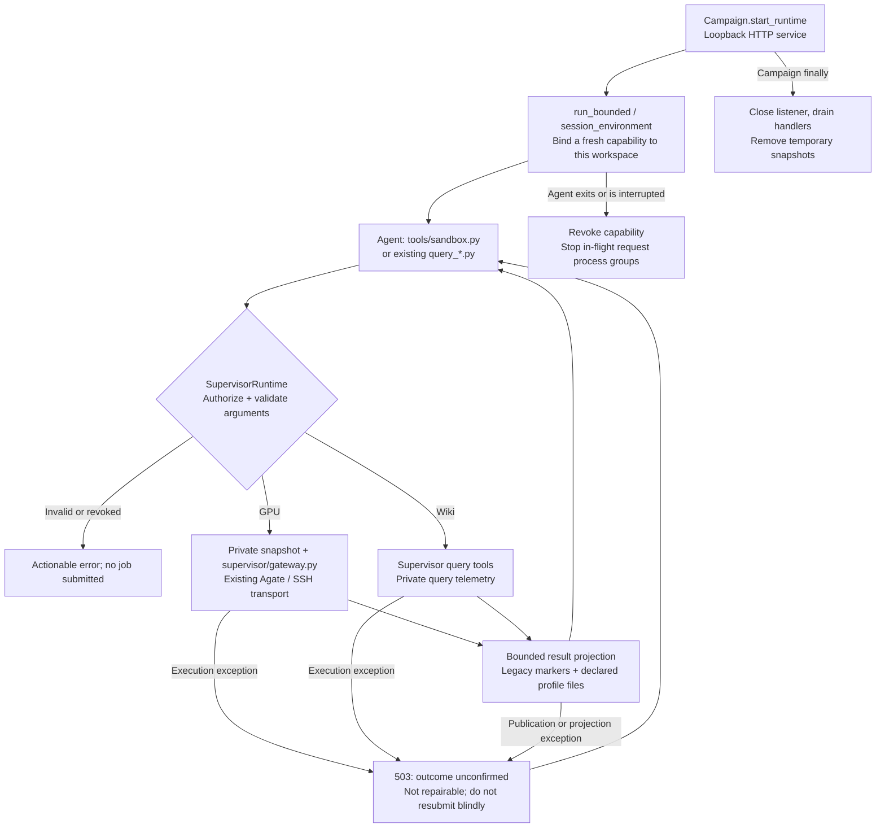

# Supervisor GPU/Wiki Runtime

The Campaign now owns GPU and Wiki execution. Agent sessions keep the familiar `python3 tools/sandbox.py ...` interface, but that script is a standard-library HTTP client. Packaging, endpoint selection, credentials, private evaluator inputs and result projection run in the Supervisor. Operators still launch `orchestrator/optimize.py`; no separate service command is required.

This is PR3 of the simplified AKA migration. It changes the execution boundary, **not the optimization workflow**. Setup/Framework Baseline, Fast/Full Episodes, phase markers, plans, profiles, Agent Git commits, Journal and acceptance remain unchanged. Kernel/Measurement IDs, cross-Episode deduplication, new retry/aggregation policies, Runtime Journal/Report and Supervisor-owned promotion belong to later changes.

## Lifecycle and authority



`Campaign.agent_environment()` starts the listener lazily. `run_bounded()` creates an invocation-scoped capability against the actual Episode worktree, including when the Campaign uses several disposable worktrees. It removes Supervisor Gateway credentials/configuration and supplies only `ATREX_AKA_RUNTIME_URL` and `ATREX_AKA_RUNTIME_TOKEN`. Auxiliary reviewer/problem-generation sessions receive no GPU/Wiki capability. Agent-created children within the same invocation may use that invocation's capability.

The managed `session_environment()` helper requires a registered Runtime owner. Missing, empty or stale owners fail without yielding an environment; there is no fallback that exposes the caller's unsanitized Gateway credentials.

The service listens on `127.0.0.1` with a random port. Its authenticated endpoints are:

| Endpoint | JSON request |
| --- | --- |
| `POST /v1/gateway/execute` | `{"argv": ["--kind", "run", "--no-sync"]}` |
| `POST /v1/wiki/query` | `{"tool": "query_hardware", "argv": ["--list", "products"]}` |

`GET /healthz` is an unauthenticated liveness check without Campaign data. Responses preserve the CLI boundary: `{"exit_code": 0, "stdout": "...", "stderr": "..."}`. The client prints those streams and returns the exit code; Agents do not need to write HTTP requests or handle bearer tokens themselves.

The capability, not an Agent-supplied path, selects the workspace. Legacy full-name endpoint flags are stripped so existing prompts remain valid; prefix abbreviations are rejected, and downstream parsers disable abbreviations. Supervisor-only preflight/health controls and Wiki store overrides are rejected. Wiki `--file` accepts only a bounded regular file within the authorized workspace. Symlinks and `..` traversal cannot grant arbitrary host reads or writes.

## GPU operations

Read the mounted `gpu-measurement` Skill for Agent-facing examples. Existing evaluator commands retain their syntax and result markers:

```bash
python3 tools/sandbox.py --kind run --no-sync -- python3 test_kernel.py --version v2 --no-memory
python3 tools/sandbox.py --kind run --mode correctness_only --no-sync
python3 tools/sandbox.py --kind run --baseline-path scratch/base.py --comparison-repeats 2 --no-sync
python3 tools/sandbox.py --kind profile --profile-level sol --no-sync
python3 tools/sandbox.py --kind dev --input scratch/probe.py --no-sync -- python3 scratch/probe.py
python3 tools/sandbox.py --kind check --sanitize memcheck --no-sync
python3 tools/sandbox.py --kind disassemble --format ptx --no-sync
python3 tools/sandbox.py --kind env
```

| Operation | Behavior and Agent result |
| --- | --- |
| Evaluate (`run`) | Existing evaluator semantics; compact `[test_kernel] RESULT_JSON=` with correctness, latency, per-Shape measurements and actionable diagnostics |
| ABBA (`run --baseline-path`) | Reuses the existing same-allocation AB/BA runner; compact `[sandbox] ABBA_JSON=` with baseline/candidate per-Shape metrics and speedup; does not select or promote a Kernel |
| Profile | Typed NCU/rocprof result, hottest Kernel/resource/SOL facts and requested counters via `[sandbox] PROFILE_JSON=`; legacy Profile commands and declared file synchronization remain supported |
| Dev | Bounded stdout/stderr and command exit status for an explicitly declared GPU probe, not necessarily an evaluation |
| Check | Typed compilation/sanitizer diagnostics via `[sandbox] CHECK_JSON=` |
| Disassemble | Typed resource facts and bounded assembly via `[sandbox] DISASSEMBLE_JSON=` |
| Env | Available Gateway environments or requested capabilities; not an arbitrary endpoint/configuration query |

Profile supports Kernel name/regex, source correlation, launch skip/count, Shape selection and counters. Profile/Check/Disassemble accept `--requirement` and `--deps-mode`. Check/Disassemble/Env require a Gateway exposing those typed APIs; they do not add an SSH implementation or upgrade an older local Gateway server. Unsupported Gateway capabilities remain explicit errors.

Evaluate can use `--input-path` and `--shapes-path` for an exploratory custom-input request, or `--mode correctness_only`; these do not replace the canonical acceptance contract. ABBA uses the complete canonical contract and rejects custom command/input/Shape/seed overrides. Native ABBA batches still use the existing runner/aggregation semantics; this PR adds neither three-repeat median aggregation nor new acceptance criteria.

A completed ABBA comparison with `correct: false` retains its nonzero exit code and public `ABBA_JSON` result in generalized/production mode. Agents can inspect baseline/candidate correctness and available per-Shape metrics; raw logs and any comparison exception text remain withheld. Infrastructure failures without a valid comparison result still return the existing operator-inspection hint, not a fabricated ABBA result.

Top-level `--version`, `--multi-seed`, `--shape-id` and `--timed-runs` are `--kind run` shorthand controls and cannot be combined with an explicit command. Use either `--kind run --multi-seed 3` or `--kind run -- python3 test_kernel.py --multi-seed 3`, not both styles in one request. The HTTP Runtime rejects mixed placement before starting the executor, and the standalone private executor applies the same validation. Shorthand controls also prevent Dev fallback when the typed request cannot honor them, including an explicitly supplied `--multi-seed 0`. ABBA retains its existing `--version`/`--timed-runs` support without a command.

Check/Disassemble and ABBA convert expected validation, I/O and execution failures into bounded `sandbox: ...` CLI errors rather than Python tracebacks. ABBA validates each nonblank `workload.jsonl` record as an object with a unique, non-empty string `uuid`; malformed records identify the physical line number and ask the operator to repair the workload contract before GPU submission. Failed ABBA child processes report the batch number, exit code and up to 4,000 characters of nested stderr, preserving its beginning and end when truncated. Timeouts or malformed results also retain bounded stderr and warn against blind resubmission. Existing generalized-result projection still withholds private diagnostics from Agents.

The moved Gateway retains its existing supported-contract Dev fallback and retry behavior. Invalid explicit custom-input or new typed options fail rather than silently running a different request. There is no HTTP-level blind resubmission: a broken connection can leave an unknown remote outcome. The existing independent Supervisor verifier invokes `supervisor/gateway.py` directly and retains its original full diagnostic format and promotion rules.

## Wiki

The mounted `KernelWiki` Skill comes exclusively from `skills/KernelWiki` and describes the same stores and query semantics as the existing Wiki. The legacy external KernelWiki submodule and its startup initialization are removed; queries use the repository's `gpu-wiki/kernel_wiki` and `gpu-wiki/hardware_wiki` JSON stores. Agent calls to `gpu-wiki/tools/query_nl.py`, `query_wiki.py` and `query_hardware.py` are forwarded automatically; `wiki-query`, `wiki-search` and `wiki-hardware` aliases are also available through `tools/sandbox.py`.

Retrieval, bridge execution and query telemetry run on the Supervisor. Agents can provide a query or a workspace-local query file, not a host store root or retained bridge workspace. `query_id`/`wiki_id` attribution still uses the existing Journal; no new feedback or Journal protocol is introduced.

## Files, diagnostics and limits

GPU execution uses a regular-file snapshot, not the mutable Agent directory. Provider homes, Git, control state, benchmark checkout and linked assets are excluded; trusted evaluator code/private inputs are supplied separately. Arbitrary Dev commands retain the existing explicit `--input` packaging rules. Publication is restricted to requested paths below `profiles/` or `scratch/`, with no-follow reads and atomic writes. Source, Git and control files cannot be replaced by remote output publication. The legacy evaluator log is appended separately for the existing report compiler.

Completed request diagnostics are stored outside the candidate tree, under `<campaign-parent>/.atrex-supervisor-runtime/<workspace-key>/request-<uuid>.json`. These contain bounded command output, invocation arguments, timestamp and exit code for operator debugging. They are not immutable Measurement Records or a public query API. They may contain private evaluation details; protect them like Session traces. Temporary request snapshots are deleted after completion. No automatic retention cleanup is added.

Limits are 2 MiB per HTTP request, 512 argv entries, 16 active request processes, 4,096 files / 64 MiB per snapshot and 16 MiB per input file. Raw stdout is limited to 4 MiB for safe parsing, stderr to a 128 KiB diagnostic prefix; runaway output spooling is interrupted at 64 MiB. An oversized stdout is an unconfirmed outcome, not a successfully parsed prefix. Agent projections are at most 384 KiB stdout / 16 KiB stderr (Wiki stdout: 256 KiB), with explicit truncation or an error when a structured result cannot fit. Profile/assembly have additional per-field limits. Exact private paths and generalized failure details are withheld; raw arbitrary Dev output is not a semantic data-loss-prevention boundary.

Only request decoding and pre-execution validation errors return HTTP 400 with a repair hint: the executor has not started, so no job was submitted by that rejected request. Missing/revoked capabilities return 401. Once execution can have started, exceptions in execution, diagnostic persistence, output publication, projection, response encoding or temporary-directory cleanup return HTTP 503 with `repairable: false` and an unknown-outcome warning. A GPU job may already have completed even if returning its result failed; Agents must report the blocker rather than modify arguments and resubmit blindly. Raw Supervisor exceptions remain in operator logs, not Agent responses. Ordinary executor exits still return HTTP 200 with the projected stdout/stderr and exit code, including nonzero exit codes.

Different capabilities do not share an execution lock. A single capability serializes its requests. Closing a Session revokes its capability; in-flight processes are terminated, allowing the existing Gateway signal handler a bounded cleanup window before forced termination. Campaign close stops the listener and joins handlers. This does not guarantee that a remote job has stopped if cancellation or the network fails.

## Python module interfaces

The shared interfaces used by this Runtime have public names; helpers used only within their defining modules retain underscores. These Python interfaces do not add Agent permissions or HTTP endpoints:

| Module | Shared interface |
| --- | --- |
| `supervisor.gateway` | Request construction: `build_typed_request`, `build_typed_agate_command`; execution: `find_agate`, `run_direct_job`, `run_agate_with_cancel_retry`, `gateway_job_timeout`; data handling: `parse_job_response`, `read_workspace_override`, `private_reference_dir`, `read_json_object`, `shape_id_sort_key`, `batch_shape_ids`, `bounded_actionable_diagnostic` |
| `supervisor.projection` | `bounded_text`, alongside the existing public result projections |
| `orchestrator.agent_home` | `open_private_directory`: context-managed, no-follow directory descriptor |
| `orchestrator.session_tail` | `read_regular_bytes`: bounded regular-file reads without following symlinks |
| `long_horizon.verifier` | `parse_abba_payload`, `merge_abba_batch_payloads`, `verification_schedule` |

Operations receive the running Gateway module instance so CLI execution as `__main__` shares job tracking and cancellation state rather than importing a second executor instance. Gateway application imports are grouped immediately after the repository-path bootstrap required for direct script execution, not interspersed with constants.

## Platform, compatibility and rollback

Native Linux/macOS (`--agent-sandbox none`) remains supported. HTTP routing and authorization are still used, but native execution is **not filesystem isolation**: an unsandboxed Agent retains the operating-system access of its user.

With `--agent-sandbox bwrap`, the Agent does not receive the private evaluator checkout, private reference directory, Supervisor storage or Gateway credentials. Existing workspace evaluator copies needed by the independent verifier are masked, and old Agate configuration copies in resumed Provider Homes are also masked. The shared host network permits loopback Runtime and model access. Legacy Git, Journal/phase/recovery grants remain; this is not yet the final all-authority-in-Supervisor architecture. Explicit operator grants remain trusted exceptions.

Standalone operator diagnostics now use the private executable, from the AKA checkout:

```bash
python3 supervisor/gateway.py --workspace /path/to/campaign --hardware REMOTE_GPU \
  --url https://your-gateway --kind run --no-sync -- python3 test_kernel.py --no-memory
```

`tools/sandbox.py` outside a live Agent Session fails explicitly instead of taking over operator credentials. Library users creating `Campaign` objects must call `close_runtime()` in `finally`; `optimize.py` already does so. A Supervisor restart creates a fresh listener/capability for a new Agent invocation; old tokens are not durable recovery credentials. Existing recovery may need to restart the Agent rather than reuse an orphaned process with a dead listener.

There is no switch that silently restores direct Agent Gateway access. To roll back, stop the Campaign and revert this revision to its PR2 base before resuming. Existing Kernel commits, numbered memory and Journal schemas are unchanged. Keep private request diagnostics for investigation. Changing to `--agent-sandbox none` disables filesystem isolation, not HTTP routing.

## Verification

Tests are kept outside the repository in accordance with the project's review convention. Local integration checks exercise the actual HTTP service, thin client and private Gateway subprocess against a fake Agate server: Evaluate, ABBA, Profile, Dev, Check, Disassemble, Env, real local Wiki hardware lookup, authorization/argument/path failures, explicit-input errors, output overflow and in-flight capability revocation. Fault injection after execution checks that audit writes, output publication, projection, response encoding and cleanup cannot become repairable 400s; the client returns exit 75 without resubmitting, while malformed requests still return 400 before dispatch. They use no model or GPU allocation.

PR1 Session-capture and PR2 auxiliary publication/probe regressions are also checked. Linux smoke testing uses actual Bubblewrap with a temporary workspace and fake Gateway, checking HTTP/Wiki access and the absence of private files/credentials. This does not establish live Provider authentication, remote GPU compilation/profiling correctness or production performance; those require a separate environment-specific end-to-end run.
