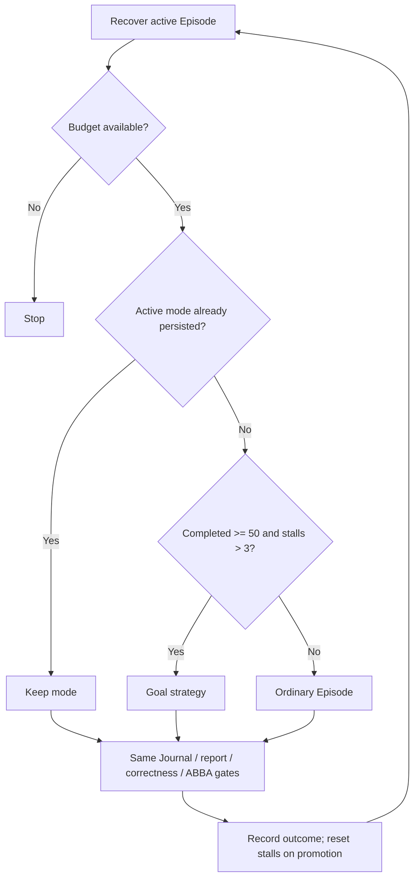

# Episode supervisor internals

This package implements the native optimization engine used by
`orchestrator/optimize.py`. It is not a separate command-line entry point.

The Supervisor maintains each version in an isolated Git worktree; the coding Agent receives a separate persistent Git-free draft. It explores Directions, records Experiments and submits `candidate_ready`, `pivot`, or `blocked` through Runtime `episode-report`. The Supervisor commits the exact measured candidate. See [handoff and promotion](../docs/supervisor-promotion.md).

The supervisor validates the journal and candidate commit, checks production policy, and requires a policy-matched recorded same-allocation ABBA for every candidate, reusing exact existing evidence. A strict correctness-passing
improvement is squash-promoted to the incumbent; every other outcome records canonical
`memory/vN.json` evidence without changing the incumbent kernel.

An episode candidate commit contains only `kernel.py`. Scratch diagnostics, journals, and handoffs stay uncommitted and are copied into the episode archive before the isolated
worktree is removed.

Runtime state lives under `.atrex_long_horizon/` in generated campaign workspaces. Public options
such as `--handoff-resumes`, `--verify-repeats`, `--verify-run-timeout`, and
`--min-improvement-pct` are parsed directly by `orchestrator/optimize.py`.

The controller maintains ignored `memory/live.json` for its legacy consumers, not as an Agent-writable handoff. It is initialized immediately and
atomically refreshed after every journal append, but it never participates in version selection or
promotion; `memory/vN.json` remains the canonical supervisor-owned record.

Every canonical record carries a compact copy of all structured experiments already persisted in
the episode journal. If the supervisor is terminated while an episode is active, the next startup
resumes the registered episode worktree in place, including its source edits, checkpoints, journal,
scratch files and generated intermediate state. If that worktree is missing or no longer matches
the recorded branch and baseline, recovery falls back to archiving it and recording an
`interrupted` `memory/vN.json`. Recovery remains idempotent across repeated termination.

Claude and Codex can resume the same session to repair an incomplete handoff; Qoder and Pi use a
single long invocation. Codex token deltas and marker ordering are read incrementally from the
resumable native rollout. Available invocation components must reconcile with cumulative rollout and
`turn.completed` totals before attribution. Reconciled events may form one phase interval across a
resume boundary. If ledger observation fails, consecutive cumulative stdout usage still supplies a
non-duplicated invocation total while phase attribution degrades fail-closed.

## Module responsibilities

- `campaign.py`: episode budgets, recovery, terminal-state processing, and promotion decisions.
- `git_episode.py`: private branch/worktree lifecycle, protected-path checks, squash promotion,
  and canonical outcome commits.
- `session.py`: one long coding-agent invocation plus bounded same-thread recovery for Claude and
  Codex.
- `journal.py` and `protocol.py`: atomic journal/handoff I/O and terminal validation.
- `verifier.py` and `remote_abba.py`: one-allocation incumbent/candidate ABBA execution.
- `store.py` and `telemetry.py`: restart state, archived attempts, and best-effort episode metrics.

`.atrex_long_horizon/state.json` and `active_episode.json` are restart state, while each
`episodes/eNNNN/` directory archives the prompt, journal-derived attempt, worktree snapshot,
verification payload, and telemetry available for that episode. These files are intentionally
excluded from campaign commits. Promotion evidence is private and digest-bound to its Git promotion; canonical `memory/v<N>.json` remains committed.

At normal completion, Python failure, `SIGINT`, `SIGTERM`, or `SIGHUP`, the orchestrator writes an ignored
`trace-retention-manifest.json`. It declares only the candidate sources,
canonical memory, episode journals and evaluations, Wiki query events, and
compact profiler reports needed for offline knowledge extraction. It explicitly
does not declare coding-agent session JSONL, stdout/stderr logs, temporary
worktrees, caches, or bulk profiler captures. The manifest also binds the
consumer-supplied `platform`, resolved `arch`, and `sandbox_hardware` to the run;
these values are deployment evidence that cannot be reconstructed reliably from
the workspace name or from a locally scoped `solution.json`. A deployment hook
may use this manifest as producer evidence, but remains responsible for path
validation, secret scanning, archive limits, transport, and retry.
`SIGKILL` cannot be handled by Python; a completion hook must treat a missing
manifest after forcible termination as an interrupted/incomplete run.

### Correctness validation

The random-input acceptance policy addresses reported optimization runs in which
the independent distribution-stress gate and numerical reviewer were too strict
for the operators under optimization to pass, blocking further progress. Required
multi-seed checks and correctness-passing ABBA verification remain the acceptance
criteria, with the evaluator's existing comparison metrics and tolerances.

Correctness uses the immutable evaluator's ordinary random input generator over the
full workload set. Native Atrex-Bench compares ordinary floating-point outputs with
`allclose` (`atol=1e-2`, `rtol=0.05` by default). NVFP4 operators use relative L2 error
at most `0.2`, selected from the operator's FP4 dtype metadata or name and passed to
the official evaluator as `--correctness-max-rel-l2 0.2`. This replaces elementwise
allclose for floating-point outputs; output shape/dtype and finite-value checks still
apply. The transport adapter and typed sandbox requests use the same selection.

Full-contract Atrex-Bench Evaluate defaults to the base random case plus five additional
correctness cases; targeted smoke requests retain their single-case default. The Supervisor
enforces six-case correctness before accepting `candidate_ready`, and promotion also requires
correctness-passing incumbent/candidate ABBA evaluation. `--multi-seed N` requests N additional
random cases; `--correctness-only` skips timing. Inputs come directly from the operator's
`input.py` without distribution rewriting or suite authoring. SOL uses its official full-workload
contract rather than the Atrex-Bench seed policy.

Production admission and promotion retain independent dependency/framework review.
Numerical acceptance comes from the evaluator's random-input results. Resume checks
production policy, then continues normal optimization and candidate verification.

## Reviewer recovery and GPU reliability

The independent production reviewer has an operator-configurable `--production-review-timeout`
(default 600 seconds). One execution timeout permits one fresh isolated review with restored
evidence. A second timeout blocks that evidence/configuration; restarting does not reset the count.
Explicit top-level service errors (overloaded, rate-limited, unavailable) wait 30 minutes and retry
without consuming another coding Episode. Successful review clears the consecutive timeout count.
Other exits, invalid verdicts and policy violations fail without an infrastructure retry.

Retry state is private under `<Supervisor scope>/review_timeouts/` and `infrastructure/`, keyed
by candidate evidence, backend and timeout. Agent workspace files cannot reset these budgets.
Reads are bounded and validate the stage, counters and deadlines. Unreadable or corrupt state
blocks validation with an operator repair hint; it is never overwritten or treated as a fresh
budget. The Supervisor log identifies the affected file. Restore a valid same-stage backup or
repair its permissions before resuming; do not delete the state to bypass a consumed retry budget.

GPU execution continues to use the existing Measurement Record/job state machine, rather than
an extra outer resubmission loop. It polls accepted job IDs, retries confirmed infrastructure
outcomes, checkpoints ABBA batches, and refuses blind resubmission when the outcome is unknown.
See [Measurement records](../docs/measurement-records.md).
`ATREX_AGATE_EXECUTABLE`, when set, must resolve to an executable; an invalid override fails
instead of silently choosing another Gateway wrapper or direct HTTP transport. The managed
Runtime returns a non-repairable `gateway_configuration_invalid` error before dispatch;
standalone Gateway CLI calls print a traceback-free `sandbox:` diagnostic. The operator must
correct or unset the override and restart the Supervisor. Without an override, a missing
default client still permits the explicit-URL HTTP fallback.

## Goal scheduling

After at least 50 completed Episodes and more than 3 consecutive non-promotions, the next Episode
uses `mode="goal"`. Otherwise it uses `mode="episode"`. This is a broader search strategy within
the same workflow, not a return to Fast/Full modes or a separate planning/reviewer pipeline.

Goal guidance asks the Agent to reassess the roadmap, explore materially different Directions
sequentially within Runtime limits, and retain the best measured candidate for the final report.
Correctness, Journal, production policy and ABBA promotion gates remain identical. Claude/Codex
allow at least 20 same-session handoff repair continuations; other backends retain their normal
single invocation. A persisted mode wins after restart; an older record without mode remains an
ordinary Episode and is not widened in flight. Historical unfinished Fast Episodes are still
rejected by the existing upgrade guard.

Goal admission takes precedence over `--max-stall`, but never over Episode, version or token
budgets. Before 50 completed Episodes, the usual stall stop applies. With `--max-stall <= 3`,
a Campaign can stop before the goal trigger; zero disables the stall stop. Promotion resets stalls.

Scheduling lives in `LongHorizonCampaign._episode_mode`; `run` persists the mode before starting
the Agent. The terminal and interrupted recovery paths preserve it in canonical memory and logs.
