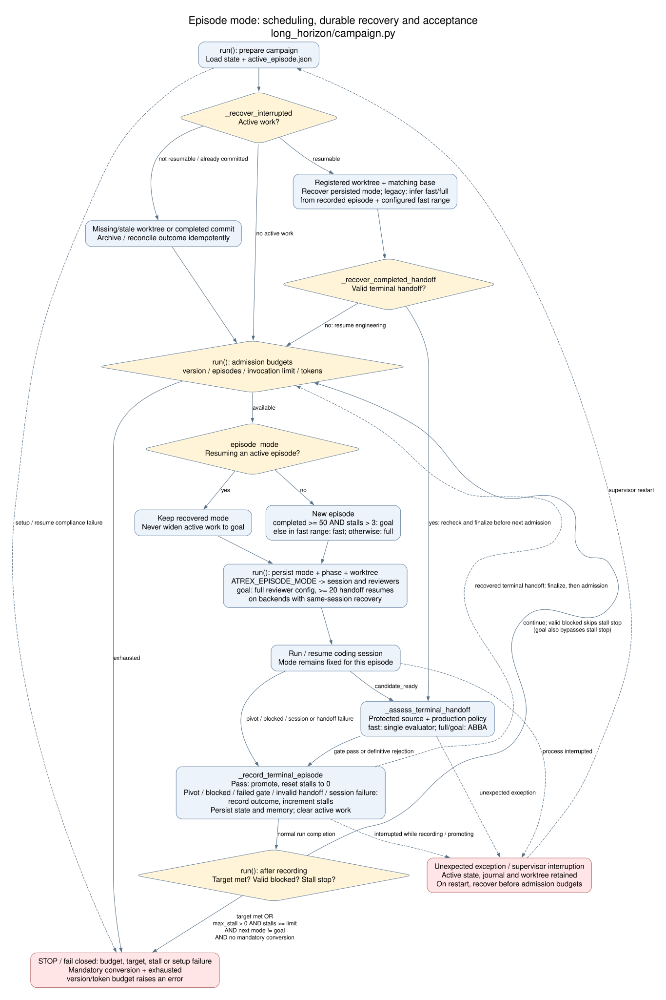

# Episode supervisor internals

This package implements the native optimization engine used by
`orchestrator/optimize.py`. It is not a separate command-line entry point.

Each canonical optimization version is explored in an isolated Git branch and worktree. A coding
agent may run multiple related profile/research/edit/validate cycles, preserve private checkpoint
commits, and finally publish one structured handoff: `candidate_ready`, `pivot`, or `blocked`.

The supervisor validates the journal and candidate commit, checks production policy, and evaluates
incumbent and candidate in an exact same-allocation ABBA schedule. A strict correctness-passing
improvement is squash-promoted to the incumbent; every other outcome records canonical
`memory/vN.json` evidence without changing the incumbent kernel.

An episode candidate commit changes `kernel.py` and may update its `solution.json` manifest. Both
files must match the reviewed commit and are promoted together, so framework conversions retain
their matching language, dependency, and source-role declarations. Plans, profiles, planner discussions,
journals, and handoffs stay uncommitted and are copied into the episode archive before the isolated
worktree is removed.

Runtime state lives under `.atrex_long_horizon/` in generated campaign workspaces. Public options
such as `--handoff-resumes`, `--verify-repeats`, `--verify-run-timeout`, and
`--min-improvement-pct` are parsed directly by `orchestrator/optimize.py`.

Each active episode also exposes ignored `memory/live.json`. It is initialized immediately and
atomically refreshed after every journal append, but it never participates in version selection or
promotion; `memory/vN.json` remains the canonical supervisor-owned record.

Every canonical record carries a compact copy of all structured experiments already persisted in
the episode journal. If the supervisor is terminated while an episode is active, the next startup
resumes the registered episode worktree in place, including its source edits, checkpoints, journal,
plans, profiles, and generated intermediate files. If that worktree is missing or no longer matches
the recorded branch and baseline, recovery falls back to archiving it and recording an
`interrupted` `memory/vN.json`. Recovery remains idempotent across repeated termination.

Claude and Codex can resume the same session to repair an incomplete handoff; Qoder and Pi use a
single long invocation. Codex token deltas and marker ordering are read incrementally from the
resumable native rollout. Available invocation components must reconcile with cumulative rollout and
`turn.completed` totals before attribution. Reconciled events may form one phase interval across a
resume boundary. If ledger observation fails, consecutive cumulative stdout usage still supplies a
non-duplicated invocation total while phase attribution degrades fail-closed.

## Module responsibilities

- `campaign.py`: episode budgets, recovery, terminal-state processing, and promotion decisions.
- `git_episode.py`: private branch/worktree lifecycle, protected-path checks, squash promotion,
  and canonical outcome commits.
- `session.py`: one long coding-agent invocation plus bounded same-thread recovery for Claude and
  Codex.
- `journal.py` and `protocol.py`: atomic journal/handoff I/O and terminal validation.
- `verifier.py` and `remote_abba.py`: one-allocation incumbent/candidate ABBA execution.
- `store.py` and `telemetry.py`: restart state, archived attempts, and best-effort episode metrics.

`.atrex_long_horizon/state.json` and `active_episode.json` are restart state, while each
`episodes/eNNNN/` directory archives the prompt, journal-derived attempt, worktree snapshot,
verification payload, and telemetry available for that episode. These files are intentionally
excluded from campaign commits. Accepted evidence is also written to committed
`memory/long_horizon_eNNNN.json` and the canonical `memory/v<N>.json`.

At normal completion, Python failure, `SIGINT`, `SIGTERM`, or `SIGHUP`, the orchestrator writes an ignored
`trace-retention-manifest.json`. It declares only the candidate sources,
canonical memory, episode journals and evaluations, Wiki query events, and
compact profiler reports needed for offline knowledge extraction. It explicitly
does not declare coding-agent session JSONL, stdout/stderr logs, temporary
worktrees, caches, or bulk profiler captures. The manifest also binds the
consumer-supplied `platform`, resolved `arch`, and `sandbox_hardware` to the run;
these values are deployment evidence that cannot be reconstructed reliably from
the workspace name or from a locally scoped `solution.json`. A deployment hook
may use this manifest as producer evidence, but remains responsible for path
validation, secret scanning, archive limits, transport, and retry.
`SIGKILL` cannot be handled by Python; a completion hook must treat a missing
manifest after forcible termination as an interrupted/incomplete run.

### Correctness validation

Required multi-seed checks, independent dependency/framework review and
correctness-passing ABBA verification use the evaluator's existing metrics and
tolerances. Numerical review adds a bounded experiment-and-repair loop.

Correctness uses the immutable evaluator's ordinary random input generator over the
full workload set. Native Atrex-Bench compares ordinary floating-point outputs with
`allclose` (`atol=1e-2`, `rtol=0.05` by default). NVFP4 operators use relative L2 error
at most `0.2`, selected from the operator's FP4 dtype metadata or name and passed to
the official evaluator as `--correctness-max-rel-l2 0.2`. This replaces elementwise
allclose for floating-point outputs; output shape/dtype and finite-value checks still
apply. The transport adapter and typed sandbox requests use the same selection.

V1 runs the base random case plus five additional correctness cases. Optimization
episodes retain their required random-seed checks, and candidate promotion requires
correctness-passing incumbent/candidate ABBA evaluation. `--multi-seed N` requests
N additional random cases; `--correctness-only` skips timing. Ordinary validation
uses the operator's original `input.py` generator.

The numerical reviewer may suggest up to three targeted distributions with
candidate and contract evidence. It has no rejection verdict. The supervisor
executes them through the immutable evaluator in isolated GPU allocations, using
at most three matching workloads, two seeds and all ranks per distribution. Public
input constraints select the relevant dispatch regime without disclosing hidden
workloads. Generators address actual tensor ABI leaves (including `lhs.0` for tuple
members) and preserve unmentioned structural inputs. Supplemental floating-point
outputs use the evaluator's relative L2 comparator with a fixed threshold of
`1e-3` per output tensor (FP4 retains its benchmark threshold of `0.2`):
`||candidate - reference||2 / max(||reference||2, 1e-12)`.
The non-FP4 bound is an explicit supplemental accuracy policy: at most 0.1%
normalized aggregate error on regenerated distributions. It is not mathematically
equivalent to the ordinary allclose tolerances, so passing ordinary validation
alone does not establish supplemental correctness. The FP4 exception preserves
the benchmark's quantization error budget. This replaces elementwise allclose for these regenerated distributions; absolute
and elementwise relative errors remain diagnostic. Non-finite outputs, structural
mismatches and forbidden input mutations still fail through the evaluator. The
supervisor records the comparison policy in feedback; reviewers and coding agents
cannot change it. Ordinary workload validation retains its original comparator.
Unsupported suggestions remain explicitly advisory, not invented executable tests.

Passing the requested probes closes the suggestion without another subjective
review. A failing workload/seed with receipts for all ranks produces `needs_repair` feedback, including the
distribution and comparison metrics. V1 gets up to two supplemental repair turns,
independent of its ordinary bring-up recovery. Episodes receive feedback before
terminal handoff acceptance and resume the same coding session within the configured
handoff budget. The updated candidate reruns the same probes before normal admission
or promotion; no failed candidate is accepted on repair-budget exhaustion.

Probes evaluate each workload/seed independently, so an evaluator stopping on a
counterexample cannot be mistaken for missing coverage. A pass requires every
requested probe; a complete counterexample goes directly to the coding agent.
Suggestions with no matching available workload remain recorded as unsupported
advisories and do not block executable cases or promotion. They are never recorded
as passing tests and are reconsidered when the workload set changes.
The sandbox privacy filter retains failure receipt counts and aggregate numerical
metrics, while withholding private workload values and raw evaluator exceptions.

Incomplete receipts and input-generation failures are `needs_validation`, not kernel
correctness failures. The planner gets one bounded probe-plan repair before reporting
a validation blocker; this does not consume a coding-agent repair. Failed experiments cannot
be silently dropped or converted to passing evidence. Confirmed service outages use
the infrastructure recovery policy below. Supplemental correctness probes never enter
ABBA timing aggregates.

Numerical planning retries a timed-out session once with twice the configured
production-review timeout. A complete, valid plan already written at timeout is
usable only after its evidence digest and unchanged source files are verified.
Missing or invalid plans remain validation blockers. Planning attempts and any
written responses are recorded as `numerical_planning-*.json` beside the feedback.

Read `verification_artifacts/.atrex_long_horizon_verify/numerical_feedback.json` for
agent feedback and `supplemental-*/numerical_result.json` for audit records. Pending
probe plans persist under `.atrex_numerical_advice/` in the private reference directory
or `.atrex_long_horizon/numerical_advice/` in the canonical workspace; coding-agent edits to feedback files do
not change the in-memory plan. Restarts rerun the probes against the current candidate.
In-process cache keys include candidate, contract, evaluator and workload contents.

## Infrastructure recovery during validation

Confirmed GPU transport outages and structured review-service errors pause the current validation
step. After each failure, the supervisor waits 30 minutes before retrying the same
step. Recovery is established by a real validation request, rather than a health
endpoint alone. There is no retry-count limit and no episode, rejection, or stall
increment while waiting. The candidate, journal, and handoff remain in place.

Each step stores its status, failure category, retry count, and next retry time under
`.atrex_long_horizon/infrastructure/`. Step identities include the candidate or
contract digest, and a restarted supervisor honors the recorded retry deadline.
An interrupted ABBA batch repeats its complete A/B/B/A schedule in one allocation;
partial timing samples are never combined across allocations.

Explicit numerical mismatches, compilation or kernel execution failures, policy
rejections, invalid evidence, and insufficient speedup remain validation failures.
They are not treated as transport outages. Gateway infrastructure categories remain
visible through a fixed marker while hidden evaluator details stay private.

Reviewer exits without a structured service error fail validation. A reviewer execution
timeout gets one retry in a fresh isolated session with restored evidence for dependency
review. Timeout counts are persisted per
evidence digest and reviewer configuration; a second timeout blocks validation with an
explicit reviewer-infrastructure diagnosis. Restarting cannot reset the limit. Changing
the evidence or reviewer timeout permits a new bounded attempt. Successful completion
clears consecutive timeout counts. Only top-level CLI service errors (`overloaded_error`,
`rate_limit_error`, `service_unavailable_error`) enter the 30-minute retry loop.
`--production-review-timeout` bounds the dependency reviewer (default: 600 seconds).

Sandbox infrastructure errors use exit code 75 plus an exact stderr marker;
remote command text cannot declare this category. Agate upload/nonblocking
submission holds its admission lock for at most 600 seconds, limited further by
the remaining wait budget. A submission deadline releases the lock and returns
the infrastructure signal so subsequent jobs can submit.

An explicit `ATREX_AGATE_EXECUTABLE` is authoritative: it must resolve to an
executable path or command name, otherwise sandbox setup raises `FileNotFoundError`.
Falling back could bypass a campaign wrapper's endpoint or execution policy. Leave
it unset to use the existing adjacent-to-Python and then PATH discovery order.
This configuration failure is not an infrastructure outage and is not retried.

## Goal scheduling

After at least 50 completed episodes and more than 3 consecutive non-promotions,
Python schedules a `goal` episode. It persists the single `episode_mode` value in
`active_episode.json`'s existing `mode` field and preserves it during recovery.
The same value reaches prompts and plan reviewers through `ATREX_EPISODE_MODE`.
Fast/full episodes retain their single-direction planning and prompt handoff rules;
goal episodes may work through a broader operator roadmap and preserve the best
validated checkpoint until the roadmap is complete or exhausted.

Goal episodes use the full-episode reviewer settings, the shared production
validation and ABBA promotion gates, and at least 20 same-session handoff recovery
continuations on backends that support them. Goal admission takes precedence over `--max-stall`
once its trigger is met. For ordinary non-blocked outcomes without mandatory conversion,
`--max-stall` from 1 to 3 can stop a campaign even after 50 completed episodes,
because the stall counter has not yet exceeded 3. With `--max-stall >= 4`, the
stall stop can fire before 50 completed episodes; after that, reaching the stop
threshold also selects goal mode and bypasses the stall stop. Zero disables the
stall stop. Episode, version and token budgets retain their existing behavior.

Recovery deliberately uses one interpretation in all paths: a persisted mode wins;
a legacy record without a mode uses its recorded episode number and the configured
fast-episode range (fast inside that range, full outside it), including completed
handoff verification. Missing episode numbers do not select fast mode; the existing
worktree/recovery checks handle the incomplete record. Legacy mode inference never
selects goal. This aligns `_recover_interrupted` and `_recover_completed_handoff`
with `run()` admission.

The diagram maps to `long_horizon/campaign.py`: `_episode_mode` selects or restores
mode, `run()` checks budgets and admits episodes, `_recover_interrupted` restores or
archives active work, `_recover_completed_handoff` rechecks terminal handoffs, and
`_record_terminal_episode` updates counters and canonical memory. Recovery runs
before the next admission budget check, so a completed handoff can be finalized
before a budget stops further exploration. The [diagram source](../assets/episode-mode-state-machine.dot)
is kept alongside the rendered SVG.

Supplemental plans persist in the supervisor private-reference directory, or in
`~/.local/state/atrex-kernel-agent/numerical_advice` when no private reference is
configured. This state must stay outside coding-agent workspaces and writable
mounts. Restart loads accept only structurally valid probe plans; workspace
feedback is an audit copy, never an admission decision. As with the private
reference corpus, deployments must protect supervisor state from agent writes.
